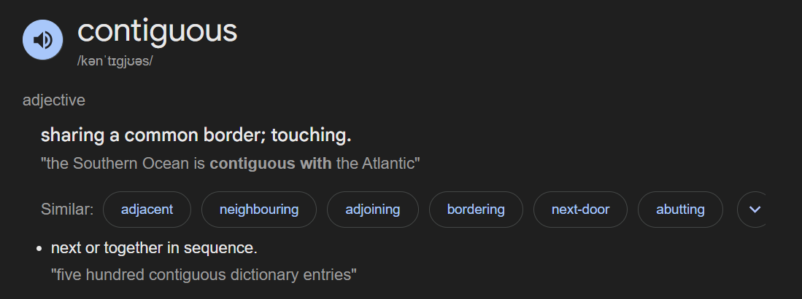

### ◄ Special Techniques – Sliding Window

**Sliding Window** is a powerful technique for solving problems involving **==contiguous subarrays or substrings==** in linear time.


__Q. What is contiguous subarray?__

__Ans__: A contiguous subarray is simply a subarray of an array with a condition that the elements of the subarray should be in exact sequence as the sequence of the elements in the array. for example if the array is [1,2,3,4,5] then [1,3,5] is a subarray of the array, but not a contiguous subarray since the sequence does not match as the elements 2 and 4 are skipped. [1,2,3] will be one of the contiguous subarrays.

> [1,3,5] is rather a subsequence. While [5,3] is not subsequence, because order is not matching with [1,2,3,4,5].


Ref: [https://stackoverflow.com/questions/50581472/what-is-contiguous-subarray](https://stackoverflow.com/questions/50581472/what-is-contiguous-subarray)  





---

#### ✅ **When to Use:**

* You’re asked to find or optimize something over **subarrays of a certain size**.
* You need to **track running values** (sum, count, max, min) over a range.
* The problem hints at **"window" size, prefix/suffix, or substring**.

---

#### 🔧 **Types of Sliding Windows:**

1. **Fixed-size window (size `k`):**
   Use when subarray/substring length is fixed.
   Example: Maximum sum of any `k` elements in an array.

2. **Dynamic-size window (shrinking/growing):**
   Use when you’re searching for the *smallest/largest* subarray that meets a condition.
   Example: Smallest subarray with sum ≥ target.

---

#### 🧠 **Core Idea:**

Use two pointers (`start`, `end`) to represent the current window.
Move `end` to expand, `start` to shrink as needed based on the condition.

---

#### 💡 **Common Problems:**

* Longest substring without repeating characters
* Maximum sum subarray of size `k`
* Minimum window substring (Leetcode 76)
* Sliding window maximum (Leetcode 239)

---

#### 🛠️ **Template (Dynamic-size Window):**

```java
int start = 0, sum = 0;
for (int end = 0; end < nums.length; end++) {
    sum += nums[end];

    while (sum >= target) {
        result = Math.min(result, end - start + 1);
        sum -= nums[start++];
    }
}
```

Sliding Window helps reduce **O(n²)** brute force to **O(n)** or **O(n log n)**, making it essential for efficient DSA problem solving.


## Explanation with example 

Let’s take an example:
👉 **Find the maximum sum of any subarray of size `k = 3`** in the array `[1, 2, 3, 4, 5]`.

---

### 🔴 **Brute Force (O(n²))**

```java
int maxSum = Integer.MIN_VALUE;
for (int i = 0; i <= arr.length - k; i++) {
    int sum = 0;
    for (int j = i; j < i + k; j++) {
        sum += arr[j]; // recomputes each time
    }
    maxSum = Math.max(maxSum, sum);
}
```

* 🧮 Time Complexity: **O(n \* k)** →== recomputes sum for every window.==
* ⏱ Example Iterations:

  * Sum of \[1,2,3]
  * Sum of \[2,3,4]
  * Sum of \[3,4,5] → total 3 subarrays, 3 operations each → 9 total.

---

### 🟢 **Sliding Window (O(n))**

```java
int windowSum = 0, maxSum = 0;
for (int i = 0; i < k; i++) {
    windowSum += arr[i]; // first window
}
maxSum = windowSum;

for (int i = k; i < arr.length; i++) {
    windowSum += arr[i] - arr[i - k]; // slide window
    maxSum = Math.max(maxSum, windowSum);
}
```

* 🧠 Instead of recalculating, it ==**updates sum by removing leftmost and adding rightmost**==.
* 🧮 Time Complexity: **O(n)** → ==each element added/subtracted once.==
* ⏱ Example Steps:

  * Start with sum of \[1,2,3] = 6
  * Slide: add 4, remove 1 → \[2,3,4] = 9
  * Slide: add 5, remove 2 → \[3,4,5] = 12

---

### ✅ **Comparison**

| Approach       | Time Complexity | Operations | Reuse of Data     |
| -------------- | --------------- | ---------- | ----------------- |
| Brute Force    | O(n \* k)       | More       | ❌ No reuse        |
| Sliding Window | O(n)            | Minimal    | ✅ Efficient reuse |

Sliding Window drastically improves performance when dealing with **contiguous subarrays** of fixed or dynamic size.
