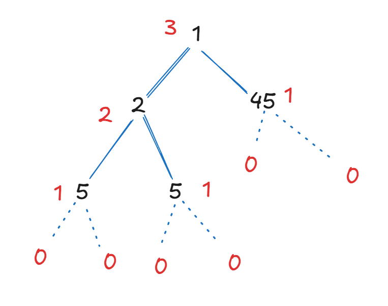
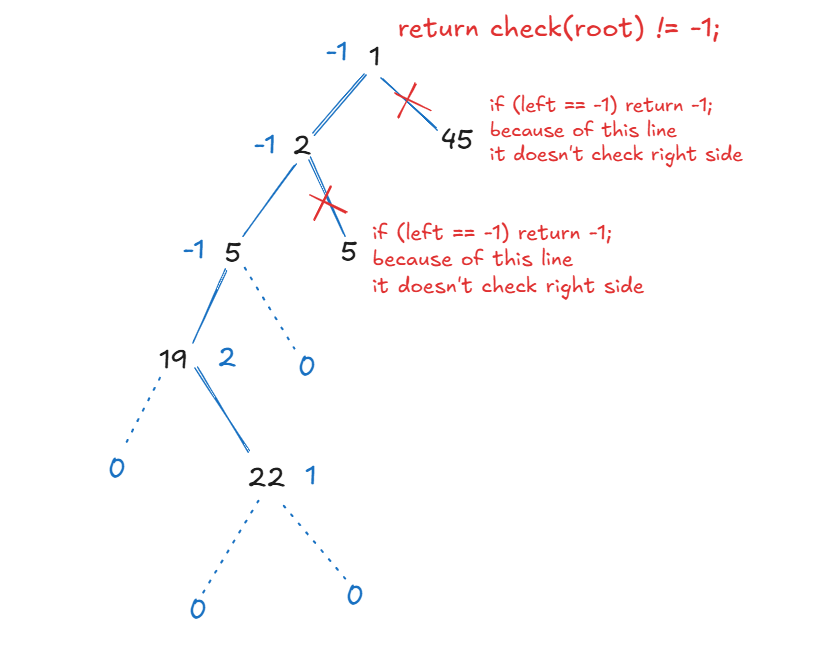

### ◄ Tree — Balanced Checks or Diameter Calculations

#### ❓ **Balanced checks or diameter calculations?**

→ **Use Postorder + height calculations**

---

### 📌 **Why Postorder?**

In **postorder traversal** (`Left → Right → Root`), we visit children **before** the parent — perfect for computing **heights** and **bottom-up values** like:

* Height of subtree
* Diameter of subtree
* Balanced property (difference in height ≤ 1)

---

### ✅ **1. Check if Tree is Balanced**

A binary tree is **height-balanced** if for ==every node==,

`|height(left) - height(right)| ≤ 1`.


```java
boolean isBalanced(TreeNode root) {
    return check(root) != -1;
}

int check(TreeNode node) {
    if (node == null) return 0;
    int left = check(node.left);
    if (left == -1) return -1;

    int right = check(node.right);
    if (right == -1) return -1;

    if (Math.abs(left - right) > 1) return -1;
    return 1 + Math.max(left, right);
}
```

### Balanced 



### Not balanced



---

### ✅ **2. Calculate Diameter of Binary Tree**

**Diameter** = longest path between any two nodes (may or may not pass through root)

```java
int diameter = 0;

int height(TreeNode node) {
    if (node == null) return 0;

    int left = height(node.left);
    int right = height(node.right);

    diameter = Math.max(diameter, left + right); // measures the diameter of each node and compares with prev diameter
    return 1 + Math.max(left, right); // measures the height of each node and increment 1 for its parent node 
}

int diameterOfBinaryTree(TreeNode root) {
    height(root);
    return diameter;
}
```

---

### 📈 Time Complexity:

* **O(n)** — each node is visited once
* **Postorder** allows reusing height info during the return phase

---

### 🧠 Summary:

> Use **postorder** when child calculations must be complete before parent logic — perfect for height-based problems like **balance** and **diameter**.


---


Q. How diameter is addition of `left + right` ?

Here's a clear explanation of why:

---

### ✅ **Diameter = left height + right height**

#### 🔍 Definition:

The **diameter** of a binary tree is:

> The **number of edges** in the **longest path** between any two nodes in the tree.


---

### 🧠 Why `left + right`?

When calculating diameter **at any node**, the longest path **through** that node will be:

```
(from the deepest node in left subtree)
        ↓
     [left subtree height]
        ↓
      current node
        ↓
     [right subtree height]
        ↓
(to the deepest node in right subtree)
```

So the total number of **edges** in that path is:

```
leftHeight + rightHeight
```

We check this at **every node** using postorder traversal, and **track the max** as we go.

---

### 📌 Example:

For this simple tree:

```
      A
     / \
    B   C
   /     \
  D       E
```

* Longest path is: `D → B → A → C → E`
* Number of **edges** = 4
* At node `A`:

  * `leftHeight = 2` (from D)
  * `rightHeight = 2` (from E)
  * `diameter = 2 + 2 = 4` ✔️

---

### 🧮 Code snippet (Leetcode style):

```java
int diameter = 0;

int height(TreeNode node) {
    if (node == null) return 0;
    int left = height(node.left);
    int right = height(node.right);
    diameter = Math.max(diameter, left + right); // ← this is the key
    return 1 + Math.max(left, right);
}
```

---

> ✅ So yes — **diameter = left + right** because it represents the **maximum edge path** that spans both subtrees through a node.
