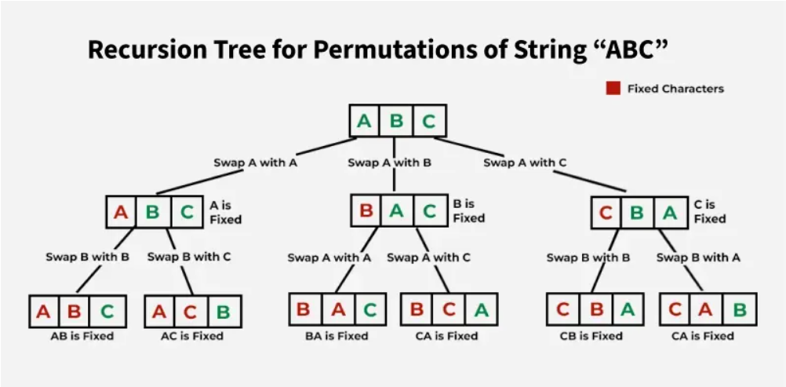

## ✅ 1. Permutation Using **Swap + Backtracking**

Most **space-efficient** – modifies the array in place.




```java
public class PermutationSwapBacktrack {
    public static void main(String[] args) {
        String str = "ABC";
        permute(str.toCharArray(), 0);
    }

    static void permute(char[] chars, int index) {
        if (index == chars.length) {
            System.out.println(new String(chars));
            return;
        }

        for (int i = index; i < chars.length; i++) {
            swap(chars, i, index);            // Fix character at current index
            permute(chars, index + 1);        // Recurse for next index
            swap(chars, i, index);            // Backtrack to previous state
        }
    }

    static void swap(char[] arr, int i, int j) {
        char temp = arr[i];
        arr[i] = arr[j];
        arr[j] = temp;
    }
}
```

---

## ✅ 2. Permutation Using **Backtracking Without Swap**

Keeps a `visited[]` array and builds up the result string.

```java
public class PermutationBacktrackOnly {
    public static void main(String[] args) {
        String str = "ABC";
        boolean[] visited = new boolean[str.length()];
        permute(str, "", visited);
    }

    static void permute(String str, String path, boolean[] visited) {
        if (path.length() == str.length()) {
            System.out.println(path);
            return;
        }

        for (int i = 0; i < str.length(); i++) {
            if (!visited[i]) {
                visited[i] = true;
                permute(str, path + str.charAt(i), visited);
                visited[i] = false; // backtrack
            }
        }
    }
}
```

---

## 🔍 Comparison Table

| Feature                     | Swap + Backtrack            | Backtrack Only               |
| --------------------------- | --------------------------- | ---------------------------- |
| **Space**                   | O(1) extra                  | O(n) for `visited[]` + path  |
| **Mutation**                | Modifies array in-place     | Keeps original string intact |
| **Performance**             | Fastest, fewer allocations  | Slightly more allocations    |
| **Easier for unique perms** | Needs extra logic for dupes | Easier to filter duplicates  |
| **Use case**                | Optimal for interviews      | Clean logic, easy to debug   |

---


## Extra: Handling duplicates 


To handle **duplicate characters** in permutations and avoid repeated results, we need to:

---

### ✅ For **Swap + Backtracking**, add a `Set` at each recursion level to skip duplicates.

```java
import java.util.*;

public class PermutationSwapUnique {
    public static void main(String[] args) {
        String str = "AAB";
        char[] chars = str.toCharArray();
        Arrays.sort(chars);  // sort to help skip duplicates
        permute(chars, 0);
    }

    static void permute(char[] chars, int index) {
        if (index == chars.length) {
            System.out.println(new String(chars));
            return;
        }

        Set<Character> used = new HashSet<>();

        for (int i = index; i < chars.length; i++) {
            if (used.contains(chars[i])) continue; // skip duplicates at same level
            used.add(chars[i]);

            swap(chars, i, index);
            permute(chars, index + 1);
            swap(chars, i, index);  // backtrack
        }
    }

    static void swap(char[] arr, int i, int j) {
        if (i != j) {
            char temp = arr[i];
            arr[i] = arr[j];
            arr[j] = temp;
        }
    }
}
```

---

### ✅ For **Backtrack Only** method, use a `boolean[]` visited and **sort the input**, then skip duplicates when needed.

```java
import java.util.*;

public class PermutationBacktrackUnique {
    public static void main(String[] args) {
        String str = "AAB";
        char[] chars = str.toCharArray();
        Arrays.sort(chars);
        boolean[] visited = new boolean[chars.length];
        permute(chars, "", visited);
    }

    static void permute(char[] chars, String path, boolean[] visited) {
        if (path.length() == chars.length) {
            System.out.println(path);
            return;
        }

        for (int i = 0; i < chars.length; i++) {
            if (visited[i]) continue;

            // skip duplicate: same char as before and previous one not used
            if (i > 0 && chars[i] == chars[i - 1] && !visited[i - 1]) continue;

            visited[i] = true;
            permute(chars, path + chars[i], visited);
            visited[i] = false; // backtrack
        }
    }
}
```

---

### 📌 Sample Output for `"AAB"`:

```
AAB
ABA
BAA
```

