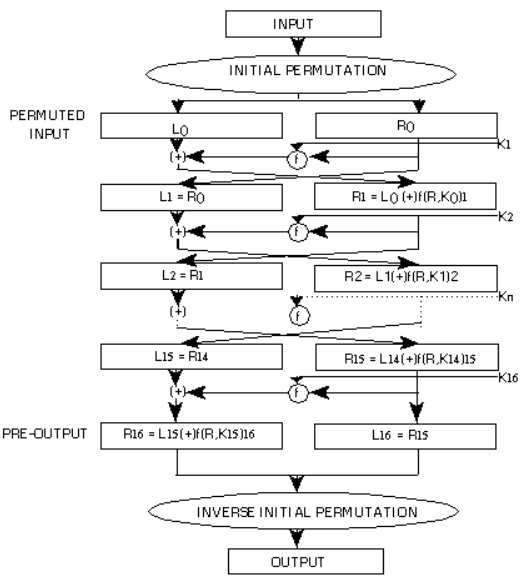
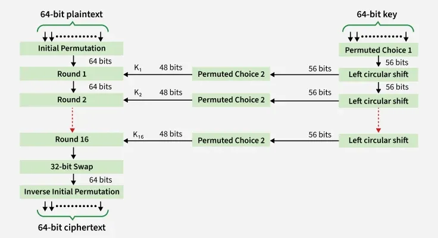

### 📌 **Introduction to Data Encryption Standard (DES)**

The **Data Encryption Standard (DES)** is one of the most well-known symmetric encryption algorithms and is a classic example of a **Feistel cipher** structure. Developed by **IBM in the 1970s** and adopted by the **U.S. National Institute of Standards and Technology (NIST)** as a federal standard, DES was widely used for **securing sensitive data** for decades.

---

## 🔐 **Overview of DES**

* **Block size:** 64 bits (data processed in 64-bit blocks)
* **Key size:** 64 bits total, but only **56 bits are used** for encryption (the remaining **8 bits are used for parity checks**)
* **Rounds:** 16 rounds of processing, each involving key mixing, substitutions, and permutations
* **Structure:** Based on the **Feistel network**, allowing encryption and decryption to follow the same structure (with reversed subkeys)

---

## 🔄 **DES Encryption Process – Step-by-Step**

### 🔸 **a. Initial Permutation (IP)**

* The 64-bit plaintext block is **rearranged** using a fixed permutation table.
* The output is then split into two halves: **Left (L0)** and **Right (R0)**, each 32 bits.

---

### 🔸 **b. Key Schedule**

* The original 56-bit key is processed to generate **sixteen 48-bit subkeys**, one for each round.
* Subkeys are derived using **bit shifting** and **compression permutations**.

---

### 🔸 **c. Expansion (E-Box)**

* The 32-bit **right half (R)** is expanded to **48 bits** using an **expansion table** by duplicating and reordering some bits.
* This allows mixing with the 48-bit subkey.

---

### 🔸 **d. XOR Operation**

* The 48-bit expanded right half is **XORed** with the **48-bit round subkey**, introducing key-dependent variation.

---

### 🔸 **e. S-Box Substitution**

* The XORed output is split into **eight 6-bit chunks**.
* Each 6-bit chunk is passed through a unique **Substitution Box (S-Box)**.
* Each S-Box maps a 6-bit input to a **4-bit output**, reducing the total output back to **32 bits**.

---

### 🔸 **f. Permutation (P-Box)**

* The 32-bit output from the S-Boxes is **rearranged** using a **P-Box permutation table** to increase diffusion and randomness.

---

### 🔸 **g. XOR and Swap**

* The output of the P-Box is **XORed with the left half (L)** of the previous round.
* Then, the left and right halves are **swapped** (except in the final round).

---

## 🔁 **Decryption Process**

DES decryption follows the **same steps in reverse**, applying the **subkeys in reverse order (K16 → K1)**. This symmetry is a key advantage of Feistel ciphers.

---

## ⚠️ **Weaknesses of DES**

1. **Short Key Size (56 bits)** – vulnerable to **brute-force attacks** (e.g., cracked in under a day using modern hardware).
2. **Known Cryptanalysis Techniques** – like differential and linear cryptanalysis.
3. **Superseded by Advanced Encryption Standard (AES)** in most applications.

---

## 🔄 **Successors of DES**

* **Triple DES (3DES):** Applies DES **three times** with multiple keys for improved security.
* **AES (Advanced Encryption Standard):** Adopted in 2001, uses **128, 192, or 256-bit keys** and is now the standard for symmetric encryption.

---

## ✅ **Conclusion**

DES marked a major milestone in the development of modern cryptography and helped standardize encryption across industries. Despite its **historical importance**, DES is now considered **obsolete** due to its vulnerability to brute-force attacks. It has been replaced by **more secure algorithms like AES**, but it remains a foundational concept in understanding block cipher design, especially the **Feistel structure**.
