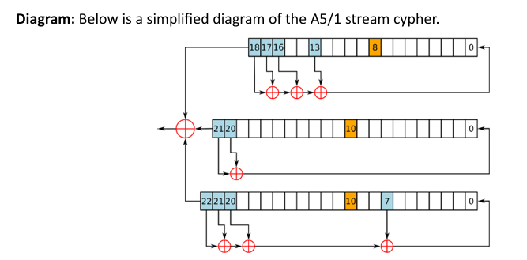

### 📌 **Overview of Stream Ciphers – Focus on A5/1 Stream Cipher**

**Stream ciphers** are a class of **symmetric key ciphers** that encrypt plaintext one **bit or byte at a time** using a **pseudorandom keystream**. Each bit or byte of plaintext is combined with the corresponding bit or byte of the keystream using the **XOR operation** to produce ciphertext.

They are well-suited for **real-time applications** like **voice communication**, **video streaming**, or **mobile communications** due to their speed and efficiency.

---

## 🔄 **A5/1 Stream Cipher**

The **A5/1** stream cipher was introduced in **1987** as part of the **GSM (Global System for Mobile Communications)** standard for **voice encryption** over cellular networks. It was kept confidential until its **structure was reverse-engineered in 1999**.

---

### 🧩 **Key Features of A5/1**

#### 🔸 **1. Linear Feedback Shift Registers (LFSRs)**

* A5/1 uses **three LFSRs**:

  * **LFSR-1**: 19 bits long
  * **LFSR-2**: 22 bits long
  * **LFSR-3**: 23 bits long
* Each LFSR generates a **bit sequence** based on an internal feedback mechanism and is initialized with the **session key and a public frame counter**.

#### 🔸 **2. Clocking Mechanism (Majority Rule)**

* Unlike simple stream ciphers, A5/1 uses a **clock control mechanism** to make the keystream harder to predict:

  * Each register has a dedicated **clocking bit** (as shown in orange in the diagram: bits 8, 10, and 10).
  * The **majority value** of these bits determines which registers will be **clocked (shifted)** in that round.
  * This creates a **non-linear progression** of the internal state, improving obfuscation.

---

### ⚙️ **Operation of A5/1**

#### 🔸 **Keystream Generation (As Illustrated in the Diagram)**

1. **Initialization**:

   * All three LFSRs are loaded with the **secret key and frame counter**.

2. **Clocking Decision**:

   * The **majority bit** among the three highlighted clocking bits is calculated.
   * Only the LFSRs whose clocking bit **matches the majority** are clocked (shifted).

3. **Bit Generation**:

   * Specific tap positions (e.g., 13, 16, 17, 18 in LFSR-1; 20, 21 in LFSR-2; and 7, 20, 21, 22 in LFSR-3) are **XORed** within each LFSR to produce their individual outputs.
   * The outputs of all three LFSRs are then **XORed together** to form the **final keystream bit**.

4. **Encryption**:

   * The keystream is XORed with the plaintext to generate ciphertext.
   * Decryption is done the same way: XOR the keystream with ciphertext to retrieve plaintext.

---

### 🛡️ **Security and Weaknesses**

* A5/1 was originally considered secure due to its **complex internal state and majority rule** mechanism.
* However, it has been proven **vulnerable to various attacks**:

  * **Brute-force**: Practical with today's computing power.
  * **Time-memory trade-off attacks**: Pre-computed tables can be used to reduce cracking time.
  * **Known plaintext attacks** and **side-channel attacks** have been demonstrated.

> These weaknesses have led to **phasing out A5/1** in favor of more secure algorithms in modern GSM and LTE networks.

---

### 📱 **Real-World Application**

* Used extensively in **2G GSM networks** for securing **voice and SMS communications**.
* Though largely **obsolete**, it has historical importance in mobile encryption.

---

### ✅ **Conclusion**

**A5/1** is a classic example of a stream cipher used in **mobile communication**. It showcases important design elements like **LFSRs** and **non-linear clocking mechanisms**. While once effective, **its security no longer meets modern standards**, and it has been replaced by stronger algorithms such as **A5/3, KASUMI**, and **AES-based encryption** in newer mobile systems. Nevertheless, A5/1 remains a key milestone in the evolution of real-time encryption techniques.
