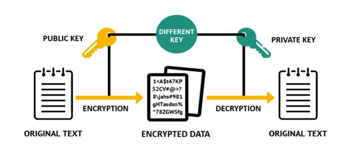

### 📌 **Public Key Cryptography**

**Public Key Cryptography (PKC)**, also known as **Asymmetric Cryptography**, uses a **pair of mathematically related keys**:

* A **public key** to encrypt the data.
* A **private key** to decrypt the data.

The core advantage of PKC is that **secure communication** is possible without exchanging secret keys in advance. This is crucial for systems like secure email, digital signatures, and secure web traffic.

The diagram provided illustrates this process clearly:

* The **public key** encrypts the original text into **ciphertext**.
* The **private key** then decrypts it back into the **original message**.

---

## 🔐 **RSA Cryptosystem**

**RSA** (named after **Rivest, Shamir, and Adleman**) is one of the earliest and most widely used public key cryptosystems. Invented in **1977**, it is based on the **mathematical hardness of factoring large composite numbers**.

---

### 🔸 **Key Features of RSA**

1. **Mathematical Foundation**

   * RSA relies on the difficulty of factoring a large number `n`, which is the product of two large primes `p` and `q`.
   * The problem of factoring `n` into `p` and `q` is computationally hard, forming the basis of RSA’s security.

2. **Key Generation**

   * Select two large prime numbers: `p` and `q`.
   * Compute: `n = p × q` (used as the modulus).
   * Compute Euler’s totient: `φ(n) = (p – 1)(q – 1)`.
   * Choose public exponent `e`: a number such that `1 < e < φ(n)` and `gcd(e, φ(n)) = 1`.
   * Compute private key `d` such that: `d ≡ e⁻¹ mod φ(n)`.

3. **Encryption and Decryption**

   * **Encryption**: `C = M^e mod n`, where:

     * `M` = plaintext
     * `C` = ciphertext
   * **Decryption**: `M = C^d mod n`, where:

     * `d` = private key

4. **Security**

   * The security of RSA grows with the size of `n`.
   * **2048-bit keys** are currently considered secure.
   * Breaking RSA would require **factoring a large number**, which is computationally infeasible with current technology.

---

### 🛡️ **Real-Life Applications of RSA**

* **SSL/TLS**: Secure web traffic (HTTPS)
* **PGP**: Secure email
* **Digital Signatures**: Ensuring message authenticity and integrity
* **VPNs** and **Secure Shell (SSH)** connections

---

### ✅ **Conclusion**

Public key cryptography, especially through RSA, revolutionized secure communication by eliminating the need to share secret keys beforehand. RSA remains one of the **most trusted cryptographic algorithms**, forming the backbone of **secure transactions, digital certificates, and encrypted communication**. As computing power grows, RSA key lengths must increase to maintain security, though many systems are gradually transitioning to more efficient alternatives like **Elliptic Curve Cryptography (ECC)**.
