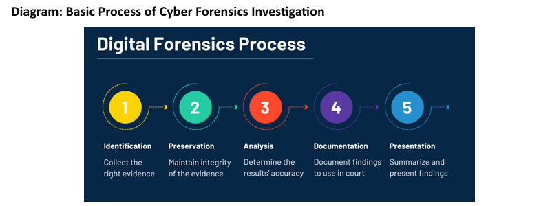

## 🛡️ **Cyberspace Law, Penalties, and Offences – IT Act, 2000**

### 🔹 **Introduction to IT Act, 2000**

The **Information Technology Act, 2000** is the key legislation in India to address legal issues relating to the **digital world**. It:

* Grants legal recognition to **electronic records and digital signatures**.
* Defines cyber offences and prescribes **penalties and compensation**.
* Facilitates **e-governance and cybersecurity**.

---

### 🧾 **Key Definitions**

* **Electronic Record**: Any data or image generated, stored, or transmitted in electronic form.
* **Digital Signature**: An electronic method of authenticating electronic records.

---

### ⚖️ **A. Cyberspace Law**

**Cyberspace law** covers legal aspects of online environments like:

* **Data privacy and protection**
* **Cybercrime**
* **E-commerce regulations**
* **Intellectual property in the digital realm**

#### 🔎 Examples of Cybercrimes under Cyberspace Law:

* **Hacking**: Unauthorized system access.
* **Phishing**: Fraudulently obtaining personal data.
* **Cyberstalking**: Online harassment or threats.

---

### 🚨 **B. Penalties under IT Act, 2000**

| **Section** | **Offence**                         | **Penalty**                                |
| ----------- | ----------------------------------- | ------------------------------------------ |
| 43          | Unauthorized access, damage to data | Compensation up to ₹1 crore                |
| 66          | Hacking                             | Up to 3 years imprisonment + ₹5 lakh fine  |
| 67          | Publishing obscene content online   | Up to 5 years imprisonment + ₹10 lakh fine |

---

### ⚖️ **C. Major Offences**

* **Section 66C – Identity Theft**: Impersonation using passwords, digital signatures.

  * **Penalty**: 3 years jail + ₹1 lakh fine

* **Section 66F – Cyber Terrorism**: Attacks on national integrity/security using cyber means.

  * **Penalty**: Life imprisonment

* **Section 72 – Breach of Confidentiality**: Accessing private data without consent.

  * **Penalty**: 2 years jail or ₹1 lakh fine or both

---

### 🔍 **Real Case Example**

In 2018, India witnessed a massive data leak involving Aadhaar details. This raised serious alarms over cyber protection, prompting tighter enforcement of the IT Act and privacy frameworks.

---

## 🧠 **Introduction to Cyber Forensics**

### 💡 **Definition**

Cyber Forensics is the **scientific process of collecting, preserving, analyzing, and presenting digital evidence** in a manner legally admissible in court.

---

### 🎯 **Importance in Crime Investigation**

Cyber Forensics helps:

* Identify offenders and understand the **modus operandi**
* Recover **crucial deleted or encrypted evidence**
* Assist law enforcement and **judicial processes**

---

### 🔍 **Critical Functions**

1. **Data Recovery** – Retrieve deleted, hidden, or encrypted files.
2. **Evidence Collection** – Extract data without tampering.
3. **Analysis** – Link actions to the suspect.
4. **Presentation** – Compile findings in a legally acceptable form.

#### 📌 Example: In a financial fraud case, investigators recovered deleted transaction logs from a suspect’s laptop, crucial for securing a conviction.

---

### 🧩 **Types of Cyber Forensics**

| **Type**           | **Purpose**                                          |
| ------------------ | ---------------------------------------------------- |
| Computer Forensics | Analysis of PCs and storage devices                  |
| Network Forensics  | Track suspicious network traffic                     |
| Mobile Forensics   | Extract evidence from phones, tablets                |
| Email Forensics    | Trace spoofed/malicious email content                |
| Malware Forensics  | Identify, dissect, and neutralize malicious software |

---

### 📊 **Cyber Forensics Investigation Process**

As shown in the image:

1. **Identification** – Find sources of digital evidence
2. **Preservation** – Prevent tampering or loss of data
3. **Analysis** – Detailed investigation of the evidence
4. **Documentation** – Recording each step and finding
5. **Presentation** – Court-ready, easy-to-understand summary

---

### ⚠️ **Challenges in Cyber Forensics**

* **Encryption**: Hard-to-decrypt data
* **Anti-forensics Tools**: Tools to wipe or mislead investigators
* **Jurisdiction Issues**: Cybercrimes cross national borders
* **Rapid Tech Evolution**: Requires constant upskilling and new tools

#### 🧪 Case Example:

In a cyber espionage case, encrypted data and lack of cooperation between international agencies delayed investigation, highlighting the need for global collaboration.

---

### ⚖️ **Role in Legal Proceedings**

* **Admissibility**: Evidence must be collected using proper chain-of-custody.
* **Expert Testimony**: Forensics professionals explain technical findings in court.

#### 📌 Example:

In a cyber espionage trial, a forensic expert explained how malware was used to extract classified data. This digital proof was key to convicting the suspect.

---

## ✅ **Conclusion**

The **IT Act, 2000** and cyber forensics together form the legal and investigative backbone of India's fight against cybercrime. With rising cyber threats, understanding the **legal provisions**, **penalties**, and **digital evidence procedures** is essential for law enforcement, professionals, and the general public.
