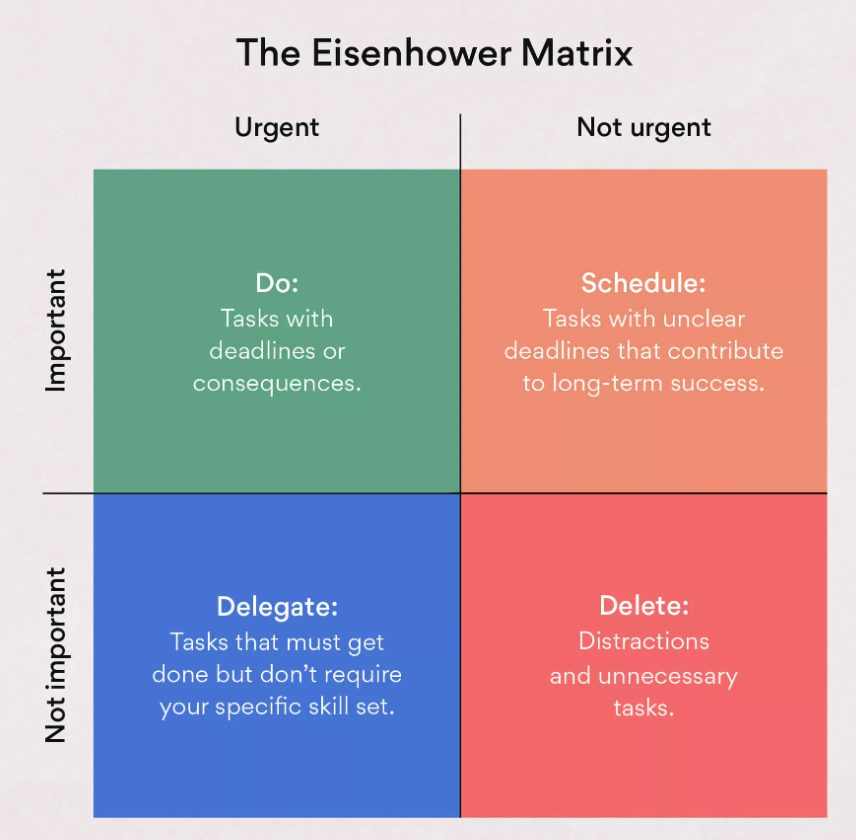

### **Mastering Time Management with the Eisenhower Matrix**

Time management is a critical skill in today’s fast-paced world, and one of the most effective tools to achieve it is the **Eisenhower Matrix**. Named after former U.S. President Dwight D. Eisenhower, this simple yet powerful framework helps individuals prioritize tasks by categorizing them based on urgency and importance.

---

### **Understanding the Eisenhower Matrix**

The Eisenhower Matrix, also known as the **Urgent-Important Matrix**, divides tasks into four quadrants:

1. **Quadrant 1: Urgent and Important**  
   These are tasks that require immediate attention and are crucial to achieving your goals. They often include crises, pressing deadlines, or emergencies.  
   **Action:** Do these tasks immediately.  

   **Examples:**  
   - Submitting a project due today.  
   - Resolving a critical client issue.  

2. **Quadrant 2: Important but Not Urgent**  
   These tasks contribute to long-term success but do not demand immediate attention. Prioritizing this quadrant is key to effective time management and personal growth.  
   **Action:** Schedule time to work on these tasks.  

   **Examples:**  
   - Planning long-term goals.  
   - Regular exercise or skill development.  

3. **Quadrant 3: Urgent but Not Important**  
   These tasks are often distractions that appear urgent but do not significantly impact your goals.  
   **Action:** Delegate these tasks, if possible.  

   **Examples:**  
   - Attending unnecessary meetings.  
   - Answering non-critical phone calls.  

4. **Quadrant 4: Neither Urgent Nor Important**  
   These are time-wasting activities that do not add value to your life or work.  
   **Action:** Eliminate these tasks.  

   **Examples:**  
   - Excessive social media scrolling.  
   - Watching irrelevant TV shows.

---

### **How to Use the Eisenhower Matrix**

1. **List Your Tasks**  
   Write down all the tasks you need to complete, regardless of priority.

2. **Categorize Tasks**  
   Assign each task to one of the four quadrants based on its urgency and importance.

3. **Take Action Based on Quadrants**  
   - **Quadrant 1:** Focus on these immediately.  
   - **Quadrant 2:** Plan and schedule time for these.  
   - **Quadrant 3:** Delegate or limit your time on these.  
   - **Quadrant 4:** Eliminate or minimize these tasks.  

4. **Review Regularly**  
   Reassess your tasks daily or weekly to adjust priorities as needed.

---

### **Benefits of the Eisenhower Matrix**

- **Improved Focus:** Helps you concentrate on what truly matters.  
- **Reduced Stress:** Prevents last-minute rushes by addressing urgent tasks in time.  
- **Better Work-Life Balance:** Ensures time for long-term goals and personal growth.  
- **Increased Productivity:** Avoids distractions and low-value tasks.  

---

### **Practical Example**

Imagine you have the following tasks for the day:

1. Finish a client report due tomorrow.  
2. Plan a strategy for next month’s project.  
3. Reply to non-urgent emails.  
4. Scroll through Instagram.  

Using the Eisenhower Matrix:  
- **Quadrant 1:** Finish the client report.  
- **Quadrant 2:** Plan the project strategy.  
- **Quadrant 3:** Delegate or delay email responses.  
- **Quadrant 4:** Skip Instagram scrolling.

---

### **Tips for Maximizing the Eisenhower Matrix**

- **Be Honest:** Accurately assess the importance and urgency of each task.  
- **Avoid Multitasking:** Focus on one quadrant at a time for better efficiency.  
- **Set Boundaries:** Say no to unnecessary tasks that fall into Quadrant 3 or 4.  
- **Leverage Tools:** Use digital tools like Trello or Asana to organize tasks visually.  

---

### **Conclusion**

The Eisenhower Matrix is not just a time management tool; it’s a mindset shift that empowers you to take control of your priorities. By focusing on what truly matters and eliminating distractions, you can achieve your goals more effectively while maintaining a healthy work-life balance. Start using the Eisenhower Matrix today and see the difference it makes in your productivity and peace of mind.