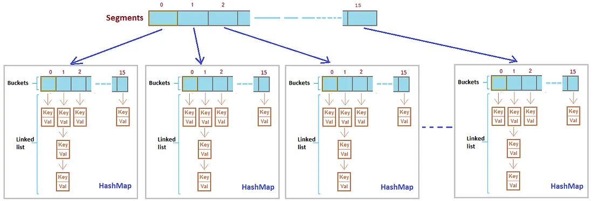

## **ConcurrentHashMap – Segmented Buckets, Thread Safety**

---

### 🚀 **Why `ConcurrentHashMap` Matters**

In backend systems that handle **high concurrency**, using a regular `HashMap` is unsafe. `HashMap` is **not thread-safe**, and under concurrent write operations, it can:

* Go into an infinite loop due to corrupted internal structure
* Lose or overwrite entries unpredictably
* Throw `ConcurrentModificationException` during iteration

To solve this, Java provides `ConcurrentHashMap` — a **thread-safe, high-performance map** implementation for multi-threaded environments.

---

### 🔧 **How It Works Internally**

#### ✅ Java 7 – Segment-Based Locking

In Java 7, `ConcurrentHashMap` used **Segmented Buckets** for concurrency control:



* Internally divided into **16 segments** by default
* Each segment acted as a mini `HashMap` with its own `ReentrantLock`
* Allowed **parallel writes** to different segments without blocking the entire map

So if 4 threads tried writing to 4 different segments, all could proceed in parallel. Reads were **mostly lock-free** unless a write was happening in the same segment.

> Think of it as a locker room with 16 lockers — one person per locker at a time, but multiple people in the room concurrently.

---

#### ✅ Java 8+ – Fine-Grained Locking & CAS

Java 8 reworked the internal design to remove `Segment` objects. Instead:

* It uses a **bucket-based array** like `HashMap`
* Uses **synchronized blocks only on specific buckets**
* Performs updates using **Compare-And-Swap (CAS)** operations
* Leverages **bin-level locking**, **lazy initialization**, and **lock-free reads**

Key optimization:

✅ `get()` is **completely non-blocking**

✅ `put()` and `remove()` lock only **a single bucket**, not the entire map

---

### 🧠 **Thread Safety in `ConcurrentHashMap`**

* **Reads** are always safe and non-blocking
* **Writes** are synchronized at a fine level (bin, node, or tree)
* **Resize operation** is done by **multiple threads cooperatively** (unlike `HashMap`)
* Disallows `null` keys and values to avoid ambiguity during concurrent access

---

### 🔥 **Why an Engineers Need to Know This**

At scale, it's common to build:

* **In-memory caches**
* **Metrics aggregators**
* **Session storage layers**
* **Distributed task trackers**

These systems require concurrent data structures that:

* Don’t become bottlenecks
* Don’t risk corruption under load
* Are lock-efficient and highly performant

Knowing how `ConcurrentHashMap` works internally helps you:

* Avoid incorrect assumptions about atomicity
* Use methods like `putIfAbsent`, `compute`, `merge` safely
* Design performant multithreaded code that scales

---

### ⚠️ **Common Pitfalls**

* Don’t treat compound actions as atomic. `if (!map.containsKey()) map.put()` is **not thread-safe** — use `computeIfAbsent()` instead.
* Avoid overusing `compute()` or `merge()` for trivial operations — they add overhead if not needed.
* Don’t synchronize externally on `ConcurrentHashMap` — it defeats its purpose.

---

### ✅ **Summary**

* Java 7 used segmented locking for coarse-grained concurrency
* Java 8+ uses CAS and fine-grained locking per bucket
* `ConcurrentHashMap` supports high-performance, thread-safe operations
* Perfect for concurrent caching, event processing, and shared registries
* Must understand its internals for real FAANG-level systems

---

__P.S.__

* ==A code example comparing `HashMap` vs `ConcurrentHashMap`==

Here’s a simple **side-by-side code example** comparing how `HashMap` and `ConcurrentHashMap` behave in a multithreaded environment.

---

### 🚨 `HashMap` – Not Thread-Safe

```java
import java.util.HashMap;
import java.util.Map;

public class HashMapRaceCondition {
    public static void main(String[] args) {
        Map<Integer, String> map = new HashMap<>();

        Runnable writer = () -> {
            for (int i = 0; i < 1000; i++) {
                map.put(i, Thread.currentThread().getName());
            }
        };

        Thread t1 = new Thread(writer, "Thread-1");
        Thread t2 = new Thread(writer, "Thread-2");

        t1.start();
        t2.start();

        try {
            t1.join();
            t2.join();
        } catch (InterruptedException ignored) {}

        System.out.println("Map size: " + map.size());
    }
}
```

**Expected Result:** Inconsistent size, possible data loss, or even `ConcurrentModificationException` in some cases.
**Why?** `HashMap` is not thread-safe and doesn't guard against concurrent structural changes.

---

### ✅ `ConcurrentHashMap` – Thread-Safe

```java
import java.util.Map;
import java.util.concurrent.ConcurrentHashMap;

public class ConcurrentHashMapSafeWrite {
    public static void main(String[] args) {
        Map<Integer, String> map = new ConcurrentHashMap<>();

        Runnable writer = () -> {
            for (int i = 0; i < 1000; i++) {
                map.put(i, Thread.currentThread().getName());
            }
        };

        Thread t1 = new Thread(writer, "Thread-1");
        Thread t2 = new Thread(writer, "Thread-2");

        t1.start();
        t2.start();

        try {
            t1.join();
            t2.join();
        } catch (InterruptedException ignored) {}

        System.out.println("Map size: " + map.size());
    }
}
```

**Expected Result:** Stable size (exactly 1000), no race conditions, no exceptions.

---

### Summary

| Feature                   | `HashMap`   | `ConcurrentHashMap` |
| ------------------------- | ----------- | ------------------- |
| Thread-safe               | ❌ No        | ✅ Yes               |
| Allows concurrent writes  | ❌ No        | ✅ Yes               |
| Use in multi-threaded env | ❌ Dangerous | ✅ Recommended       |

Let me know if you'd like the **interview questions** and **real-world case studies** next.

---

* ==Interview questions based on its internal design==

Here are **FAANG-level interview questions** focused on the **internal design of `ConcurrentHashMap`**, ranging from conceptual to deep-dive implementation details.

---

### 💬 **Basic to Mid-Level Questions**

1. **Why is `HashMap` not thread-safe? What issues can arise in a multithreaded environment?**

2. **What are the key differences between `HashMap`, `Hashtable`, and `ConcurrentHashMap`?**

3. **Can you explain how `ConcurrentHashMap` achieves thread safety for reads and writes?**

4. **Why are `null` keys and values not allowed in `ConcurrentHashMap`?**

5. **What happens internally when two threads try to update the same key in `ConcurrentHashMap`?**

---

### 🔍 **Deep-Dive Design Questions**

6. **Describe how `ConcurrentHashMap` worked in Java 7. What were segments, and how were they used?**

7. **How does the implementation change in Java 8 and above compared to Java 7?**

8. **What is the role of CAS (Compare-And-Swap) in `ConcurrentHashMap`? Where is it used?**

9. **What do you mean by "bin-level locking" in Java 8 `ConcurrentHashMap`?**

10. **Explain how rehashing/resizing is handled in `ConcurrentHashMap`. How is it different from `HashMap`?**

11. **How does Java 8’s `ConcurrentHashMap` manage collisions and convert bins to trees?**

12. **What are the concurrency guarantees for compound operations like `putIfAbsent()` and `computeIfAbsent()`? Are they atomic?**

---

### ⚠️ **Design & Tradeoff Questions**

13. **Is `ConcurrentHashMap` completely lock-free? Why or why not?**

14. **What are the performance trade-offs between using `ConcurrentHashMap` and external synchronization with `HashMap`?**

15. **In what scenarios would `ConcurrentHashMap` become a bottleneck, and what alternatives would you consider?**

16. **What is "help transfer" during resizing, and why is it important for scalability?**

17. **Can you use `ConcurrentHashMap` for implementing an LRU cache? If yes, how would you do it?**

---

These questions help interviewers assess:

* Your understanding of **low-level JVM concurrency**
* Whether you know **Java collection internals**
* If you can think in terms of **correctness, performance, and scalability**


---

* ==Real-world case studies where it solved concurrency issues==


Here are **real-world case studies** where `ConcurrentHashMap` helped solve serious concurrency challenges in backend systems...

---

### 1. **Thread-Safe In-Memory Caching in a High-Traffic API Gateway**

**Problem**:
An API gateway needed to cache token metadata (like scopes, expiry, and issuer) for incoming requests. With thousands of concurrent users, using a plain `HashMap` led to:

* Occasional `NullPointerExceptions`
* Cache entries being overwritten or corrupted
* Race conditions when two threads updated the same token

**Solution**:
Replaced `HashMap` with `ConcurrentHashMap` and used `computeIfAbsent()` to ensure only one thread populated a missing token.

**Outcome**:

* Thread-safe, lazy-loading of cache
* No more race conditions or corrupted entries
* Improved latency due to lock-free reads

---

### 2. **Request Deduplication in a Microservice**

**Problem**:
A payments service needed to prevent duplicate processing of the same transaction request sent by external clients (common due to retries). A deduplication map was maintained, but under concurrent requests, `HashMap` failed.

**Solution**:
Used `ConcurrentHashMap` with `putIfAbsent()` to track incoming transaction IDs atomically.

**Outcome**:

* Exactly-once request processing achieved
* No need for external locking or synchronized blocks
* Safe in a distributed, multithreaded environment

---

### 3. **Rate Limiting Per User in a Multi-Threaded Web Server**

**Problem**:
A web application needed to enforce rate limits per user (e.g., max 100 requests per 10 seconds). User-specific counters were stored in a shared map. With `HashMap`, the counts were unreliable under concurrent access.

**Solution**:
Switched to `ConcurrentHashMap` of userId → AtomicInteger. Each thread could increment counters safely without locking the entire map.

**Outcome**:

* Clean rate-limiting logic using concurrent access
* No data loss or update collisions
* Maintained high throughput under load

---

### 4. **Real-Time Metrics Aggregation**

**Problem**:
A telemetry system collected metrics (like response time, failure count, etc.) from multiple threads reporting in parallel. The use of synchronized wrappers led to thread contention and high CPU usage.

**Solution**:
Moved to a `ConcurrentHashMap<String, AtomicLong>` structure, allowing each thread to update individual metrics safely and concurrently.

**Outcome**:

* Improved performance with less contention
* Reliable metrics with accurate real-time updates
* Code became simpler — no manual locking required

---

### 5. **User Session Tracking in WebSocket Server**

**Problem**:
A real-time messaging backend managed thousands of WebSocket sessions mapped by sessionId. Concurrent joins and disconnects led to inconsistent session tracking and crashes.

**Solution**:
Used `ConcurrentHashMap<String, Session>` to track active connections, allowing concurrent add/remove across multiple threads.

**Outcome**:

* Session lifecycle became thread-safe
* No more concurrent modification issues
* Reduced operational bugs during spikes in connection volume

---

Below it's expanded with code or diagram. These examples also work great in system design discussions where you're asked to justify your choice of data structures.

Let’s expand **Case Study #2 – Request Deduplication in a Microservice**, since it's one of the most commonly discussed real-world scenarios in FAANG interviews, especially in **payments**, **inventory systems**, or **event-driven architectures**.

---

## **Real-World Case Study: Request Deduplication in a Microservice**

---

### 🧩 Problem Context

A **payments microservice** was exposed to clients (mobile apps, partner APIs, etc.) which could **re-send the same request multiple times**, often due to:

* network instability,
* retries from client libraries,
* frontend double-clicks.

The service was supposed to be **idempotent** — meaning the same request should only be **processed once**.

Initially, the team used a simple `HashMap<String, Boolean>` to store the processed transaction IDs (`txnId`) as a deduplication mechanism.

But under load, things fell apart:

* Multiple threads accessed the `HashMap` at the same time.
* Duplicate transactions occasionally slipped through.
* Sometimes transactions were skipped entirely or overwritten.
* CPU usage spiked due to thread contention from external `synchronized` blocks trying to guard the map.

---

### 💡 Solution: Use `ConcurrentHashMap` with `putIfAbsent`

They replaced the unsafe `HashMap` with a **`ConcurrentHashMap<String, Boolean>`** where the key was `txnId`.

```java
private final Map<String, Boolean> deduplicationCache = new ConcurrentHashMap<>();

public boolean shouldProcess(String txnId) {
    // putIfAbsent returns null if key was not present
    return deduplicationCache.putIfAbsent(txnId, true) == null;
}
```

Then in the processing logic:

```java
public void processTransaction(Transaction txn) {
    if (!shouldProcess(txn.getTxnId())) {
        // Transaction already processed
        return;
    }

    // Safe to process
    paymentProcessor.charge(txn);

    // Response sent back to client
}
```

---

### ✅ Outcome

* **Thread-safe deduplication** without any manual locking
* **Atomic check-then-insert** behavior using `putIfAbsent`
* No race conditions even under heavy traffic
* Easier to maintain and scale, with minimal code

---

### 🔍 What Interviewers Care About

1. **Why is `putIfAbsent()` important here instead of `containsKey()` followed by `put()`?**
   Because it avoids race conditions — two threads may both find the key absent before the `put()` if used separately.

2. **How would you expire old entries?**
   You could use `ConcurrentHashMap` + `ScheduledExecutorService` or better, a `Cache<String, Boolean>` with `Caffeine` or `Guava` with TTL (time-to-live).

3. **What happens when the map grows indefinitely?**
   In real systems, add eviction logic — use LRU-style maps or switch to distributed caches (like Redis) for persistence and scale.

---

### 🧠 Lessons Learned

* Use `ConcurrentHashMap` to safely manage shared, mutable state across threads.
* Use atomic operations like `putIfAbsent`, `computeIfAbsent`, and `merge`.
* Never trust `containsKey()` followed by `put()` in concurrent code — it’s not atomic.
* Simpler concurrency tools (when used correctly) beat complex locking schemes.


