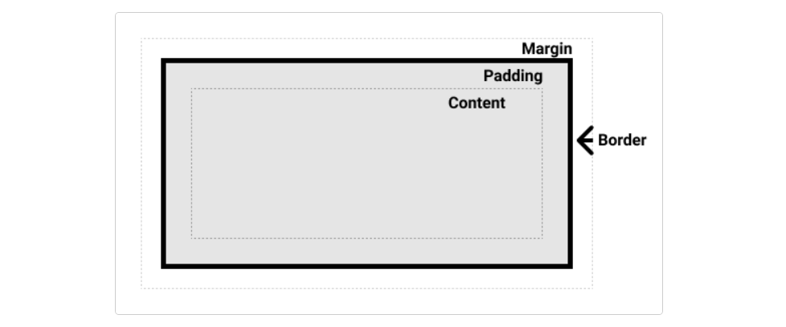
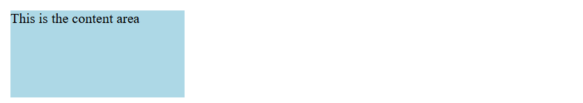
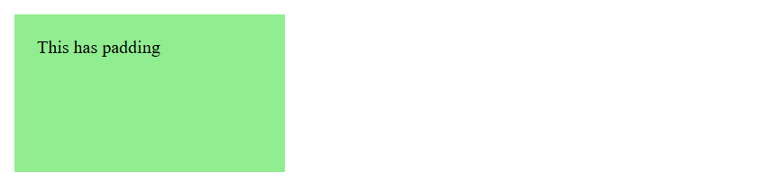
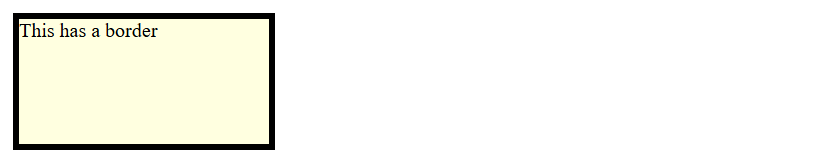
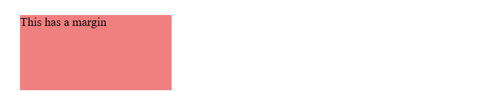
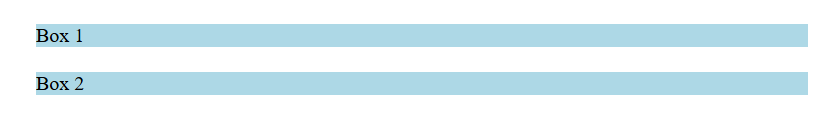
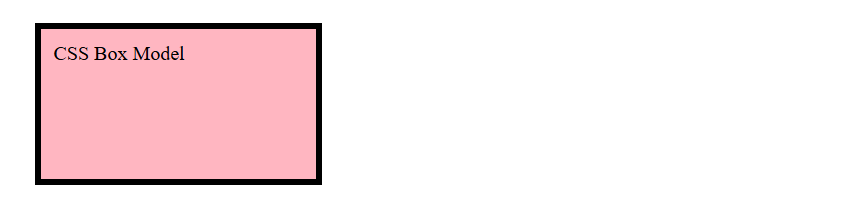

# Mastering the CSS Box Model: Content, Padding, Border, and Margin  

The CSS Box Model is the cornerstone of web design, providing the structure and spacing for all elements on a webpage. Understanding its components—**Content**, **Padding**, **Border**, and **Margin**—is essential for building visually appealing and well-structured layouts. In this blog, we’ll break down the box model step by step with detailed explanations and examples.  

---

## **What is the CSS Box Model?**  

The box model represents the structure of every element on a webpage. It describes how the element’s **content**, **padding**, **border**, and **margin** interact and affect the overall size and spacing of the element.  

### **Structure of the Box Model**  
1. **Content**: The innermost part, where text, images, or other content resides.  
2. **Padding**: The space between the content and the border.  
3. **Border**: The edge around the padding, which can be styled with color, width, and patterns.  
4. **Margin**: The outermost layer, providing space between the element and its neighbors.  




---

## **1. Content**  

The **content** is the area where text, images, and other media are displayed. The size of the content is determined by properties such as `width` and `height`.  

### **Example**  

```html
<div class="content-box">This is the content area</div>
```  

```css
.content-box {
  width: 200px;
  height: 100px;
  background-color: lightblue;
}
```  

**Result:**  
The `div` has a fixed size of 200px by 100px, and its content is displayed within this area.  




---

## **2. Padding**  

The **padding** is the space between the content and the border. It ensures that the content doesn’t touch the border directly. Padding is affected by the `padding` property, which can be set for all sides or individually.  

### **Example**  

```html
<div class="padding-box">This has padding</div>
```  

```css
.padding-box {
  width: 200px;
  height: 100px;
  padding: 20px;
  background-color: lightgreen;
}
```  

**Result:**  
The `div`’s content is pushed inward by 20px from all sides, increasing the total size.  




### **Individual Padding Properties**  
You can set padding for specific sides:  
- `padding-top`  
- `padding-right`  
- `padding-bottom`  
- `padding-left`  

```css
padding: 10px 20px 30px 40px; /* Top, Right, Bottom, Left */
```  

---

## **3. Border**  

The **border** wraps around the padding and content, adding a visible edge to the element. Borders can be styled with properties such as `border-width`, `border-style`, and `border-color`.  

### **Example**  

```html
<div class="border-box">This has a border</div>
```  

```css
.border-box {
  width: 200px;
  height: 100px;
  border: 5px solid black;
  background-color: lightyellow;
}
```  

**Result:**  
The `div` has a black border of 5px thickness around the content and padding.  




### **Shorthand for Borders**  
```css
border: 2px dashed red; /* Width, Style, Color */
```  

### **Individual Border Properties**  
Borders can be set for specific sides:  
- `border-top`  
- `border-right`  
- `border-bottom`  
- `border-left`  

---

## **4. Margin**  

The **margin** is the outermost layer, providing space between an element and its neighbors. Margins are often used for spacing and alignment.  

### **Example**  

```html
<div class="margin-box">This has a margin</div>
```  

```css
.margin-box {
  width: 200px;
  height: 100px;
  margin: 20px;
  background-color: lightcoral;
}
```  

**Result:**  
The `div` has 20px of space around it, separating it from adjacent elements.  




### **Individual Margin Properties**  
Margins can be set for specific sides:  
- `margin-top`  
- `margin-right`  
- `margin-bottom`  
- `margin-left`  

```css
margin: 10px 20px 30px 40px; /* Top, Right, Bottom, Left */
```  

---

## **Practical Scenarios and Tips**  

### **1. Understanding Box Sizing**  

By default, the `width` and `height` of an element apply only to the content area. However, you can change this behavior using the `box-sizing` property.  

- **Default (`content-box`)**: Width and height include only the content.  
- **Border-box**: Width and height include ==content==, ==padding==, and ==border==.  

```css
.box-sizing-example {
  width: 200px;
  height: 100px;
  padding: 20px;
  border: 5px solid black;
  box-sizing: border-box; /* Total size is fixed at 200x100 */
}
```  

---

### **2. Collapsing Margins**  

When two elements have margins that touch, the larger margin takes precedence instead of summing up.  

```html
<div class="box1">Box 1</div>
<div class="box2">Box 2</div>
```  

```css
.box1, .box2 {
  margin: 20px;
  background-color: lightblue;
}
```  

**Result:**  
The space between the boxes will be 20px, not 40px, due to margin collapsing.  




---

### **3. Negative Margins**  

You can use negative margins to pull elements closer or overlap them.  

```css
.negative-margin {
  margin-top: -10px;
}
```  

---

## **Combining Box Model Properties**  

Here’s an example that combines all box model components:  

```html
<div class="combined-box">CSS Box Model</div>
```  

```css
.combined-box {
  width: 200px;
  height: 100px;
  padding: 10px;
  border: 5px solid black;
  margin: 20px;
  background-color: lightpink;
}
```  

**Result:**  
- Content: 200px by 100px  
- Padding: 10px (expands total inner space)  
- Border: 5px (adds visual edge)  
- Margin: 20px (creates spacing from other elements)  



---

## **Conclusion**  

The CSS Box Model is foundational for web design, controlling how elements are sized and spaced. Mastering its components—content, padding, border, and margin—will empower you to create responsive and visually appealing layouts.  

Experiment with the box model to refine your designs and ensure consistency across your web projects!