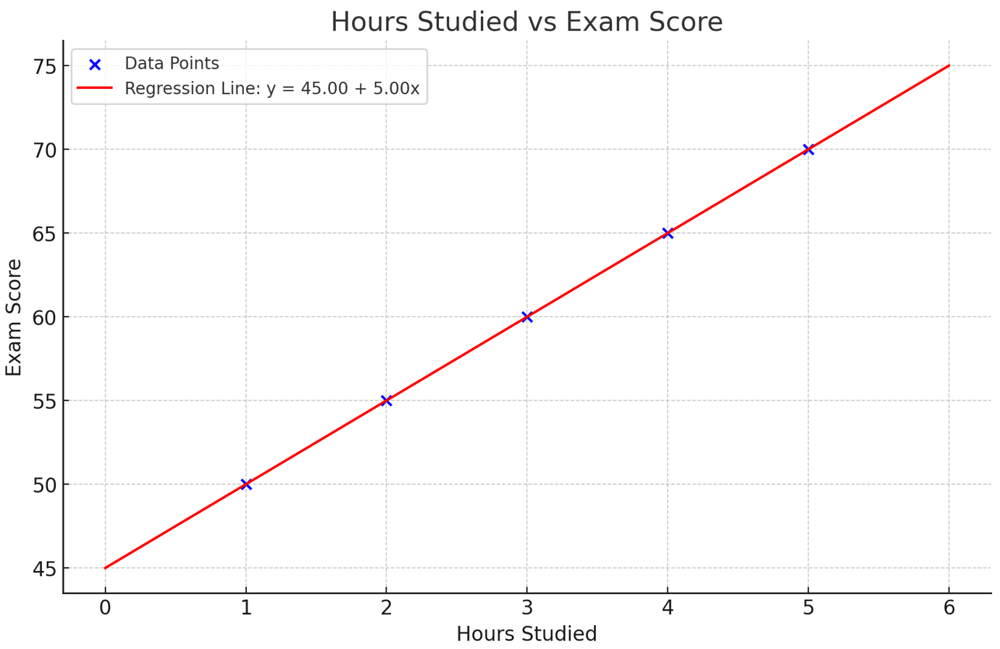

### **A Comprehensive Guide to Simple Linear Regression**

Simple Linear Regression is a fundamental statistical technique used to understand and model the relationship between two variables. This method is widely applied in various fields, including economics, biology, engineering, and machine learning, to make predictions and derive insights from data.

---

### **What is Simple Linear Regression?**

Simple linear regression is a technique used to model the relationship between a **dependent variable** (response) and an **independent variable** (predictor) by fitting a straight line through the data points. This line is known as the **regression line**.

### **Key Equation**
The equation for simple linear regression is:

\[
y = b_0 + b_1x + \epsilon
\]

Where:
- \( y \): Dependent variable (what you want to predict or understand)
- \( x \): Independent variable (predictor or input variable)
- \( b_0 \): Intercept (the value of \( y \) when \( x = 0 \))
- \( b_1 \): Slope (the change in \( y \) for a one-unit change in \( x \))
- \( \epsilon \): Error term (captures the noise or variability in \( y \) that \( x \) cannot explain)

---

### **Goals of Simple Linear Regression**

1. **Model the Relationship**: Understand how the independent variable affects the dependent variable.
2. **Predict Outcomes**: Use the regression model to predict the value of \( y \) for new values of \( x \).
3. **Interpret Coefficients**: Determine the strength and direction of the relationship between variables.

---

### **Steps to Perform Simple Linear Regression**

#### **1. Collect Data**
The first step is to gather data that contains both the independent variable (\( x \)) and the dependent variable (\( y \)).

#### **2. Plot the Data**
Create a scatter plot to visualize the relationship between \( x \) and \( y \). This helps in identifying patterns or trends.

#### **3. Compute the Regression Line**
The line of best fit is computed using the least squares method, which minimizes the sum of the squared residuals (differences between actual and predicted values).

\[
b_1 = \frac{\sum (x_i - \bar{x})(y_i - \bar{y})}{\sum (x_i - \bar{x})^2}
\]

\[
b_0 = \bar{y} - b_1\bar{x}
\]

Where:
- \( \bar{x} \): Mean of \( x \)
- \( \bar{y} \): Mean of \( y \)

#### **4. Evaluate the Model**
Use metrics such as \( R^2 \), Mean Squared Error (MSE), or Root Mean Squared Error (RMSE) to assess the model’s performance.

#### **5. Make Predictions**
Once the model is trained, you can use it to predict the dependent variable for new values of the independent variable.

---

### **Assumptions of Simple Linear Regression**

1. **Linearity**: The relationship between \( x \) and \( y \) is linear.
2. **Independence**: Observations are independent of each other.
3. **Homoscedasticity**: The variance of residuals is constant across all values of \( x \).
4. **Normality of Residuals**: The residuals (errors) are normally distributed.

---

### **Example of Simple Linear Regression**

#### Problem Statement:
Suppose you are studying the relationship between the number of hours studied (\( x \)) and exam scores (\( y \)).

#### Dataset:
| Hours Studied (\( x \)) | Exam Score (\( y \)) |
|--------------------------|----------------------|
| 1                        | 50                   |
| 2                        | 55                   |
| 3                        | 60                   |
| 4                        | 65                   |
| 5                        | 70                   |

#### ==Step 1: Calculate \( b_1 \) and \( b_0 \)==

To compute the slope (\( b_1 \)) and intercept (\( b_0 \)) of the regression line in simple linear regression, we use the following formulas:

\[
b_1 = \frac{\sum (x_i - \bar{x})(y_i - \bar{y})}{\sum (x_i - \bar{x})^2}
\]

\[
b_0 = \bar{y} - b_1 \bar{x}
\]

Here’s a detailed breakdown:

---

**Understanding the Variables**
- \( x_i \): Each data point in the independent variable (\( X \)).
- \( y_i \): Each data point in the dependent variable (\( Y \)).
- \( \bar{x} \): Mean of the \( X \) values.
- \( \bar{y} \): Mean of the \( Y \) values.
- \( b_1 \): Slope of the regression line (how much \( Y \) changes for a unit change in \( X \)).
- \( b_0 \): Intercept of the regression line (value of \( Y \) when \( X = 0 \)).

---

**Data Points**

We have the following data:

| \( X \) (Hours) | \( Y \) (Scores) |
|-----------------|------------------|
| 1               | 50               |
| 2               | 55               |
| 3               | 60               |
| 4               | 65               |
| 5               | 70               |

---

**Calculating the Means**
1. Mean of \( X \) (\( \bar{x} \)):
\[
\bar{x} = \frac{\text{Sum of } X}{\text{Number of data points}} = \frac{1+2+3+4+5}{5} = 3
\]

1. Mean of \( Y \) (\( \bar{y} \)):
\[
\bar{y} = \frac{\text{Sum of } Y}{\text{Number of data points}} = \frac{50+55+60+65+70}{5} = 60
\]

---

**Computing the Numerator and Denominator for \( b_1 \)**
1. Compute \( (x_i - \bar{x})(y_i - \bar{y}) \) for each data point:

| \( x_i \) | \( y_i \) | \( x_i - \bar{x} \) | \( y_i - \bar{y} \) | \( (x_i - \bar{x})(y_i - \bar{y}) \) |
|-----------|-----------|---------------------|---------------------|------------------------------------|
| 1         | 50        | \( 1 - 3 = -2 \)    | \( 50 - 60 = -10 \)  | \( (-2)(-10) = 20 \)               |
| 2         | 55        | \( 2 - 3 = -1 \)    | \( 55 - 60 = -5 \)   | \( (-1)(-5) = 5 \)                 |
| 3         | 60        | \( 3 - 3 = 0 \)     | \( 60 - 60 = 0 \)    | \( 0 \times 0 = 0 \)               |
| 4         | 65        | \( 4 - 3 = 1 \)     | \( 65 - 60 = 5 \)    | \( (1)(5) = 5 \)                   |
| 5         | 70        | \( 5 - 3 = 2 \)     | \( 70 - 60 = 10 \)   | \( (2)(10) = 20 \)                 |

\[
\sum (x_i - \bar{x})(y_i - \bar{y}) = 20 + 5 + 0 + 5 + 20 = 50
\]

2. Compute \( (x_i - \bar{x})^2 \) for each data point:

| \( x_i \) | \( x_i - \bar{x} \) | \( (x_i - \bar{x})^2 \) |
|-----------|---------------------|-------------------------|
| 1         | \( 1 - 3 = -2 \)    | \( (-2)^2 = 4 \)        |
| 2         | \( 2 - 3 = -1 \)    | \( (-1)^2 = 1 \)        |
| 3         | \( 3 - 3 = 0 \)     | \( (0)^2 = 0 \)         |
| 4         | \( 4 - 3 = 1 \)     | \( (1)^2 = 1 \)         |
| 5         | \( 5 - 3 = 2 \)     | \( (2)^2 = 4 \)         |

\[
\sum (x_i - \bar{x})^2 = 4 + 1 + 0 + 1 + 4 = 10
\]

---

**Calculating the Slope (\( b_1 \))**
\[
b_1 = \frac{\sum (x_i - \bar{x})(y_i - \bar{y})}{\sum (x_i - \bar{x})^2} = \frac{50}{10} = 5
\]

---

**Calculating the Intercept (\( b_0 \))**
\[
b_0 = \bar{y} - b_1 \bar{x} = 60 - (5 \times 3) = 60 - 15 = 45
\]

---

#### ==Step 2: Regression Equation==

Substitute \( b_0 \) and \( b_1 \) to get the regression equation, such as:

\[
Y = b_0 + b_1X = 45 + 5X
\]

### **Explanation**
- The slope (\( b_1 = 5 \)) means that for every additional hour studied, the score increases by 5 points.
- The intercept (\( b_0 = 45 \)) means that if no hours are studied (\( X = 0 \)), the expected score is 45.

This regression line allows us to predict scores based on the number of hours studied.

#### ==Step 3: Make Predictions==
If a student studies for 6 hours, their predicted exam score is:
\[
y = 45 + 5(6) = 75
\]

#### Visualization:

---

### **Interpreting the Results**

1. **Intercept (\( b_0 \))**: This is the expected value of \( y \) when \( x = 0 \). In this case, if a student studies for 0 hours, their predicted score is 45.
2. **Slope (\( b_1 \))**: This indicates that for every additional hour studied, the exam score increases by 5 points.

---

### **Applications of Simple Linear Regression**

1. **Predictive Analytics**: Forecasting sales, revenue, or demand.
2. **Medical Research**: Understanding the effect of a drug dosage on patient health.
3. **Social Sciences**: Analyzing the impact of education on income levels.
4. **Engineering**: Estimating system performance based on input variables.

---

### **Advantages**

- Easy to implement and interpret.
- Provides a baseline for more complex models.
- Effective for simple relationships.

---

### **Limitations**

- Assumes a linear relationship, which may not always be true.
- Sensitive to outliers, which can skew results.
- Cannot handle multiple predictors (use multiple regression instead).

---

### **Conclusion**

Simple Linear Regression is a foundational tool in data analysis and machine learning. It is easy to implement yet powerful enough to uncover valuable insights about relationships between variables. By understanding its assumptions and properly applying it, you can make accurate predictions and derive meaningful conclusions.

Start practicing simple linear regression today with datasets to strengthen your data analytics and modeling skills!