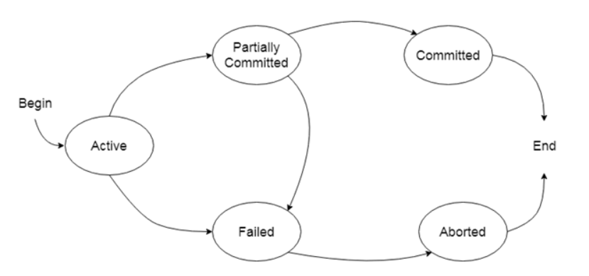

# **Transaction States in DBMS**

A transaction in a Database Management System (DBMS) is a logical unit of work ==that comprises a series of operations==. Transactions ensure the integrity of data even in the event of system failures or concurrent execution. The lifecycle of a transaction involves multiple states, each representing a specific phase in the transaction's execution.

In this blog, we’ll delve into the **Transaction States**, explain their significance, and illustrate the concepts with examples.

---

## **What are Transaction States?**

Transaction states represent the stages that a transaction goes through during its lifecycle. These states track whether a transaction is actively being processed, completed successfully, or terminated due to failure.

---

## **Transaction States**

A transaction can be in one of the following states:

1. **Active**
2. **Partially Committed**
3. **Committed**
4. **Failed**
5. **Aborted**

### 1. **Active State**
- A transaction enters the **active state** as soon as it starts execution.
- Operations like reading or writing data are performed in this state.
- A transaction remains in this state until it completes all its operations or encounters an error.

#### **Example:**
Suppose a banking system transaction involves transferring ₹5000 from Account A to Account B:
1. ==The transaction begins==.
2. ₹5000 is debited from Account A.
   - The transaction is in the **active state** during this process.

---

### 2. **Partially Committed State**
- After executing the final statement, the transaction moves to the **partially committed state**.
- At this point, the changes are made in the database but not yet permanently saved (committed).

#### **Example:**
Continuing the bank transfer example:
1. The transaction debits ₹5000 from Account A and credits ₹5000 to Account B.
2. ==All the operations complete successfully==.
   - The transaction enters the **partially committed state**.

---

### 3. **Committed State**
- A transaction moves to the **committed state** ==once all changes are made permanent in the database==.
- At this point, the transaction is considered successfully completed, and the changes are visible to other transactions.

#### **Example:**
In the bank transfer:
1. After the transaction is verified and successfully executed:
   - The debited amount is permanently deducted from Account A.
   - The credited amount is permanently added to Account B.
   - The transaction enters the **committed state**.

---

### 4. **Failed State**
- If a transaction encounters an error during execution, it moves to the **failed state**.
- Errors may occur due to reasons such as system crashes, deadlocks, or violations of constraints.

#### **Example:**
Suppose Account A has ₹3000, and the transaction attempts to transfer ₹5000:
1. The transaction tries to debit ₹5000.
2. Insufficient funds cause the transaction to fail.
   - The transaction moves to the **failed state**.

---

### 5. **Aborted State**
- After a transaction moves to the failed state, it is rolled back to its previous consistent state and enters the **aborted state**.
- All changes made by the transaction are undone.

#### **Example:**
In the insufficient funds scenario:
1. The transaction rolls back any debited amount.
2. The database is restored to its state before the transaction started.
   - The transaction enters the **aborted state**.

---

## **State Transition Diagram**

The state transitions can be visualized in the following diagram:

```
[Active] ---> [Partially Committed] ---> [Committed]
   |                  |
   v                  v
[Failed] ----------> [Aborted]
```

### **Explanation of Transitions**:
1. **Active → Partially Committed**: When the transaction executes its final operation.
2. **Partially Committed → Committed**: When the database successfully writes the changes permanently.
3. **Active → Failed**: When an error occurs during the transaction.
4. **Failed → Aborted**: When changes made by the transaction are rolled back.

---

## **Example: E-Commerce Order Processing**

Consider a scenario where an e-commerce system processes an order:
1. Deduct the product's quantity from inventory.
2. Update the order status to "Confirmed."
3. Generate a payment receipt.

### Transaction States:
1. **Active**: The transaction begins and starts updating the inventory.
2. **Partially Committed**: The inventory is updated, and the order status is changed, but the receipt is not yet generated.
3. **Committed**: The payment receipt is successfully generated, and all changes are made permanent.
4. **Failed**: If the payment gateway fails, the transaction moves to the failed state.
5. **Aborted**: All changes, such as restoring inventory and canceling the order, are rolled back.





---

## **Importance of Transaction States**

1. **Error Handling**: Helps in identifying and handling errors effectively.
2. **Data Integrity**: ==Ensures that incomplete or failed transactions do not leave the database in an inconsistent state.==
3. **Concurrency Management**: Facilitates proper transaction management in multi-user environments.

---

## **Conclusion**

Transaction states in DBMS are essential for ensuring reliable and robust database operations. By understanding the lifecycle of a transaction—from its active state to commit or abort—you can design systems that handle failures gracefully and maintain data consistency.

Whether it’s processing financial transactions, managing inventory, or handling e-commerce orders, the concept of transaction states ensures that databases operate seamlessly, even in the face of concurrent access or unexpected failures.