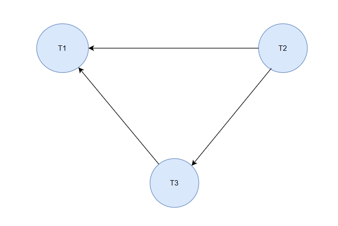

# Serializability and Precedence Graphs: A Comprehensive Guide

In database management systems (DBMS), **serializability** is a fundamental concept that ensures the correctness of transactions executed concurrently. A schedule of transactions is considered serializable if the outcome of the concurrent execution is the same as some serial execution of the transactions. ==To determine whether a schedule is serializable, we often use **precedence graphs** as a tool==. This blog will delve into the details of serializability, precedence graphs, and their practical applications.

---

## **What is Serializability?**
Serializability ensures that the concurrent execution of transactions maintains the integrity and consistency of the database. It is a criterion for evaluating the correctness of transaction schedules.

### **Types of Serializability**
1. **Conflict Serializability**:
   - A schedule is conflict-serializable if it can be transformed into a serial schedule by swapping non-conflicting operations.

2. **View Serializability**:
   - A schedule is view-serializable if the final result is the same as that of a serial schedule, even if conflicting operations are not swapped.

While view serializability is more general, conflict serializability is easier to test and is widely used in practice.

---

## **What is a Precedence Graph?**
A **precedence graph** (also called a **serialization graph**) is a directed graph used to determine whether a schedule is conflict-serializable. It captures the dependencies between transactions in a schedule.

### **Components of a Precedence Graph**
1. **Nodes**:
   - Each node represents a transaction.

2. **Edges**:
   - A directed edge from transaction `T1` to `T2` (denoted as `T1 → T2`) indicates that `T1` must precede `T2` in the serial schedule ==due to a conflict==.

3. **Conflicts**:
   - ==A conflict arises when two transactions access the same data item, and at least one operation is a write==. Types of conflicts:
     - **Read-Write (RW) Conflict**: `T1: Read(A)` and `T2: Write(A)`.
     - **Write-Read (WR) Conflict**: `T1: Write(A)` and `T2: Read(A)`.
     - **Write-Write (WW) Conflict**: `T1: Write(A)` and `T2: Write(A)`.

### **How to Test Serializability Using a Precedence Graph**
1. **Identify Transactions and Operations**:
   - List all operations (read, write) and their associated transactions.

2. **Find Conflicts**:
   - Identify pairs of conflicting operations between transactions.

3. **Create Nodes**:
   - Add a node for each transaction.

4. **Add Directed Edges**:
   - Draw an edge from `T1` to `T2` if `T1`'s operation conflicts with `T2`'s and occurs earlier in the schedule.

5. **Check for Cycles**:
   - If the graph contains a cycle, the schedule is **not conflict-serializable**.

---

## **Examples of Precedence Graphs**

### **Example 1: Conflict-Serializable Schedule**
**Schedule:**
```
T1: Read(A), Write(A)
T2: Read(A), Write(B)
```

**Steps:**
1. **Identify Conflicts:**
   - `T1: Write(A)` conflicts with `T2: Read(A)` (Write-Read conflict).
2. **Create Nodes:**
   - Nodes: `T1`, `T2`.
3. **Add Edges:**
   - Add an edge from `T1` to `T2` because `T1` writes to `A` before `T2` reads `A`.
4. **Check Cycles:**
   - No cycles in the graph.

**Precedence Graph:**
```
T1 → T2
```

**Conclusion:**
The schedule is conflict-serializable.

---

### **Example 2: Non-Conflict-Serializable Schedule**
**Schedule:**
```
T1: Read(A), Write(B)
T2: Read(B), Write(A)
```

**Steps:**
1. **Identify Conflicts:**
   - `T1: Write(B)` conflicts with `T2: Read(B)` (Write-Read conflict).
   - `T2: Write(A)` conflicts with `T1: Read(A)` (Write-Read conflict).
2. **Create Nodes:**
   - Nodes: `T1`, `T2`.
3. **Add Edges:**
   - Add an edge from `T1` to `T2` for the first conflict.
   - Add an edge from `T2` to `T1` for the second conflict.
4. **Check Cycles:**
   - The graph has a cycle: `T1 → T2 → T1`.

**Precedence Graph:**
```
T1 → T2
↑       ↓
T2 ← T1
```

**Conclusion:**
The schedule is not conflict-serializable.

---

## **Advantages of Using Precedence Graphs**
1. **Visual Representation**:
   - Makes it easy to analyze dependencies and conflicts.

2. **Efficient Testing**:
   - Detects cycles (or, loops) quickly to determine serializability.

3. **Practical Application**:
   - Used in database systems to ensure conflict-free transaction execution.

---

## **Conclusion**
Serializability is a cornerstone of concurrency control in DBMS, ensuring the integrity and consistency of data during concurrent transactions. Precedence graphs provide a systematic way to test for conflict serializability by visualizing transaction dependencies and conflicts. By understanding and applying these concepts, database designers can optimize transaction schedules for both performance and correctness.

> **Note** : No cycle/loop in the precedence graph confirms, its conflict serializable. Means there exits a serial schedule exists for this non-serial schedule. Since its serializable, its consistent. 

Using the precedence graph, we can show the serial schedule of the non-serial conflict serializable schedule. 

**Example :**

Let's consider a more complex example with three transactions \( T_1 \), \( T_2 \), and \( T_3 \).

### Transactions:

1. \( T_1 \): \( R(X), R(Z), W(X), W(Z) \)
2. \( T_2 \): \( R(Y), R(Z), W(Z) \)
3. \( T_3 \): \( R(Y), R(X), W(Y) \)

### Schedule \( S \):
```
R1(X), R3(Y), R3(X), R2(Y), R2(Z), W3(Y), W2(Z), R1(Z), W1(X), W1(Z)
```

### Table Representation:

| **Step** | **\( T_1 \)** | **\( T_2 \)** | **\( T_3 \)** |
|----------|---------------|---------------|---------------|
| 1        | \( R1(X) \)   |               |               |
| 2        |               |               | \( R3(Y) \)   |
| 3        |               |               | \( R3(X) \)   |
| 4        |               | \( R2(Y) \)   |               |
| 5        |               | \( R2(Z) \)   |               |
| 6        |               |               | \( W3(Y) \)   |
| 7        |               | \( W2(Z) \)   |               |
| 8        | \( R1(Z) \)   |               |               |
| 9        | \( W1(X) \)   |               |               |
| 10       | \( W1(Z) \)   |               |               |


### Step 1: Identify Conflicts
Conflicting operations occur when:
- The same data item is accessed.
- At least one of the operations is a write.
- ==Operations belong to different transactions.==

#### Conflicts in \( S \):
1. \( R3(X) \) and \( W1(X) \): \( T_3 \to T_1 \)
2. \( R2(Y) \) and \( W3(Y) \): \( T_2 \to T_3 \)
3. \( R2(Z) \) and \( W1(Z) \): \( T_2 \to T_1 \)
4. \( W2(Z) \) and \( W1(Z) \): \( T_2 \to T_1 \)

### Step 2: Construct Precedence Graph
1. **Nodes**: \( T_1 \), \( T_2 \), \( T_3 \)
2. **Edges**:
   - \( T_2 \to T_1 \) (from conflicts on \( Z \)).
   - \( T_2 \to T_3 \) (from conflicts on \( Y \)).
   - \( T_3 \to T_1 \) (from conflicts on \( X \)).





#### Graph:
- \( T_2 \to T_1 \)
- \( T_2 \to T_3 \)
- \( T_3 \to T_1 \)

### Step 3: Check for Cycles
The graph contains no cycles. This means the schedule \( S \) is **conflict-serializable**.

---

### Finding the equivalent serial schedule of it:

1. Using the precedence graph we can find the equivalent serial schedule. 
2. With 3 nodes, we have 8 possible serial schedules possible and they are T1T2T3, T1T3T2, T2T1T3, T2T3T1 etc.. Out of which we can find the schedules which are equivalent to the non-serial conflict serializable schedule.  
3. First find the node with in-order 0. Here its T2. 
4. Erase T2 from Graph. Now the remaining T3 and T1. The node with in-order 0 is T3. 
5. Erase T3 from Graph. Now the remaining T1 node.
6. Hence the serial schedule we got is, T2 -> T3 -> T1. 

### Schedule \( S \):
```
R2(Y), R2(Z), W2(Z), R3(Y), R3(X), W3(Y), R1(X), R1(Z), W1(X), W1(Z)
```

### Table Representation:

| **Step** | **\( T_1 \)** | **\( T_2 \)** | **\( T_3 \)** |
|----------|---------------|---------------|---------------|
| 1        |               | \( R2(Y) \)   |               |
| 2        |               | \( R2(Z) \)   |               |
| 3        |               | \( W2(Z) \)   |               |
| 4        |               |               | \( R3(Y) \)   |
| 5        |               |               | \( R3(X) \)   |
| 6        |               |               | \( W3(Y) \)   |
| 7        | \( R1(X) \)   |               |               |
| 8        | \( R1(Z) \)   |               |               |
| 9        | \( W1(X) \)   |               |               |
| 10       | \( W1(Z) \)   |               |               |

---

> If we get loop in precedence graph, then its not guaranteed that whether the schedule is serializable or not. There is another way To check it using view serializability.