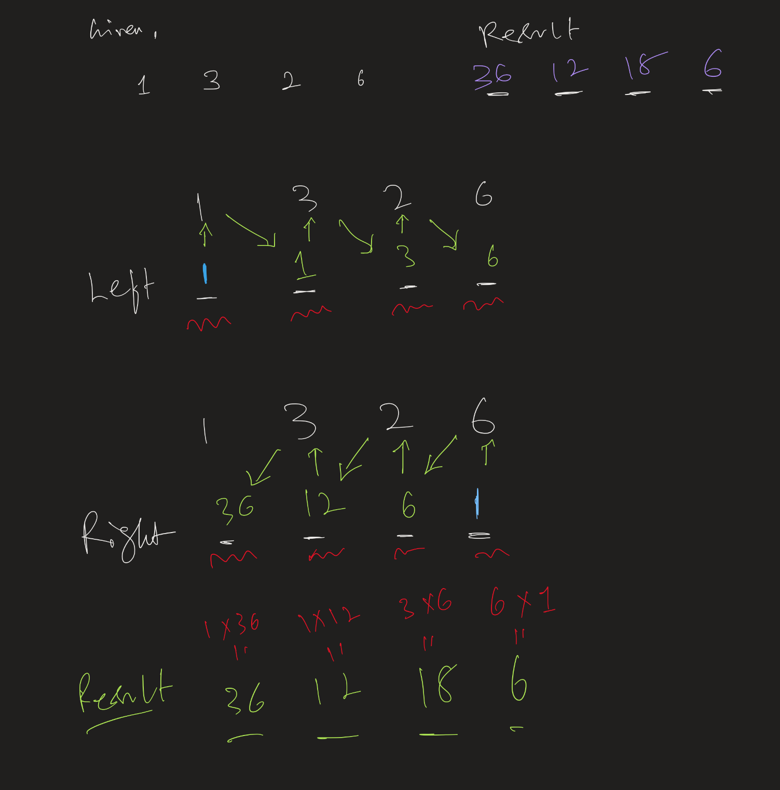
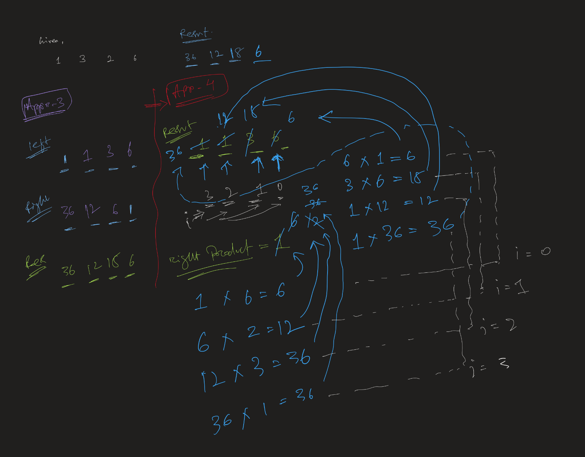

The **"[Product of Array Except Self](https://leetcode.com/problems/product-of-array-except-self/?envType=study-plan-v2&envId=top-interview-150)"** problem on LeetCode asks you to return an array such that each element at index `i` is the product of all elements in the array except the one at `i`, **without using division** and in **O(n) time complexity**.


### **Example**
#### **Input**:
```plaintext
nums = [1, 2, 3, 4]
```
#### **Output**:
```plaintext
[24, 12, 8, 6]
```
Explanation:
- `output[0] = 2 × 3 × 4 = 24`
- `output[1] = 1 × 3 × 4 = 12`
- `output[2] = 1 × 2 × 4 = 8`
- `output[3] = 1 × 2 × 3 = 6`

---


## 🔁 Approach 1: Brute Force (❌ TLE)

- **Idea:** For each `i`, multiply all elements except `nums[i]`
- **Time Complexity:** O(n²)
- **Space Complexity:** O(1) (excluding output)

```java
int[] result = new int[nums.length];
for (int i = 0; i < nums.length; i++) {
    int prod = 1;
    for (int j = 0; j < nums.length; j++) {
        if (i != j) prod *= nums[j];
    }
    result[i] = prod;
}
```

---

## 🚫 Approach 2: Division Method (Not allowed)

- **Idea:** Multiply all elements, then divide total by `nums[i]`
- **Fails:** If `nums[i] == 0` or multiple zeros exist
- **Time:** O(n), Space: O(1)
- **Not valid per problem constraint**

---

## ✅ Approach 3: Two-Pass with Left and Right Product Arrays

### Step-by-step:
- Create:
  - `left[i]`: product of all elements to the **left** of `i`
  - `right[i]`: product of all elements to the **right** of `i`
- Final result: `answer[i] = left[i] * right[i]`

### Code:
```java
public int[] productExceptSelf(int[] nums) {
    int n = nums.length;
    int[] left = new int[n];
    int[] right = new int[n];
    int[] result = new int[n];

    left[0] = 1;
    for (int i = 1; i < n; i++) {
        left[i] = left[i - 1] * nums[i - 1];
    }

    right[n - 1] = 1;
    for (int i = n - 2; i >= 0; i--) {
        right[i] = right[i + 1] * nums[i + 1];
    }

    for (int i = 0; i < n; i++) {
        result[i] = left[i] * right[i];
    }
    return result;
}
```




- **Time Complexity:** O(n)
- **Space Complexity:** O(n) extra

---

## ✅ Approach 4: Optimal Space (Single Output Array + Prefix)

> Use result array to store left products, then multiply with right product in reverse pass

```java
public int[] productExceptSelf(int[] nums) {
    int n = nums.length;
    int[] result = new int[n];

    result[0] = 1;
    for (int i = 1; i < n; i++) {
        result[i] = result[i - 1] * nums[i - 1];
    }

    int rightProduct = 1;
    for (int i = n - 1; i >= 0; i--) {
        result[i] *= rightProduct;
        rightProduct *= nums[i];
    }

    return result;
}
```



- ✅ **Time:** O(n)  
- ✅ **Space:** O(1) (output array not counted as extra)

---

## Summary of All Approaches

| Approach                      | Time     | Space   | Valid for Problem |
|------------------------------|----------|---------|--------------------|
| Brute Force                  | O(n²)    | O(1)    | ❌ Too slow        |
| With Division                | O(n)     | O(1)    | ❌ Not allowed     |
| Left & Right Arrays          | O(n)     | O(n)    | ✅ Works           |
| Optimized (One Array + Pass) | O(n)     | O(1)    | ✅ Best solution   |


---

### **Efficient Solution (Prefix & Suffix Approach - O(n) Time, O(1) Space) | # Approach 4 **
Instead of using division, we use two passes:
1. Compute **prefix products** (left-to-right).
2. Compute **suffix products** (right-to-left).

#### **Steps**
1. **First Pass (Left to Right - Prefix Product):**
   - Store the cumulative product of all elements to the **left** of `i`.
2. **Second Pass (Right to Left - Suffix Product):**
   - Multiply the current value with the cumulative product of all elements to the **right** of `i`.

#### **Implementation (Java)**
```java
class Solution {
    public int[] productExceptSelf(int[] nums) {
        int n = nums.length;
        int[] result = new int[n];
        
        // Step 1: Compute left products
        result[0] = 1;
        for (int i = 1; i < n; i++) {
            result[i] = result[i - 1] * nums[i - 1];
        }
        
        // Step 2: Compute right products and update result in-place
        int rightProduct = 1;
        for (int i = n - 1; i >= 0; i--) {
            result[i] *= rightProduct;
            rightProduct *= nums[i];
        }
        
        return result;
    }
}
```

---

### **Time & Space Complexity**
- **Time Complexity**: **O(n)** (Two passes)
- **Space Complexity**: **O(1)** (Output array is not counted as extra space)


---

### **Understanding the Prefix & Suffix Product Approach**
We solve the **"Product of Array Except Self"** problem efficiently using **two passes** (left-to-right and right-to-left) to compute prefix and suffix products.

---

## **Step 1: Understanding Prefix and Suffix Products**
The main idea is:
1. **Prefix Product (`left` pass)**: Compute the product of all elements **before** each index.
2. **Suffix Product (`right` pass)**: Compute the product of all elements **after** each index.
3. **Final Result**: Multiply the prefix and suffix products for each index.

---

### **Example Walkthrough**
#### **Input:**
```plaintext
nums = [1, 2, 3, 4]
```

#### **First Pass: Compute Prefix Products**
We initialize `result[]` where `result[i]` stores the product of all elements **before** `i`.

| Index | `nums[i]` | `result[i]` (Prefix Product) |
|--------|--------|----------------------------|
| `0`    | `1`    | `1`  (No elements before, set to `1`) |
| `1`    | `2`    | `1 * 1 = 1` |
| `2`    | `3`    | `1 * 2 = 2` |
| `3`    | `4`    | `1 * 2 * 3 = 6` |

Result after this step:
```plaintext
result = [1, 1, 2, 6]
```

---

#### **Second Pass: Compute Suffix Products and Multiply**
We use a variable `rightProduct` to keep track of the product of elements **after** `i`.

We start from the last index and move backward.

| Index | `rightProduct` (Before) | `result[i]` (Final Value) |
|--------|--------------------|--------------------------|
| `3`    | `1`                | `6 * 1 = 6`   |
| `2`    | `4` (`rightProduct * nums[3]`) | `2 * 4 = 8` |
| `1`    | `12` (`rightProduct * nums[2]`) | `1 * 12 = 12` |
| `0`    | `24` (`rightProduct * nums[1]`) | `1 * 24 = 24` |

Final result after suffix pass:
```plaintext
[24, 12, 8, 6]
```

---


## **Time & Space Complexity Analysis**
- **Time Complexity:** `O(n)` (two passes)
- **Space Complexity:** `O(1)` (since `result[]` is not extra space, it is part of the output)

---

## **Why Not Use Division?**
A simpler solution would be:
1. Compute `totalProduct = product of all elements`.
2. Divide `totalProduct` by `nums[i]` for each element.

But this approach **fails** when:
- `nums` contains **zero**, since division by zero is undefined.
- Division is **not allowed** in the problem constraints.

---

## **Key Takeaways**
- Use **prefix and suffix** products to compute the result **without division**.
- Maintain **one output array** instead of using extra memory.
- Process **left to right** first, then **right to left**.

---

### **Dry Run with Another Example**
Let's take an input array with different values, including zeros, to fully understand the **prefix and suffix** product approach.

---

### **Example**
#### **Input:**
```plaintext
nums = [3, 1, 0, 4]
```

#### **Expected Output:**
```plaintext
[0, 0, 12, 0]
```

---

## **Step 1: Compute Prefix Products**
We initialize `result[]`, where `result[i]` stores the **product of all elements before index `i`**.

| Index | `nums[i]` | `result[i]` (Prefix Product) |
|--------|--------|----------------------------|
| `0`    | `3`    | `1`  (No elements before, set to `1`) |
| `1`    | `1`    | `1 * 3 = 3` |
| `2`    | `0`    | `3 * 1 = 3` |
| `3`    | `4`    | `3 * 0 = 0` |

#### **Result after prefix pass:**
```plaintext
result = [1, 3, 3, 0]
```

---

## **Step 2: Compute Suffix Products and Multiply**
We initialize `rightProduct = 1` and traverse **right to left**.

| Index | `rightProduct` (Before) | `result[i]` (Final Value) | Updated `rightProduct` |
|--------|--------------------|--------------------------|----------------------|
| `3`    | `1`                | `0 * 1 = 0`   | `1 * 4 = 4` |
| `2`    | `4` (`rightProduct * nums[3]`) | `3 * 4 = 12` | `4 * 0 = 0` |
| `1`    | `0` (`rightProduct * nums[2]`) | `3 * 0 = 0` | `0 * 1 = 0` |
| `0`    | `0` (`rightProduct * nums[1]`) | `1 * 0 = 0` | `0 * 3 = 0` |

#### **Final Result:**
```plaintext
[0, 0, 12, 0]
```

---

### **Final Output**
```plaintext
[0, 0, 12, 0]
```
This is correct because:
- `output[0] = 1 × 0 × 4 = 0`
- `output[1] = 3 × 0 × 4 = 0`
- `output[2] = 3 × 1 × 4 = 12`
- `output[3] = 3 × 1 × 0 = 0`

---


### **Key Takeaways**
✔ **Handles Zeroes Correctly** (without division).  
✔ **Efficient O(n) Time Complexity** (two passes).  
✔ **O(1) Space Complexity** (ignoring output array).  


