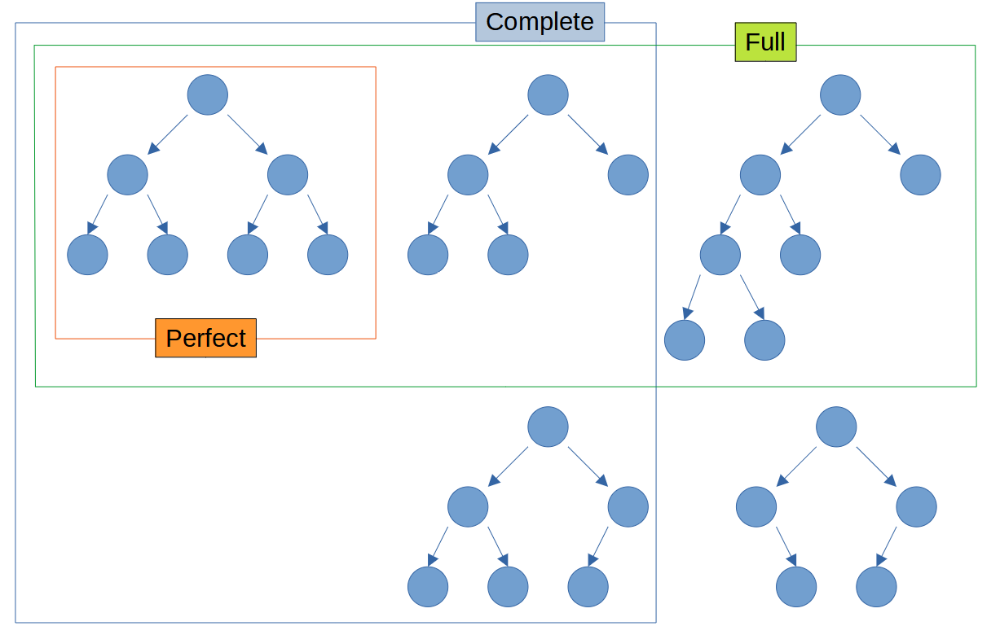

# **Introduction to Heaps**  

When dealing with **priority-based data structures**, heaps are one of the most **efficient and widely used** structures. From implementing priority queues to optimizing algorithms like **Dijkstra’s shortest path**, heaps play a crucial role in computer science.  

In this blog, we will dive deep into **heaps**, covering their **definition, types, operations, implementations, and real-world applications**.  

---

## **1. What is a Heap?**  
A **heap** is a **binary tree-based** data structure that satisfies the **heap property**:  
- **Max-Heap Property**: The **parent node** is always **greater than or equal to** its child nodes.  
- **Min-Heap Property**: The **parent node** is always **less than or equal to** its child nodes.  

### **Heap Characteristics:**  
✔️ A heap is a **complete binary tree** (all levels are fully filled except the last, which is filled from left to right).  
✔️ Used in **priority queues, sorting algorithms, and graph algorithms**.  
✔️ Efficient operations with **O(log n) time complexity** for insert and delete.  





>  **No strict order between left and right children** – As long as the heap property is maintained, the left child can be greater or smaller than the right child and vice versa.   


---

## **2. Types of Heaps**  

### **1️⃣ Max Heap**  
A **max heap** ensures that the **largest element is always at the root**. Every parent node has a value **greater than or equal to** its children.  
📌 **Example of a Max Heap:**  
```
       50
      /   \
    30     40
   /  \   /  \
  10  20 15  35
```
🔹 **Root is the maximum (50)**, and each child node is smaller than its parent.  

---

### **2️⃣ Min Heap**  
A **min heap** ensures that the **smallest element is always at the root**. Every parent node has a value **less than or equal to** its children.  
📌 **Example of a Min Heap:**  
```
       10
      /   \
    30     20
   /  \   /  \
  50  40 35  15
```
🔹 **Root is the minimum (10)**, and each child node is larger than its parent.  

---

## **3. Heap Operations**  
The **basic heap operations** include:

### **1️⃣ Insertion (O(log n))**  
- Insert the element at the **end of the heap**.  
- **Bubble Up (Heapify Up)**: Compare it with its **parent** and swap if needed.  
- Repeat until the heap property is restored.  

📌 **Example (Insert 45 in Max Heap)**  
```
Before:
       50
      /   \
    30     40
   /  \   /  
  10  20 15  

After inserting 45:
       50
      /   \
    30     40
   /  \   /  \
  10  20 15  45

After Heapify (Bubble Up):
       50
      /   \
    45     40
   /  \   /  \
  30  20 15  10
```
🔹 **Time Complexity**: O(log n)  

---

### **2️⃣ Deletion (O(log n))**  
- The **root node** (max or min element) is removed.  
- The **last element replaces the root**.  
- **Heapify Down (Bubble Down)**: Compare with children and swap if needed.  
- Repeat until heap property is restored.  

📌 **Example (Delete 50 from Max Heap)**  
```
Before:
       50
      /   \
    45     40
   /  \   /  \
  30  20 15  10

After deleting root:
       10
      /   \
    45     40
   /  \   /  
  30  20 15  

After Heapify (Bubble Down):
       45
      /   \
    30     40
   /  \   /  
  10  20 15  
```
🔹 **Time Complexity**: O(log n)  

---

### **3️⃣ Heapify (O(log n))**  
Heapify is a **process of converting an array into a heap**.  
It is used in **heap sort** and after inserting or deleting elements.  
- **Heapify Up**: Used when inserting an element.  
- **Heapify Down**: Used when deleting an element.  

📌 **Example of Heapify Down (Max Heapify)**
```
Input Array: [3, 9, 2, 1, 4, 5]

Step 1: Convert to Binary Tree
       3
      /   \
    9      2
   /  \   /
  1   4  5

Step 2: Heapify (Bottom-Up)
       9
      /   \
    4      5
   /  \   /
  1   3  2

Final Max Heap: [9, 4, 5, 1, 3, 2]
```

---

## **4. Heap Implementations in Code**
### **Max Heap Implementation (Java)**
```java
import java.util.PriorityQueue;

public class MaxHeapExample {
    public static void main(String[] args) {
        PriorityQueue<Integer> maxHeap = new PriorityQueue<>((a, b) -> b - a);

        maxHeap.add(50);
        maxHeap.add(30);
        maxHeap.add(40);
        maxHeap.add(10);
        maxHeap.add(20);
        maxHeap.add(15);

        System.out.println("Max Heap: " + maxHeap);
        System.out.println("Extract Max: " + maxHeap.poll());
        System.out.println("After Extraction: " + maxHeap);
    }
}
```

### **Min Heap Implementation (Python)**
```python
import heapq

min_heap = []
heapq.heappush(min_heap, 50)
heapq.heappush(min_heap, 30)
heapq.heappush(min_heap, 40)
heapq.heappush(min_heap, 10)

print("Min Heap:", min_heap)
print("Extract Min:", heapq.heappop(min_heap))
print("After Extraction:", min_heap)
```

---

## **5. Applications of Heaps**
Heaps are used in **various real-world applications**, including:

### **1️⃣ Priority Queues** (CPU Scheduling, Task Scheduling)  
- Min-heaps and max-heaps are used to efficiently manage **priorities**.  
- Example: **Dijkstra’s algorithm** uses a **min-heap** to find the shortest path.  

### **2️⃣ Heap Sort (O(n log n))**  
- A **comparison-based sorting algorithm** using heaps.  
- **Steps**: Convert array → Extract elements one by one → Heapify.  

### **3️⃣ Graph Algorithms (Dijkstra’s, Prim’s Algorithm)**  
- **Dijkstra’s Algorithm** uses a **min-heap** for finding the shortest path in graphs.  
- **Prim’s Algorithm** uses a **min-heap** for Minimum Spanning Trees (MST).  

### **4️⃣ Finding K-th Largest/Smallest Element (O(n log k))**  
- Use a **min-heap** to keep track of `k` largest elements efficiently.  

---

## **6. Summary**
| **Operation** | **Time Complexity** |
|--------------|--------------------|
| Insertion | O(log n) |
| Deletion (Extract Max/Min) | O(log n) |
| Heapify | O(log n) |
| Build Heap (Heap Sort) | O(n log n) |

### **Key Takeaways**
✔️ Heaps are **complete binary trees**.  
✔️ **Min-heap** has the smallest element at the root, **Max-heap** has the largest.  
✔️ Used in **priority queues, graph algorithms, and sorting**.  
✔️ **Efficient operations** with O(log n) complexity.  

