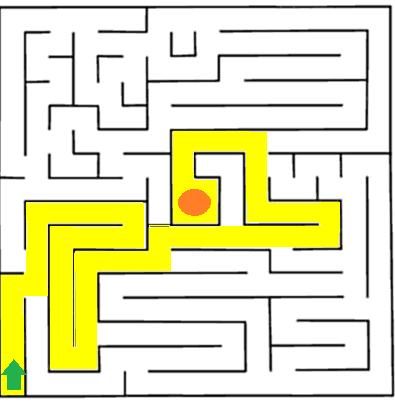

# **Backtracking (Maze Problems, Recursion)**

Backtracking is a powerful algorithmic technique used to solve problems ==that involve searching for solutions incrementally==. It is commonly used in problems like **maze solving, Sudoku, n-queens, and word search**. In this blog, we will focus on **backtracking for maze problems using recursion** in Java.

---

## **1. What is Backtracking?**
Backtracking is ==a method of **exploring all possible paths** to find a solution and discarding paths that fail to meet the problem constraints==.

### **Steps in Backtracking**
1. Choose a path (make a choice).
2. Move forward (recurse).
3. If the path leads to an invalid state, backtrack (undo the choice).
4. Continue exploring other paths.

### **Where is Backtracking Used?**
- **Maze problems** (finding a path from start to end).
- **Graph problems** (Hamiltonian cycles, coloring problems).
- **Combinatorial problems** (permutations, subsets, Sudoku).
- **N-Queens problem**.

---

## **2. Maze Problem Using Backtracking**





### **Problem Statement**
Given a `N x N` maze with some blocked and open cells, the goal is to find a path from the **top-left** corner `(0,0)` to the **bottom-right** `(N-1, N-1)`, moving only **right** or **down**.

### **Example Maze (1 = Open, 0 = Blocked)**
```plaintext
1  0  0  0
1  1  0  1
0  1  0  0
1  1  1  1
```
✅ **Valid path:** `(0,0) → (1,0) → (1,1) → (2,1) → (3,1) → (3,2) → (3,3)`

---

## **3. Backtracking Approach**
### **Algorithm**
1. **Base Case**: If `(x, y) == (N-1, N-1)`, we have reached the destination.
2. **Recursive Case**:
   - Mark the cell as part of the solution path.
   - Try moving **right** and **down** recursively.
   - If the path is invalid, backtrack by unmarking the cell.

---

## **4. Java Code for Maze Solver**
```java
public class MazeSolver {
    private static final int N = 4;

    public static boolean solveMaze(int[][] maze) {
        int[][] solution = new int[N][N];

        if (!solveMazeUtil(maze, 0, 0, solution)) {
            System.out.println("No solution found!");
            return false;
        }

        printSolution(solution);
        return true;
    }

    private static boolean solveMazeUtil(int[][] maze, int x, int y, int[][] solution) {
        // Base case: If (x, y) is the destination
        if (x == N - 1 && y == N - 1) {
            solution[x][y] = 1;
            return true;
        }

        // Check if maze[x][y] is a valid move
        if (isSafe(maze, x, y)) {
            solution[x][y] = 1; // Mark cell as part of solution

            // Move right
            if (solveMazeUtil(maze, x, y + 1, solution)) return true;

            // Move down
            if (solveMazeUtil(maze, x + 1, y, solution)) return true;

            // Backtrack (undo move)
            solution[x][y] = 0;
        }
        return false;
    }

    private static boolean isSafe(int[][] maze, int x, int y) {
        return (x >= 0 && x < N && y >= 0 && y < N && maze[x][y] == 1);
    }

    private static void printSolution(int[][] solution) {
        for (int[] row : solution) {
            for (int cell : row) {
                System.out.print(cell + " ");
            }
            System.out.println();
        }
    }

    public static void main(String[] args) {
        int[][] maze = {
            {1, 0, 0, 0},
            {1, 1, 0, 1},
            {0, 1, 0, 0},
            {1, 1, 1, 1}
        };

        solveMaze(maze);
    }
}
```

---

## **5. Explanation**
### **Step-by-step Execution**
1. Start at `(0,0)`.
2. Move **right** if possible; otherwise, move **down**.
3. If the path is blocked, **backtrack** and try a different route.
4. If `(N-1, N-1)` is reached, print the solution.

### **Output**
```plaintext
1  0  0  0
1  1  0  0
0  1  0  0
0  1  1  1
```
This **1-marked path** shows the valid solution.

---

## **6. Handling More Maze Variations**
### **1. Allowing More Moves (Up, Left, Right, Down)**
Modify the `solveMazeUtil()` function to explore **four directions** instead of just right and down.

### **2. Finding All Possible Paths**
Instead of returning after finding the first path, **store all valid paths in a list**.

### **3. Shortest Path in a Maze**
Use **Breadth-First Search (BFS)** instead of backtracking to find the shortest path.

---

## **7. Complexity Analysis**
| Approach | Time Complexity | Space Complexity |
|----------|---------------|-----------------|
| Backtracking | **O(2^(N²))** (worst case) | **O(N²)** (recursion stack) |
| BFS (Shortest Path) | **O(N²)** | **O(N²)** |

---

## **8. When to Use Backtracking vs BFS?**
| Scenario | Approach |
|----------|---------|
| Find **any** path | **Backtracking** |
| Find **all** paths | **Backtracking with a list** |
| Find **shortest** path | **BFS (Dijkstra, A*)** |

---

## **9. Conclusion**
- Backtracking efficiently **explores all possible paths** in a maze.
- **Recursive approach** helps simplify the implementation.
- If we need **shortest path**, BFS is more efficient.

💡 **Mastering backtracking helps in solving combinatorial problems, pathfinding, and constraint-based problems!** 🚀