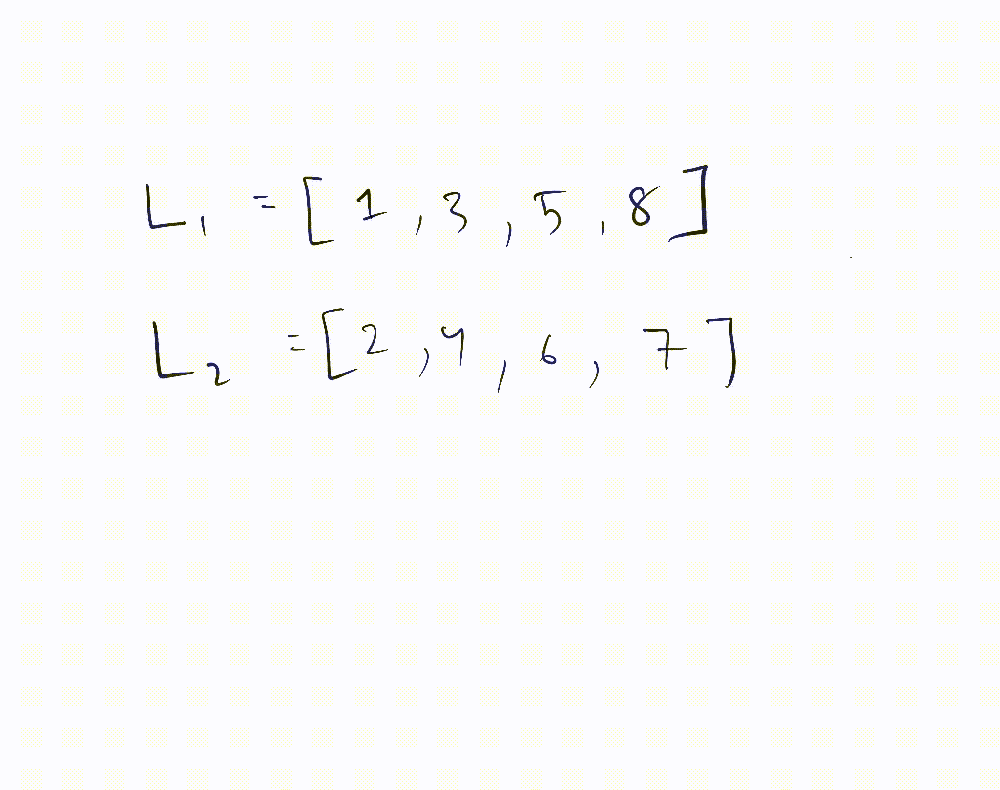

## **LeetCode Problem: [Sort List (148)](https://leetcode.com/problems/sort-list/description/?envType=study-plan-v2&envId=top-interview-150)**
**Problem Statement**  
Given the head of a singly linked list, return the list sorted in **ascending order**.  
You must use **O(n log n)** time complexity and **O(1) or O(log n) space complexity**.

---

# **Approach 1: Merge Sort (Top-Down Recursive)**
### **Algorithm**
1. **Find the middle** of the linked list using **slow & fast pointers**.
2. **Split the list** into two halves.
3. **Recursively sort** both halves.
4. **Merge the two sorted halves**.

### **Time & Space Complexity**
- **Time Complexity:** **O(n log n)**  
  - Each level splits the list into **two halves (log n levels)**.
  - Merging takes **O(n)** at each level.
- **Space Complexity:** **O(log n)** (Recursive stack calls).

### **Java Code**
```java
class Solution {
    public ListNode sortList(ListNode head) {
        if (head == null || head.next == null) return head;

        // Find the middle node
        ListNode mid = getMid(head);
        ListNode left = head;
        ListNode right = mid.next;
        mid.next = null; // Split the list

        // Recursive sorting
        left = sortList(left);
        right = sortList(right);

        // Merge sorted halves
        return merge(left, right);
    }

    private ListNode getMid(ListNode head) {
        ListNode slow = head, fast = head.next;
        while (fast != null && fast.next != null) {
            slow = slow.next;
            fast = fast.next.next;
        }
        return slow;
    }

    private ListNode merge(ListNode l1, ListNode l2) {
        ListNode dummy = new ListNode(0);
        ListNode tail = dummy;
        while (l1 != null && l2 != null) {
            if (l1.val < l2.val) {
                tail.next = l1;
                l1 = l1.next;
            } else {
                tail.next = l2;
                l2 = l2.next;
            }
            tail = tail.next;
        }
        tail.next = (l1 != null) ? l1 : l2;
        return dummy.next;
    }
}
```

---

# **Approach 2: Merge Sort (Bottom-Up Iterative)**
### **Algorithm**
1. **Start with sublists of size 1** and merge them in pairs.
2. **Double the sublist size** each iteration (`1 -> 2 -> 4 -> 8 ...`).
3. **Continue merging until the entire list is sorted**.

### **Time & Space Complexity**
- **Time Complexity:** **O(n log n)**
- **Space Complexity:** **O(1)** (No recursion stack)

### **Java Code**
```java
class Solution {
    public ListNode sortList(ListNode head) {
        if (head == null || head.next == null) return head;

        int length = getLength(head);
        ListNode dummy = new ListNode(0);
        dummy.next = head;

        for (int size = 1; size < length; size *= 2) {
            ListNode prev = dummy;
            ListNode curr = dummy.next;

            while (curr != null) {
                ListNode left = curr;
                ListNode right = split(left, size);
                curr = split(right, size);
                prev = merge(left, right, prev);
            }
        }
        return dummy.next;
    }

    private int getLength(ListNode head) {
        int count = 0;
        while (head != null) {
            count++;
            head = head.next;
        }
        return count;
    }

    private ListNode split(ListNode head, int size) {
        if (head == null) return null;
        for (int i = 1; head.next != null && i < size; i++) {
            head = head.next;
        }
        ListNode next = head.next;
        head.next = null;
        return next;
    }

    private ListNode merge(ListNode l1, ListNode l2, ListNode prev) {
        ListNode dummy = new ListNode(0);
        ListNode tail = dummy;
        while (l1 != null && l2 != null) {
            if (l1.val < l2.val) {
                tail.next = l1;
                l1 = l1.next;
            } else {
                tail.next = l2;
                l2 = l2.next;
            }
            tail = tail.next;
        }
        tail.next = (l1 != null) ? l1 : l2;

        while (tail.next != null) tail = tail.next;
        prev.next = dummy.next;
        return tail;
    }
}
```

---

# **Approach 3: Quick Sort (Not Recommended)**
### **Algorithm**
1. **Pick a pivot** (usually the last node).
2. **Partition the list** into two parts (less than pivot, greater than pivot).
3. **Recursively quick sort** both halves.
4. **Combine the sorted parts**.

### **Time & Space Complexity**
- **Best/Average Case:** O(n log n)
- **Worst Case:** **O(n²)** (If the list is already sorted)
- **Space Complexity:** **O(log n)** (Recursive stack)

### **Java Code**
```java
class Solution {
    public ListNode sortList(ListNode head) {
        return quickSort(head, null);
    }

    private ListNode quickSort(ListNode head, ListNode end) {
        if (head == end || head.next == end) return head;

        ListNode pivot = partition(head, end);
        quickSort(head, pivot);
        quickSort(pivot.next, end);
        return head;
    }

    private ListNode partition(ListNode head, ListNode end) {
        int pivotVal = head.val;
        ListNode i = head, j = head.next;

        while (j != end) {
            if (j.val < pivotVal) {
                i = i.next;
                int temp = i.val;
                i.val = j.val;
                j.val = temp;
            }
            j = j.next;
        }

        int temp = head.val;
        head.val = i.val;
        i.val = temp;

        return i;
    }
}
```
**Why Not Quick Sort?**  
🚫 **Worst case is O(n²)** (bad pivot selection).  
🚫 **Space is O(log n)** due to recursion.  

---

# **Approach 4: Heap Sort (Priority Queue)**
### **Algorithm**
1. **Insert all nodes into a Min-Heap** (Priority Queue).
2. **Extract the min element one by one** and build a sorted list.

### **Time & Space Complexity**
- **Time Complexity:** **O(n log n)** (Each insertion/extraction is log n)
- **Space Complexity:** **O(n)** (Heap stores all nodes)

### **Java Code**
```java
import java.util.PriorityQueue;

class Solution {
    public ListNode sortList(ListNode head) {
        if (head == null) return null;

        PriorityQueue<ListNode> minHeap = new PriorityQueue<>((a, b) -> a.val - b.val);
        while (head != null) {
            minHeap.add(head);
            head = head.next;
        }

        ListNode dummy = new ListNode(0);
        ListNode tail = dummy;
        while (!minHeap.isEmpty()) {
            tail.next = minHeap.poll();
            tail = tail.next;
        }
        tail.next = null; // Important to avoid cycle
        return dummy.next;
    }
}
```
**Why Not Heap Sort?**  
🚫 **O(n) extra space needed** for storing all nodes in heap.  
🚫 **Not O(1) space**, so not optimal for interview.  

---

## **Best Approach?**
✅ **Merge Sort (Bottom-Up Iterative)** → **O(n log n) time, O(1) space** (Best for interviews).  
✅ **Merge Sort (Recursive)** → **O(n log n) time, O(log n) space** (Easier to implement).  
🚫 **Quick Sort** → Risk of **O(n²) worst case**.  
🚫 **Heap Sort** → **O(n) extra space**, not optimal.  

---

### **Dry Run for Approach 1: Merge Sort (Top-Down Recursive)**

#### **Input**
```
Input: head = 4 -> 2 -> 1 -> 3
```

#### **Step 1: Find the Middle and Split**
1. **Using slow and fast pointers** to find the middle:
   ```
   slow = 4, fast = 4
   slow = 2, fast = 1
   slow = 1, fast = NULL (stops here)
   ```
   **Middle node found: 1**
2. **Split into two halves**:
   ```
   Left half: 4 -> 2
   Right half: 1 -> 3
   ```

---

#### **Step 2: Recursive Sort on Left Half**
Sorting **4 → 2**:
- **Find middle** → `slow = 4, fast = 2`
- **Split into**:
  ```
  Left half: 4
  Right half: 2
  ```
- Since each half is a single node, they are **already sorted**.
- **Merge** `[4]` and `[2]` → **Sorted list: `2 -> 4`**.

---

#### **Step 3: Recursive Sort on Right Half**
Sorting **1 → 3**:
- **Find middle** → `slow = 1, fast = 3`
- **Split into**:
  ```
  Left half: 1
  Right half: 3
  ```
- Since each half is a single node, they are **already sorted**.
- **Merge** `[1]` and `[3]` → **Sorted list: `1 -> 3`**.

---

#### **Step 4: Merge the Sorted Halves**
Now we merge **[2 → 4]** and **[1 → 3]**:
- Compare `2` and `1` → Pick `1`
- Compare `2` and `3` → Pick `2`
- Compare `4` and `3` → Pick `3`
- Pick `4` (only one left)

Final sorted list:
```
1 -> 2 -> 3 -> 4
```

---

### **Dry Run for Approach 2: Bottom-Up Merge Sort (Iterative)**
#### **Input**
```
Input: head = 4 -> 2 -> 1 -> 3
```

---

#### **Step 1: Initialize Variables**
- **Find the length of the list** → `length = 4`
- **Dummy node** → `dummy -> 4 -> 2 -> 1 -> 3`

---

#### **Step 2: Iteration (Size = 1)**
- **Merge adjacent 1-element lists**:
  ```
  [4]  [2] → Merge → [2 → 4]
  [1]  [3] → Merge → [1 → 3]
  ```
- **List after this step**:
  ```
  2 -> 4 -> 1 -> 3
  ```

---

#### **Step 3: Iteration (Size = 2)**
- **Merge adjacent 2-element lists**:
  ```
  [2 → 4] and [1 → 3] → Merge
  ```
- **Merging process**:
  - Compare `2` and `1` → Pick `1`
  - Compare `2` and `3` → Pick `2`
  - Compare `4` and `3` → Pick `3`
  - Pick `4` (last element)

- **Final Sorted List**:
  ```
  1 -> 2 -> 3 -> 4
  ```

---

### **Final Output for Both Approaches**
```
Output: 1 -> 2 -> 3 -> 4
```

✅ **Both approaches give the same sorted result, but Approach 2 (Bottom-Up Merge Sort) avoids recursion and has better space efficiency.** 🚀

---

### Comparison during merge operation (with pointers)

#### **Given Two Heads L1 and L2**
```
Input: 
L1 = 1 -> 3 -> 5 -> 8 
L2 = 2 -> 4 -> 6 -> -> 7
```



