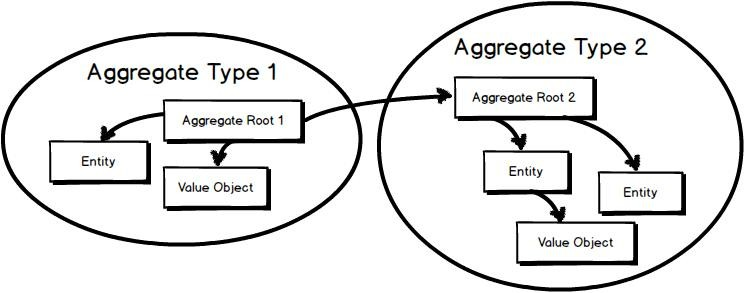
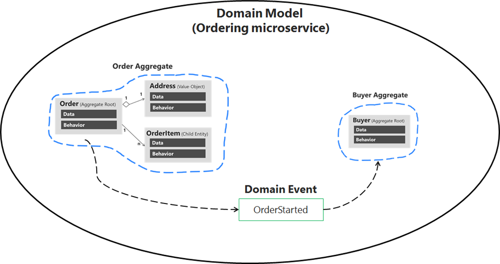

# **Domain-Driven Design (DDD) in Microservices: A Comprehensive Guide**

## **Introduction**
As microservices architecture grows in popularity, structuring services correctly becomes crucial for scalability, maintainability, and long-term success. **Domain-Driven Design (DDD)** provides a powerful approach to designing microservices by aligning the system architecture with the business domain. 

This blog will explore **DDD principles, bounded contexts, aggregates, and how to implement DDD in microservices effectively**.

---

## **1. What is Domain-Driven Design (DDD)?**
DDD, introduced by **Eric Evans**, is an architectural approach that emphasizes designing software systems **based on the real-world business domain**. The goal is to **bridge the gap between technical implementation and business logic**.

### **Key Benefits of DDD in Microservices**
✅ Ensures microservices align with business capabilities.  
✅ Helps **avoid a distributed monolith** by defining clear boundaries.  
✅ Enhances maintainability by **minimizing dependencies between services**.  
✅ Enables teams to work independently by **dividing responsibilities into domains**.  

---

## **2. Core Concepts of Domain-Driven Design**
DDD introduces several key concepts that help in structuring microservices:

### **2.1 Bounded Contexts**
A **Bounded Context** is a **logical boundary** around a **business capability** where a specific domain model is applied. Each microservice typically represents a bounded context.

#### **Example: E-commerce System**
- **Order Service** → Handles order creation, tracking, and payment.  
- **Inventory Service** → Manages stock availability.  
- **Customer Service** → Manages user information and preferences.  
- **Payment Service** → Handles payment processing and fraud detection.  

Each service has **its own data model** and **business logic**, avoiding tight coupling.

### **2.2 Entities and Value Objects**
- **Entity** → An object with a unique identifier that changes over time. Example: `Order`, `Customer`.  
- **Value Object** → An immutable object without a unique ID. Example: `Address`, `Money`.  

#### **Example in Java**
```java
@Entity
public class Order {
    @Id
    @GeneratedValue(strategy = GenerationType.IDENTITY)
    private Long id;
    private String status;
    @Embedded
    private Address shippingAddress;
}
```
> Here, `Order` is an **entity**, and `Address` is a **value object**.

### **2.3 Aggregates and Aggregate Roots**
==An **aggregate** is a cluster of domain objects that are treated as a single unit==. **The aggregate root is the main entry point to control consistency within the aggregate.**



#### **Example: Order Aggregate**
An **Order Aggregate** consists of:
- `Order` (Aggregate Root)
- `OrderItems` (Part of Aggregate)
- `PaymentDetails` (Value Object)

```java
@Entity
public class Order {
    @Id
    @GeneratedValue(strategy = GenerationType.IDENTITY)
    private Long id;
    private String status;
    @OneToMany(cascade = CascadeType.ALL, mappedBy = "order")
    private List<OrderItem> items;
}
```
> The `Order` entity acts as an **aggregate root**, and `OrderItem` is a part of it.


### **2.4 Domain Events**
Instead of making direct service calls, microservices **emit domain events**, reducing coupling.




#### **Example: Order Created Event (Using Kafka)**
```java
public class OrderCreatedEvent {
    private Long orderId;
    private String status;
}
```

Publishing the event:
```java
kafkaTemplate.send("order-events", new OrderCreatedEvent(order.getId(), order.getStatus()));
```
> This allows other services (like Payment or Inventory) to **react to changes asynchronously**.

---

## **3. Implementing DDD in Microservices**
Here’s how you can apply **DDD principles** effectively:

### **3.1 Identifying Bounded Contexts**
- Use **Event Storming** to map business processes.
- Identify **separate capabilities** in the system.
- Define **clear ownership** of data and behavior.

### **3.2 Designing Aggregates**
- Keep aggregates **small** (preferably one transaction per aggregate).
- Ensure that **only the aggregate root** modifies the state.
- Use **event-driven communication** to notify other microservices.

### **3.3 Implementing Repositories**
Repositories act as **gateways to access domain objects** while abstracting data persistence.

#### **Example: Order Repository**
```java
@Repository
public interface OrderRepository extends JpaRepository<Order, Long> {
    List<Order> findByStatus(String status);
}
```

### **3.4 Handling Transactions Across Microservices**
Microservices must **avoid distributed transactions**. Instead, use **Saga Patterns** to maintain consistency.

- **Choreography-Based Saga** (Event-Driven)
- **Orchestration-Based Saga** (Managed by a Saga Coordinator)

#### **Example: Saga Flow for Order Processing**
1. **OrderService** emits an `OrderCreated` event.
2. **PaymentService** processes the payment and emits `PaymentSuccess`.
3. **InventoryService** reserves stock and emits `StockReserved`.
4. **OrderService** updates the order to `CONFIRMED`.

This **ensures eventual consistency** without needing distributed transactions.

---

## **4. Common Pitfalls in DDD for Microservices**
❌ **Too many small microservices:** Leads to operational overhead.  
❌ **Forgetting domain boundaries:** Leads to distributed monoliths.  
❌ **Tightly coupled aggregates:** Reduces flexibility and scalability.  
❌ **Mixing domain logic with infrastructure logic:** Leads to poor maintainability.  

**✅ Solution:** Follow **DDD strategic design** and **event-driven communication**.

---

## **5. Best Practices for Applying DDD in Microservices**
✔ **Model microservices around business capabilities (Bounded Contexts).**  
✔ **Use aggregates wisely to ensure transaction boundaries.**  
✔ **Embrace event-driven architecture for decoupled communication.**  
✔ **Avoid direct service-to-service calls (Use asynchronous messaging).**  
✔ **Use Saga Pattern for consistency in distributed transactions.**  

---

## **Conclusion**
DDD helps build **scalable, maintainable, and business-aligned microservices** by enforcing **clear boundaries, encapsulating business logic, and enabling loose coupling**. By leveraging **bounded contexts, aggregates, and domain events**, microservices can effectively handle real-world complexity while maintaining agility.

---

Let's create a **hands-on project** showcasing **Domain-Driven Design (DDD) in Microservices** using **Spring Boot, Kafka, and Kubernetes**. The project will consist of **three microservices** that interact using an **event-driven architecture**.


# **🛠 Project: E-Commerce Order Processing System**

## **🔹 Tech Stack**
- **Spring Boot** for microservices
- **Spring Data JPA** for database interaction
- **Kafka** for event-driven communication
- **Docker & Kubernetes** for containerization & orchestration
- **PostgreSQL** as the database
- **Spring Cloud Config** for centralized configuration
- **Spring Boot Actuator** for monitoring

---

## **📌 Microservices Overview**
1. **Order Service** → Creates an order and emits an `OrderCreated` event.
2. **Payment Service** → Listens for the `OrderCreated` event and processes payment.
3. **Inventory Service** → Listens for the `OrderPaid` event and updates stock.

---

## **🛠 Step 1: Setting Up Order Service (Bounded Context: Orders)**
### **1.1 Define Order Entity**
```java
@Entity
public class Order {
    @Id
    @GeneratedValue(strategy = GenerationType.IDENTITY)
    private Long id;
    private String status; // PENDING, PAID, SHIPPED
    private Double amount;
}
```

### **1.2 Define Order Repository**
```java
@Repository
public interface OrderRepository extends JpaRepository<Order, Long> {
}
```

### **1.3 Define Order Event (Domain Event)**
```java
public class OrderCreatedEvent {
    private Long orderId;
    private Double amount;
}
```

### **1.4 Publish Event to Kafka**
```java
@Service
public class OrderService {
    @Autowired private OrderRepository orderRepository;
    @Autowired private KafkaTemplate<String, OrderCreatedEvent> kafkaTemplate;

    public Order createOrder(Order order) {
        order.setStatus("PENDING");
        Order savedOrder = orderRepository.save(order);
        kafkaTemplate.send("order-events", new OrderCreatedEvent(savedOrder.getId(), savedOrder.getAmount()));
        return savedOrder;
    }
}
```

---

## **🛠 Step 2: Setting Up Payment Service (Bounded Context: Payments)**
### **2.1 Listen to Kafka Order Created Event**
```java
@Service
public class PaymentService {
    @Autowired private KafkaTemplate<String, OrderPaidEvent> kafkaTemplate;

    @KafkaListener(topics = "order-events", groupId = "payment-group")
    public void processPayment(OrderCreatedEvent event) {
        System.out.println("Processing payment for Order ID: " + event.getOrderId());
        kafkaTemplate.send("payment-events", new OrderPaidEvent(event.getOrderId(), "SUCCESS"));
    }
}
```

### **2.2 Define OrderPaidEvent**
```java
public class OrderPaidEvent {
    private Long orderId;
    private String status;
}
```

---

## **🛠 Step 3: Setting Up Inventory Service (Bounded Context: Inventory)**
### **3.1 Listen to Kafka Payment Event**
```java
@Service
public class InventoryService {
    @KafkaListener(topics = "payment-events", groupId = "inventory-group")
    public void updateStock(OrderPaidEvent event) {
        System.out.println("Updating inventory for Order ID: " + event.getOrderId());
    }
}
```

---

## **🛠 Step 4: Configuring Kafka in `application.yml`**
### **Kafka Configuration for Order Service**
```yaml
spring:
  kafka:
    bootstrap-servers: localhost:9092
    producer:
      key-serializer: org.apache.kafka.common.serialization.StringSerializer
      value-serializer: org.springframework.kafka.support.serializer.JsonSerializer
    consumer:
      group-id: order-group
      key-deserializer: org.apache.kafka.common.serialization.StringDeserializer
      value-deserializer: org.springframework.kafka.support.serializer.JsonDeserializer
      properties:
        spring.json.trusted.packages: "*"
```

### **Kafka Configuration for Payment and Inventory Services**
Just update the `group-id` in their respective configurations.

---

## **🛠 Step 5: Running Microservices in Docker & Kubernetes**
### **5.1 Create `Dockerfile` for Each Microservice**
```dockerfile
FROM openjdk:17-jdk-slim
COPY target/order-service.jar order-service.jar
ENTRYPOINT ["java", "-jar", "/order-service.jar"]
```

### **5.2 Create Kubernetes Deployment**
```yaml
apiVersion: apps/v1
kind: Deployment
metadata:
  name: order-service
spec:
  replicas: 2
  selector:
    matchLabels:
      app: order-service
  template:
    metadata:
      labels:
        app: order-service
    spec:
      containers:
        - name: order-service
          image: order-service:latest
          ports:
            - containerPort: 8080
```

### **5.3 Create Kubernetes Service**
```yaml
apiVersion: v1
kind: Service
metadata:
  name: order-service
spec:
  selector:
    app: order-service
  ports:
    - protocol: TCP
      port: 80
      targetPort: 8080
  type: ClusterIP
```

---

## **📌 Expected Flow**
1. `OrderService` creates an order and emits **OrderCreatedEvent**.
2. `PaymentService` listens to the event and **processes the payment**, then emits **OrderPaidEvent**.
3. `InventoryService` listens to **OrderPaidEvent** and **updates stock**.

---

## **🔹 Why This Example?**
✔ **Follows Domain-Driven Design (DDD)** – Bounded contexts, aggregates, and events.  
✔ **Decoupled Services** – No direct service-to-service calls, only event-based communication.  
✔ **Scalable** – Can handle high throughput using **Kafka**.  
✔ **Production-Ready** – Uses **Docker & Kubernetes** for deployment.  

---

## **🔹 Next Steps**
- **Add Circuit Breaker** using **Resilience4J**.
- **Implement Saga Pattern** for distributed transactions.
- **Use OpenTelemetry for Tracing**.

---

### **Domain-Driven Design (DDD) Concepts Used in the Microservices Example**

In the **E-Commerce Order Processing System**, we applied various **DDD principles** to structure our microservices efficiently. Here’s how **DDD concepts** were incorporated:

---

## **1. Bounded Contexts**
A **Bounded Context** defines the **boundary** of a microservice, ensuring that each service is responsible for a specific domain **without interference from other services**.

### **How it is applied?**
We defined **three microservices**, each representing its **own bounded context**:
- **Order Service** → Handles order creation and status updates.
- **Payment Service** → Manages payment processing.
- **Inventory Service** → Manages stock levels and updates availability.

Each of these services has **its own database** and **domain model**, ensuring clear separation of concerns.

---

## **2. Entities and Value Objects**
- **Entities** are domain objects with a unique identifier.
- **Value Objects** do not have an identity and are immutable.

### **How it is applied?**
- **Entity:** The `Order` class is an entity because it has a unique `id` and persists over time.
- **Value Object:** The `Address` in `Order` can be a **value object** because it does not need a unique ID.

#### **Example (Entity & Value Object)**
```java
@Entity
public class Order {
    @Id
    @GeneratedValue(strategy = GenerationType.IDENTITY)
    private Long id;
    private String status;
    
    @Embedded
    private Address shippingAddress; // Value Object
}
```

---

## **3. Aggregates and Aggregate Root**
An **Aggregate** is a group of domain objects that should be treated as a single unit, with the **Aggregate Root** being the primary entry point to modify or retrieve the state.

### **How it is applied?**
- **Order Aggregate** consists of:
  - `Order` (Aggregate Root)
  - `OrderItems` (Part of Aggregate)
  - `ShippingDetails` (Value Object)

**Only the Order entity (Aggregate Root) should control modifications** to `OrderItems`.

#### **Example (Aggregate)**
```java
@Entity
public class Order {
    @Id
    @GeneratedValue(strategy = GenerationType.IDENTITY)
    private Long id;
    private String status;
    
    @OneToMany(cascade = CascadeType.ALL, mappedBy = "order")
    private List<OrderItem> items; // Part of Aggregate
}
```
This ensures **consistency within the Order aggregate**, as `OrderItem` should not be modified outside the `Order` entity.

---

## **4. Domain Events**
**DDD promotes an Event-Driven approach** where services communicate via **domain events** instead of direct API calls. This ensures **loose coupling**.

### **How it is applied?**
- **Order Service** emits an `OrderCreatedEvent` when an order is placed.
- **Payment Service** listens to `OrderCreatedEvent` and processes payment.
- **Inventory Service** listens to `OrderPaidEvent` and updates stock.

#### **Example (Publishing an Event in Kafka)**
```java
public class OrderCreatedEvent {
    private Long orderId;
    private Double amount;
}

kafkaTemplate.send("order-events", new OrderCreatedEvent(order.getId(), order.getAmount()));
```

#### **Example (Listening to Events in Payment Service)**
```java
@KafkaListener(topics = "order-events", groupId = "payment-group")
public void processPayment(OrderCreatedEvent event) {
    System.out.println("Processing payment for Order ID: " + event.getOrderId());
}
```
This **loosely couples** services, allowing them to function **independently** without direct API calls.

---

## **5. Repositories (Data Access Layer)**
Repositories **abstract database operations**, allowing the domain model to focus only on business logic.

### **How it is applied?**
Each microservice has **its own repository** for data access.

#### **Example (Order Repository)**
```java
@Repository
public interface OrderRepository extends JpaRepository<Order, Long> {
}
```

---

## **6. Application Services**
Application services handle **business logic** and **domain event handling**, ensuring domain objects remain **pure**.

### **How it is applied?**
- **OrderService** handles order creation.
- **PaymentService** listens for `OrderCreatedEvent` and processes payment.
- **InventoryService** updates stock after payment confirmation.

#### **Example (Application Service for Order Creation)**
```java
@Service
public class OrderService {
    @Autowired private OrderRepository orderRepository;
    @Autowired private KafkaTemplate<String, OrderCreatedEvent> kafkaTemplate;

    public Order createOrder(Order order) {
        order.setStatus("PENDING");
        Order savedOrder = orderRepository.save(order);
        kafkaTemplate.send("order-events", new OrderCreatedEvent(savedOrder.getId(), savedOrder.getAmount()));
        return savedOrder;
    }
}
```
> This ensures **business logic is separated from controllers**, following **DDD principles**.

---

## **7. Anti-Corruption Layer (ACL)**
An **Anti-Corruption Layer** protects bounded contexts from being tightly coupled to **external services or legacy systems**.

### **How it is applied?**
Instead of direct calls, **Order Service** publishes an event, and **Payment Service** processes it **asynchronously**.

This prevents **direct dependencies**, making microservices **flexible and future-proof**.

---

## **8. CQRS (Command Query Responsibility Segregation)**
CQRS **separates write and read models**, improving scalability.

### **How it is applied?**
- **Commands** (`OrderService`) → Place Order (`POST /orders`)
- **Queries** (`OrderQueryService`) → Fetch Order Details (`GET /orders/{id}`)

**Implementation Example**
```java
@RestController
@RequestMapping("/orders")
public class OrderQueryService {
    @Autowired private OrderRepository orderRepository;

    @GetMapping("/{id}")
    public ResponseEntity<Order> getOrder(@PathVariable Long id) {
        return ResponseEntity.ok(orderRepository.findById(id).orElseThrow());
    }
}
```
This **optimizes read-heavy operations** by keeping read queries **separate** from writes.

---

## **9. Saga Pattern for Distributed Transactions**
Instead of **two-phase commits**, we use **Saga Pattern** to ensure **eventual consistency** across services.

### **How it is applied?**
- **Choreography-Based Saga**: Each service listens and reacts to events.
- **Orchestration-Based Saga**: A **Saga Coordinator** manages workflow.

#### **Example Saga Flow**
1. `OrderService` emits `OrderCreatedEvent`.
2. `PaymentService` listens and emits `PaymentSuccessEvent`.
3. `InventoryService` listens and emits `StockUpdatedEvent`.
4. `OrderService` marks the order as `CONFIRMED`.

This ensures **eventual consistency without blocking transactions**.

---

## **🔹 Summary of DDD Concepts Applied**
| **DDD Concept**       | **How it’s Applied in Microservices Example** |
|-----------------------|----------------------------------------------|
| **Bounded Contexts**  | Each microservice has its own domain (Orders, Payments, Inventory). |
| **Entities**          | `Order` entity has a unique `id`. |
| **Value Objects**     | `Address` (part of Order) is immutable. |
| **Aggregates**        | `Order` is the aggregate root with `OrderItems`. |
| **Domain Events**     | `OrderCreatedEvent`, `OrderPaidEvent` are published to Kafka. |
| **Repositories**      | `OrderRepository`, `PaymentRepository` abstract DB access. |
| **Application Services** | `OrderService` handles order logic and event publishing. |
| **ACL (Anti-Corruption Layer)** | Kafka ensures services don’t directly depend on each other. |
| **CQRS** | Separate query services for fetching order details. |
| **Saga Pattern** | Ensures distributed transaction consistency across services. |

---

## **🚀 Final Thoughts**
By applying **DDD principles**, this microservices system is:
✅ **Modular & Scalable** → Each service has clear boundaries.  
✅ **Loosely Coupled** → Services communicate through **events** instead of direct API calls.  
✅ **Resilient & Fault-Tolerant** → Event-driven patterns and **Saga** ensure reliability.  

This architecture follows **best practices for a real-world, enterprise-grade system**.


