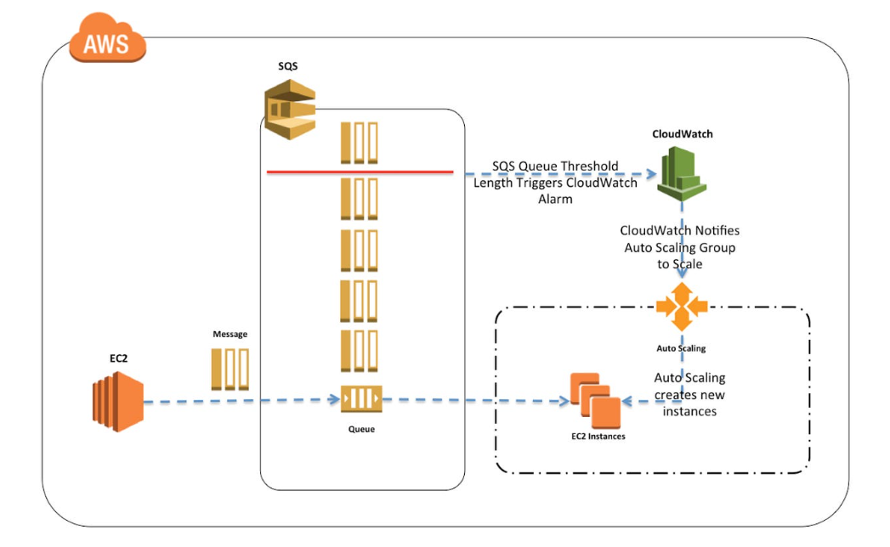
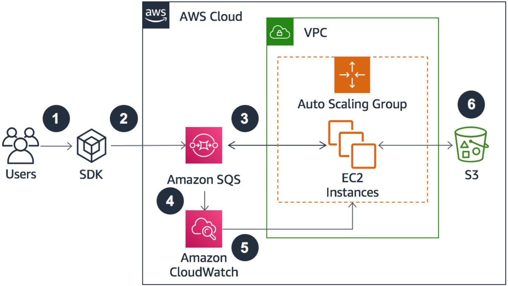
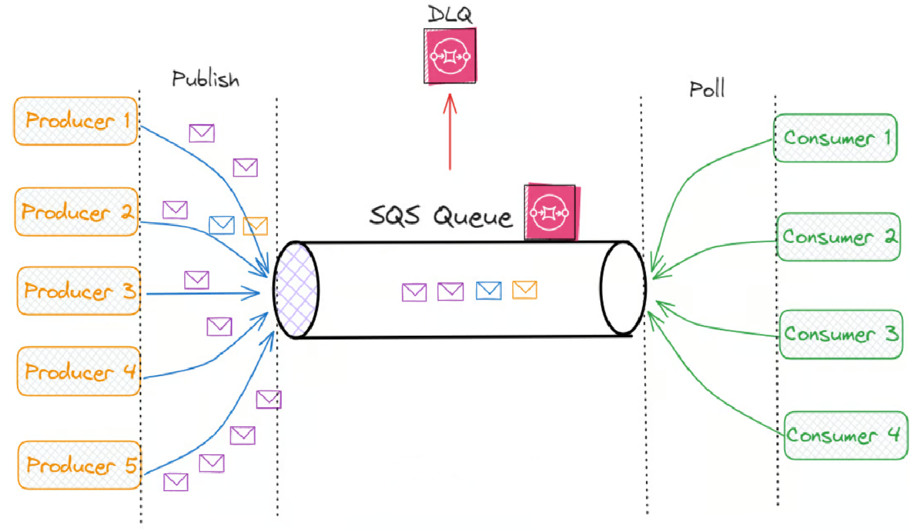

# 📬 Understanding Amazon SQS – Overview

As cloud-native applications grow in complexity and scale, the need for reliable, decoupled communication between microservices becomes critical. **Amazon SQS (Simple Queue Service)**, one of the oldest and most reliable AWS services, provides a fully managed queuing service that enables asynchronous communication between distributed systems.

---

## 🧱 What Is a Queue?

A **queue** is a temporary storage mechanism that enables one part of a system to communicate with another without being directly connected. It allows **producers** (senders) to send messages to a queue, while **consumers** retrieve and process those messages asynchronously.





---

## 🧾 Amazon SQS – Standard Queue Overview

The **Standard Queue** is the default queue type in SQS and is ideal for scenarios requiring high throughput and eventual consistency.

> ==Eventual consistency== is a data consistency model in distributed systems where, after a period of time, all data replicas will eventually converge to the same value, even if there are temporary inconsistencies

### 🔑 Key Attributes:
- **Fully managed and serverless**
- **Unlimited throughput** and number of messages
- **Low latency** (<10 ms)
- Message **retention**: 4 days (default), up to 14 days
- **Message size limit**: 256 KB
- **At-least-once delivery** (possible duplicates)
- **Best-effort ordering** (messages may not be in order)


**Note :**

> **==Best-effort ordering==** in the context of message queues (like Amazon SQS) means that while the system tries to deliver messages in the order they were sent, there's no guarantee of strict ordering, and messages might occasionally arrive out of sequenc

> **==At-least-once delivery==** ensures messages are delivered at least once, potentially leading to duplicates, but guarantees no message loss in case of failures, requiring the consumer to handle potential duplicates

---

## 📨 Producing Messages to SQS

Messages are sent using the **SendMessage API** from the AWS SDK or CLI. Once sent, the message is **persisted** until it is deleted by a consumer.

### Example:
Sending an order to be processed:

```json
{
  "orderId": "1234",
  "customerId": "5678"
}
```

The message stays in SQS until a consumer deletes it after processing.

---

## 📥 Consuming Messages from SQS

### 🧾 Consumer Responsibilities:
- **Poll** the SQS queue using the `ReceiveMessage` API. 
- Process the message (e.g., update a database)
- **Delete** the message using the `DeleteMessage` API after successful processing



Consumers can be hosted on:
- EC2 Instances
- Lambda functions
- On-premise servers

> **DLQ** stands for ==Dead Letter Queue==, which is a software component that temporarily stores messages that can't be processed. DLQs are used in message queueing systems and can be used in services like Amazon SQS, Azure Service Bus, and Apache Kafka. 

---

## ⚙️ Scaling with EC2 Instances

Amazon SQS supports **horizontal scaling** using multiple EC2 instances. Each instance polls the queue in parallel to process messages efficiently.

### Benefits:
- **Parallel processing**
- **Best-effort ordering**
- **At-least-once delivery**
- Improved throughput by **scaling consumers horizontally**


---

## ⚡ SQS with Auto Scaling Group (ASG)

To handle message spikes, EC2 instances in an Auto Scaling Group can scale based on the number of messages in the queue.

### How It Works:
1. SQS pushes CloudWatch metrics (queue length).
2. CloudWatch Alarm detects a threshold breach.
3. Alarm triggers Auto Scaling Group to **scale up** or down EC2 instances.

This enables **cost-optimized, dynamic scaling** based on actual load.

---

## 🔗 SQS for Decoupling Applications

SQS plays a crucial role in **decoupling frontend and backend systems**.

- Frontend applications (auto-scaled) send requests to the SQS queue.
- Backend applications poll the queue and process messages independently.

This decoupling:
- Improves system reliability
- Enables independent scaling
- Simplifies architecture

---

## 🔐 SQS Security

Amazon SQS offers multiple layers of security:

### Encryption:
- **In-transit**: HTTPS
- **At-rest**: KMS-managed encryption
- **Client-side encryption**: Optional for custom encryption

### Access Control:
- IAM policies to control access to the SQS API
- Queue policies for **cross-account access**
- Integration with **SNS, Lambda, S3**, etc.

---

## 📌 Conclusion

Amazon SQS is a powerful, cost-effective service that helps build **reliable**, **scalable**, and **decoupled** cloud applications. Whether you're sending orders, handling logs, or triggering workflows, SQS ensures your components communicate **asynchronously and efficiently**.

By combining SQS with services like EC2 Auto Scaling, Lambda, and CloudWatch, you can build intelligent, responsive systems that scale automatically while maintaining separation of concerns.

