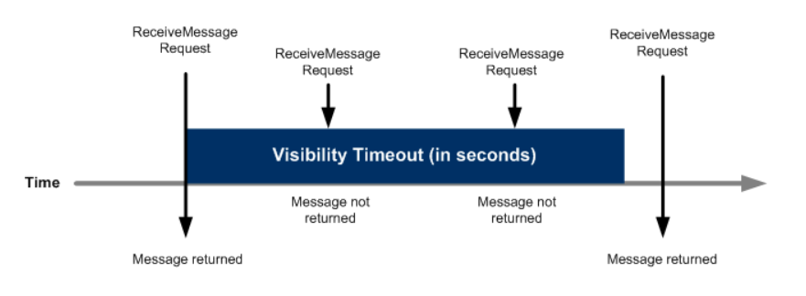
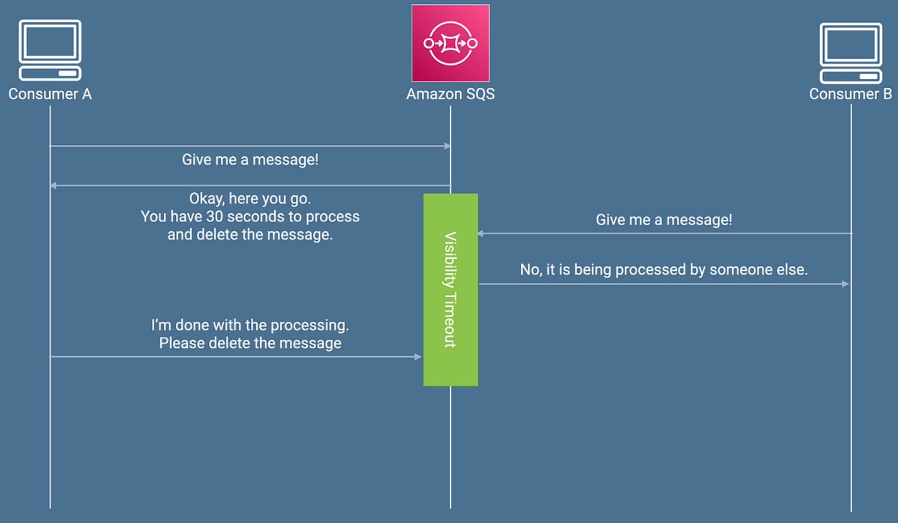
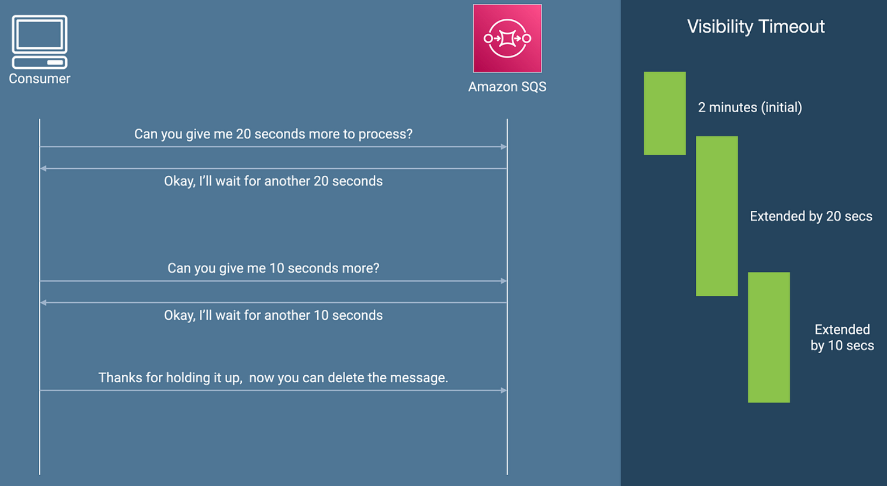

# ⏳ Amazon SQS – Message Visibility Timeout: A Deep Dive

In distributed systems, managing messages between producers and consumers is critical. Amazon Simple Queue Service (SQS) helps decouple application components, but a key concept that determines how messages behave once received is the **Message Visibility Timeout**.

Let’s explore what it is, why it matters, and how to use it effectively.

---

## 📩 What is Message Visibility Timeout?

When a consumer retrieves a message from an SQS queue using the `ReceiveMessage` API, the message **does not get deleted** automatically. Instead, it becomes **temporarily invisible** to other consumers. This period is called the **visibility timeout**.

### 🔒 Default Timeout
- By default, this timeout is set to **30 seconds**.
- During this window, **only the consumer who received the message can process it**.
- If the consumer fails to delete the message within that timeframe, it becomes **visible again** to other consumers.

---

## 📊 Timeline Example





---

## 💥 Why is it Important?

### ✅ Prevents Duplicate Processing — Temporarily hides the message from others while it's being processed.

### ⚠️ Avoids Reprocessing — If the consumer fails to delete it before timeout, **SQS assumes failure**, and the message gets delivered again.

---

## ⚙️ Changing the Timeout

Sometimes, 30 seconds may not be enough. In such cases, the consumer can call the `ChangeMessageVisibility` API to **extend the visibility timeout** dynamically.

```bash
aws sqs change-message-visibility \
  --queue-url <queue-url> \
  --receipt-handle <message-receipt-handle> \
  --visibility-timeout 120
```




---

## 🔄 What Happens If:

- **Message is not deleted** → It will **reappear** after timeout, and might be picked by another consumer.
- **Visibility Timeout too low** → Results in **duplicate messages**.
- **Timeout too high & consumer crashes** → Message is stuck until timeout expires.

---

## 🧠 Best Practices

- Estimate your average processing time and set visibility timeout slightly higher.
- Use `ChangeMessageVisibility` for long-running tasks.
- Monitor unprocessed or reappearing messages using **CloudWatch metrics**.
- Combine with **dead-letter queues** to manage message retries and failures.

---

## 🔄 Summary

| Scenario | Outcome |
|----------|---------|
| Message processed within timeout | ✅ Message deleted |
| Message not processed | 🔁 Message reappears after timeout |
| Message visibility extended | ⏳ More time given before reappearance |
| Timeout too low | ⚠️ Duplicate processing risk |
| Timeout too high & crash | ⛔ Delay in retrying |

---

## 📝 Final Thoughts

Understanding and tuning the **message visibility timeout** is vital to designing reliable and scalable systems with Amazon SQS. It ensures **exactly-once processing** behavior where possible and protects against accidental duplicate handling. With thoughtful configuration, it becomes a powerful lever in building resilient async architectures.

