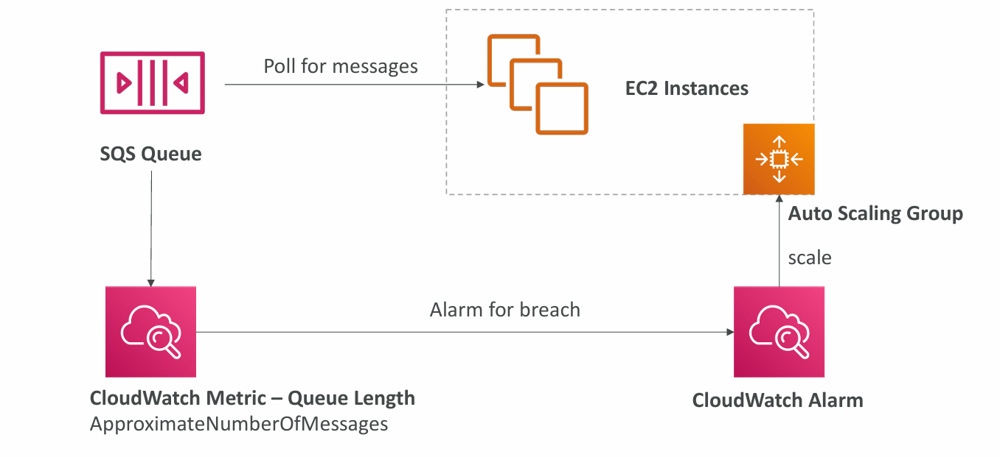

# 📦 **Scaling Applications with Amazon SQS and Auto Scaling Groups**

In a modern cloud-native architecture, ensuring seamless scalability, reliability, and fault-tolerance is essential. Amazon SQS (Simple Queue Service) combined with Auto Scaling Groups (ASGs) offers a powerful approach to handle traffic spikes, asynchronous processing, and application decoupling. Let's dive into how these components interact and solve real-world scalability challenges.

---

## 🔁 **Why Auto Scaling Alone Isn’t Enough**

Without queues, high incoming traffic can overload your application instances even if they are behind an auto-scaling group. This can lead to failed requests or dropped transactions, especially when backend systems like databases become overwhelmed.

**Problems:**
- Requests can get lost if the server crashes.
- Backend systems may not handle burst traffic gracefully.

> ==Bursty traffic== refers to network traffic characterized by sudden spikes of high data transfer rates followed by periods of low activity or idle time, which can lead to congestion and performance issues

---

## 🧯 **SQS as a Buffer to Protect Your Database**

Amazon SQS acts as a buffer between your application and backend databases. When a spike in traffic occurs:
1. The frontend app sends messages to the SQS queue.
2. A scalable fleet of backend consumers processes the messages and performs database writes.

This approach ensures:
- No request is lost during peak traffic.
- Backend databases are protected from sudden spikes.
- Failures don't result in data loss.

---

## 🏗 **Auto Scaling Based on Queue Metrics**

With **CloudWatch Metrics**, you can monitor the **ApproximateNumberOfMessages** in the SQS queue. If the queue length increases:
- A **CloudWatch Alarm** triggers an **Auto Scaling Group** to launch additional EC2 instances.
- These instances poll the queue and process the messages.

This reactive system ensures just the right amount of compute power is used to handle the load.

---

## 🧩 **Decoupling Application Tiers**

SQS is also instrumental in **decoupling** frontend and backend systems. Instead of direct communication:
- Frontend places messages in the queue.
- Backend reads from the queue and processes them.

Benefits:
- Independent scalability of services.
- Improved fault tolerance.
- Easier debugging and monitoring.

---

## 🌐 **Real-World Use Case: Order Processing System**

Let’s imagine an e-commerce application:
- Frontend captures orders and places them into SQS.
- Backend (order processor) picks them from the queue, updates inventory, and processes payment.

Even if the backend is temporarily down, the queue retains messages. When the backend resumes, it processes pending messages—ensuring no order is lost.

---

## ⚖️ **Advantages of This Architecture**

✅ **Scalability:** Dynamically scales EC2 instances to match traffic.

✅ **Reliability:** Messages persist in SQS until successfully processed.

✅ **Efficiency:** Optimizes compute usage based on real load.

✅ **Modularity:** Each component can evolve independently.

---

## 📌 **Final Thoughts**

Using **Amazon SQS as a buffer** between application tiers or between applications and databases is a best practice for building resilient, scalable systems. By integrating it with **Auto Scaling Groups**, you can automate infrastructure growth based on demand—saving cost, improving performance, and ensuring fault-tolerance.

