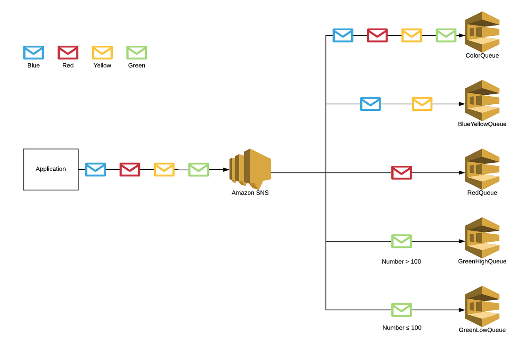
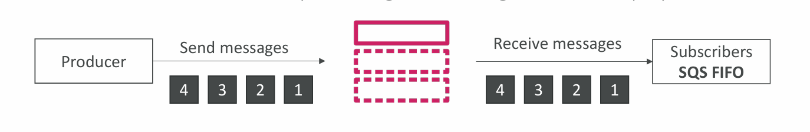
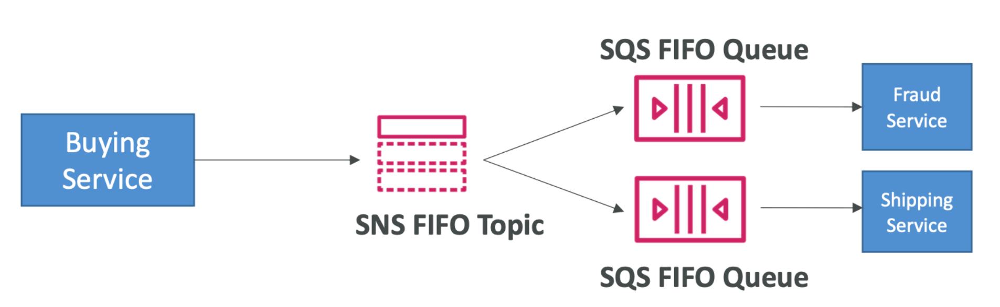
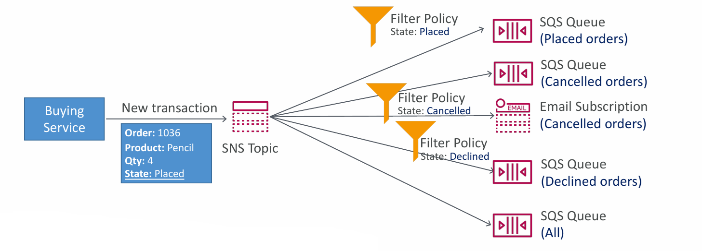

# 📬 Deep Dive into Amazon SNS: Advanced Features & Use Cases

After understanding the basics of Amazon SNS, let’s explore its more advanced capabilities like fan-out, FIFO topics, filtering, and real-world integrations with other AWS services.

---

## 🔁 SNS + SQS: Fan-Out Architecture

One of the most powerful patterns with SNS is **fan-out**, where a single SNS message is pushed to multiple SQS queues. This ensures:

- **Scalability:** Multiple consumers can process the message independently.
- **Resilience:** Fully decoupled systems with **no data loss**.
- **Flexibility:** Add more SQS queues anytime without modifying the producer.
- **Persistence & Retry:** SQS queues offer **durable storage, delayed delivery**, and **retry logic**.
- **Cross-region support:** You can deliver messages to SQS queues in different AWS regions.

✅ **Best Practice:** Always ensure your SQS queue’s **access policy** permits the SNS topic to send messages.

---

## 📦 Use Case: S3 Events to Multiple Consumers

Amazon S3 only allows **one event notification** for a combination of event type and object prefix. But what if multiple services need to react to an S3 event?

💡 **Solution:** Use SNS as a middleman.

- Configure the **S3 event** to publish to an **SNS topic**.
- Fan-out the event to **multiple SQS queues** and **Lambda functions** from SNS.

This architecture simplifies broadcasting an S3 event to multiple consumers.

---

## 🔥 Use Case: SNS to S3 via Kinesis Data Firehose

SNS can be used to stream events to data lakes and analytics platforms via **Kinesis Data Firehose**.

🔄 Architecture:
- The **Buying Service** sends events to an **SNS Topic**.
- The topic pushes data to **Kinesis Data Firehose**.
- Firehose delivers it to **Amazon S3** or any other supported **destination**.

📊 Ideal for:
- Log aggregation
- Event auditing
- Real-time analytics pipelines

---

## 📑 FIFO Topics: Order and Deduplication with SNS

By default, SNS topics do **not guarantee order**. But in critical systems, **message order and deduplication** are vital. Enter **SNS FIFO Topics**.

### Features:
- **Ordering:** Messages are sent and received in the same sequence using `MessageGroupId`.
- **Deduplication:** Avoids duplicates using `DeduplicationId` or content-based deduplication.
- Can **fan-out** to **SQS FIFO** or **Standard Queues**.
- ⚠️ **Throughput Limitation:** Same as SQS FIFO (~300 msg/sec without batching).

🚀 Use when **event order and idempotency** are critical.

> **Note:** ==Data deduplication== is the process of removing duplicate data from a system to save storage space and improve data quality. It can be done at the file, block, or byte level. 

> **Note:** ==Idempotency==, in the context of computer science and APIs, is a property where an operation, when applied multiple times, yields the same result as applying it once, ensuring no unintended side effects or duplicates. 

---

## 🧵 SNS FIFO + SQS FIFO: Fan-Out with Order + Deduplication

For mission-critical pipelines that need **guaranteed order**, **exact-once delivery**, and **multi-subscriber fan-out**, pair **SNS FIFO** with **SQS FIFO Queues**.

📌 Example:
- A **Buying Service** pushes messages to **SNS FIFO**.
- SNS fans out messages to multiple **FIFO queues** (e.g., Fraud Detection, Shipping).
- Each subscriber processes events in the **same order** and with **no duplicates**.

---

## 🧠 Advanced Filtering: Tailored Event Delivery

Sometimes, you don’t want every subscriber to receive all messages. Enter **SNS Message Filtering**.

### How It Works:
- Subscribers attach a **JSON filter policy** to the topic.
- Only messages that match the policy are delivered.
- If no filter policy is defined, the subscriber gets **all messages**.

🔍 Example:
- A message with `"State": "Placed"` is only delivered to the queue filtering for `"Placed"`.
- `"Cancelled"` messages go to a different queue and also to an **email subscription**.
- This reduces noise and improves processing efficiency.

---

## 📌 Summary: Why SNS is a Game-Changer

| Feature                        | Benefit                                              |
|-------------------------------|------------------------------------------------------|
| Pub/Sub Architecture          | Decouples services, scales easily                    |
| Fan-Out with SQS              | Push once, deliver to many                           |
| FIFO Topics                   | Ordered, deduplicated messaging                      |
| Kinesis Integration           | Stream to S3 or analytics platforms                  |
| Message Filtering             | Precision delivery using JSON policies               |
| Cross-Region and Mobile Push  | Supports global and mobile communication channels    |

---

## 🔚 Final Thoughts

Amazon SNS is not just a simple notification service—it's a robust backbone for **event-driven** and **microservices** architectures. Whether you're processing e-commerce transactions, logging user activity, or integrating AWS services, SNS delivers flexibility, reliability, and power.

