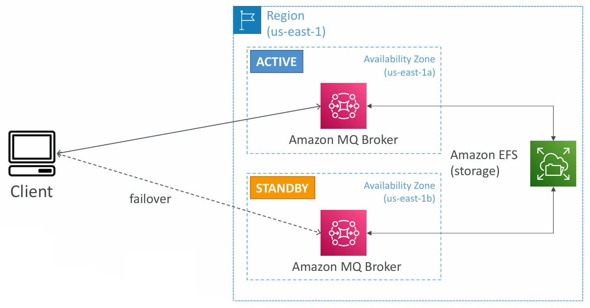

## 💬 Amazon MQ – Bridging Traditional Messaging with Cloud Scalability

As cloud-native architectures evolve, so do messaging needs. While services like **Amazon SQS**, **SNS**, and **Kinesis** are ideal for scalable cloud applications, many organizations still run traditional systems based on **open messaging protocols**. Enter **Amazon MQ** — a managed message broker designed to help bridge the gap between legacy systems and modern AWS infrastructure.

---

### 🚀 What is Amazon MQ?

**Amazon MQ** is a **managed message broker service** for **Apache ActiveMQ** and **RabbitMQ**. It supports standard protocols like:
- **AMQP**
- **MQTT**
- **STOMP**
- **Openwire**
- **WSS**

Unlike SQS and SNS, which use **AWS-proprietary protocols**, Amazon MQ allows applications to **migrate to the cloud without rewriting** the messaging layer.

---

### 🔄 Amazon MQ vs. SQS/SNS

| Feature                     | Amazon MQ                     | SQS / SNS                         |
|----------------------------|-------------------------------|------------------------------------|
| Protocol Support           | Open (AMQP, MQTT, STOMP, etc.)| AWS-native                         |
| Message Broker             | Yes (ActiveMQ/RabbitMQ)       | No (Queue/Topic only)              |
| Scalability                | Limited scaling               | High scalability                   |
| Deployment Type            | Server-based brokers          | Fully managed, serverless          |
| Use Case                   | Lift-and-shift legacy systems | Cloud-native, event-driven apps    |

---

### 📦 Key Features of Amazon MQ

- **Supports existing messaging protocols**: No need to rewrite your application if you're using RabbitMQ or ActiveMQ on-prem.
- **Managed broker infrastructure**: AWS handles provisioning, patching, and failover.
- **Supports both queues and topics**:
  - Queues → like SQS
  - Topics → like SNS (pub/sub)
- **Multi-AZ deployment** for **high availability**.
- **EFS-backed storage** ensures persistence and replication across zones.

---

### 🛠️ When Should You Use Amazon MQ?

Use Amazon MQ when:

- You are **migrating legacy applications** that already use **standard messaging protocols**.
- You want to **avoid refactoring** code to work with SQS/SNS.
- Your applications rely on **features from traditional brokers** (e.g., persistent subscriptions, transactions, protocol-level features).

---

### 🛡️ Amazon MQ – High Availability Architecture

Amazon MQ supports **Active/Standby broker deployments across Availability Zones** for fault tolerance.

#### Architecture Highlights:
- Brokers run in **two AZs** (e.g., `us-east-1a` and `us-east-1b`).
- **Active broker** handles traffic.
- If it fails, clients automatically **failover to standby**.
- **Amazon EFS** ensures both brokers share the same storage backend.

📊 This setup ensures **minimal downtime** and **message durability** even during infrastructure failures.

---

### 🧠 Key Considerations

- **Amazon MQ is not built for massive scale** like SQS or Kinesis.
- Ideal for **migration scenarios** or **hybrid architectures**.
- Offers more **fine-grained control**, but with **more complexity** than serverless messaging.

---

### ✅ Summary

| Pros                                           | Cons                                           |
|------------------------------------------------|------------------------------------------------|
| No need to rewrite legacy messaging apps       | Not as scalable as SQS/SNS                    |
| Protocol support (AMQP, MQTT, etc.)            | Requires broker sizing and tuning             |
| High availability across AZs                   | More complex than SQS/SNS                     |
| Managed RabbitMQ/ActiveMQ                      | Slightly higher operational overhead           |

---

### 🔚 Final Thoughts

If your enterprise is shifting from a traditional on-prem system with RabbitMQ or ActiveMQ, **Amazon MQ provides a smooth lift-and-shift path to AWS**. It delivers the reliability and protocol compatibility of legacy brokers, with the managed infrastructure and high availability of AWS.

However, for high-scale, event-driven, or microservice-based applications, **SQS, SNS, and Kinesis** are still the preferred solutions.

