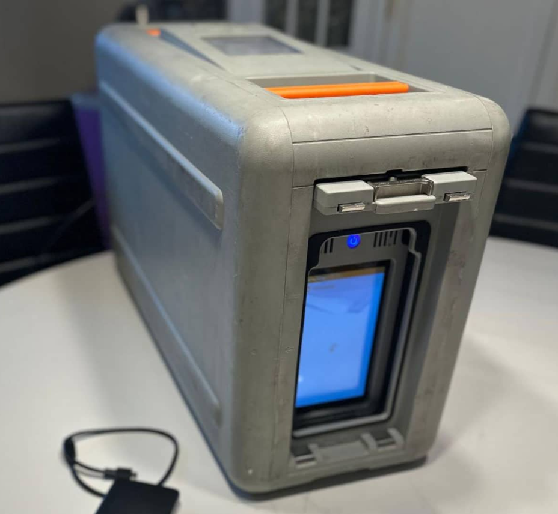

## ❄️ AWS Snowball – Move Petabytes with Speed, Security, and Simplicity

When it comes to moving huge volumes of data to the cloud, traditional network-based data transfer methods fall short. That’s where **AWS Snowball** steps in — a physical data transport device designed to handle **petabyte-scale data migrations**, even in **limited or disconnected environments**.

---

### 🚚 What is AWS Snowball?

**AWS Snowball** is a **highly-secure, portable device** that allows organizations to:

- **Collect and process data at the edge** (remote locations)
- **Migrate data into and out of AWS**
- **Preprocess and analyze data before transfer**

Snowball devices come with **military-grade security**, **tamper-evident enclosures**, and **tracking via Amazon SNS**.

---

### 📦 Snowball Edge Devices – Compute vs. Storage Optimized

AWS offers two Snowball Edge variants:

| Device Type                         | Compute       | Memory | Storage (SSD) |
|------------------------------------|---------------|--------|---------------|
| **Storage Optimized**              | 104 vCPUs     | 416 GB | **210 TB**     |
| **Compute Optimized**              | 104 vCPUs     | 416 GB | 28 TB          |

- **Storage Optimized**: Ideal for large data migrations.
- **Compute Optimized**: Tailored for **edge computing**, supports **EC2 instances** and **Lambda functions** locally.

---

### 🔁 Data Migrations with Snowball – Why & When?

Transferring **petabytes over the internet** is often **slow, expensive**, and **unreliable**. Snowball overcomes:

#### 🌐 Network Transfer Challenges:
- Limited bandwidth or connectivity
- High network costs
- Unstable connections
- Shared bandwidth in enterprise settings

#### 🕒 Transfer Time Estimates:

| Data Size | 100 Mbps | 1 Gbps  | 10 Gbps |
|-----------|----------|--------|---------|
| 10 TB     | 12 days  | 30 hrs | 3 hrs   |
| 100 TB    | 124 days | 12 days| 30 hrs  |
| 1 PB      | 3 years  | 124 days | 12 days |

💡 **Rule of Thumb:** If it takes more than a week over the network — **use Snowball**.

---

### 🛠️ Snowball in Action – Direct Upload vs. Snowball Workflow

#### 1. **Direct Upload to Amazon S3**
- Fast (if 10 Gbps available)
- Requires stable high-speed internet

#### 2. **Snowball Workflow**
- Client loads data onto Snowball
- Device is physically **shipped to AWS**
- Data is **imported to S3** by AWS team

> ✅ Offline transfers become viable for **disconnected**, **remote**, or **high-volume** use cases.

---

## 🌍 Edge Computing with AWS Snowball

In remote areas where cloud connectivity is limited or unavailable, **Snowball Edge** enables **processing data on-site**, reducing the need for real-time uploads.

### ⚙️ What is Edge Computing?

**Edge computing** processes data **at or near the source** of generation — rather than sending it to a centralized cloud.

#### Example Edge Locations:
- Trucks on the road
- Ships in the ocean
- Mining stations underground

> Note: ==Edge computing== is a distributed computing paradigm that brings computation and data storage closer to the sources of data, like IoT devices or local servers, to reduce latency and improve performance by processing data locally rather than relying solely on centralized cloud data centers

---

### 🧠 Snowball Edge for Edge Computing

Snowball Edge devices are designed to run **EC2 instances** and **Lambda functions** directly on the device. 

Use cases:
- Preprocessing sensor data
- Running AI/ML models locally
- Transcoding video in remote environments

---

### 🧳 Real-World Use Cases

| Industry        | Use Case                                     |
|-----------------|-----------------------------------------------|
| Logistics       | Track cargo on moving trucks and process logs |
| Oil & Mining    | Analyze geological data in offline zones      |
| Healthcare      | Run ML models on patient scans on-site        |
| Media           | Transcode videos on location                  |

---

### 🛡️ Security

- Data is encrypted using **256-bit encryption**.
- Keys are managed using **AWS Key Management Service (KMS)**.
- Device is locked and tamper-resistant.

---

### ✅ Summary – Why Use AWS Snowball?

| Benefit                        | Description                                    |
|-------------------------------|------------------------------------------------|
| ✅ Massive-scale transfer      | Petabyte-level migration in days               |
| ✅ Offline capability          | Useful in areas with low/no internet           |
| ✅ Edge processing             | Run apps closer to where data is generated     |
| ✅ Fully managed by AWS        | Device tracking, import, and wipe handled by AWS |

---

### 🧭 Final Thoughts

AWS Snowball is not just a data transport device — it’s a **powerful edge computing solution** for modern businesses dealing with **massive**, **distributed**, or **low-connectivity** data environments. Whether you're migrating terabytes to AWS S3 or processing data in the middle of the ocean, Snowball has you covered.
