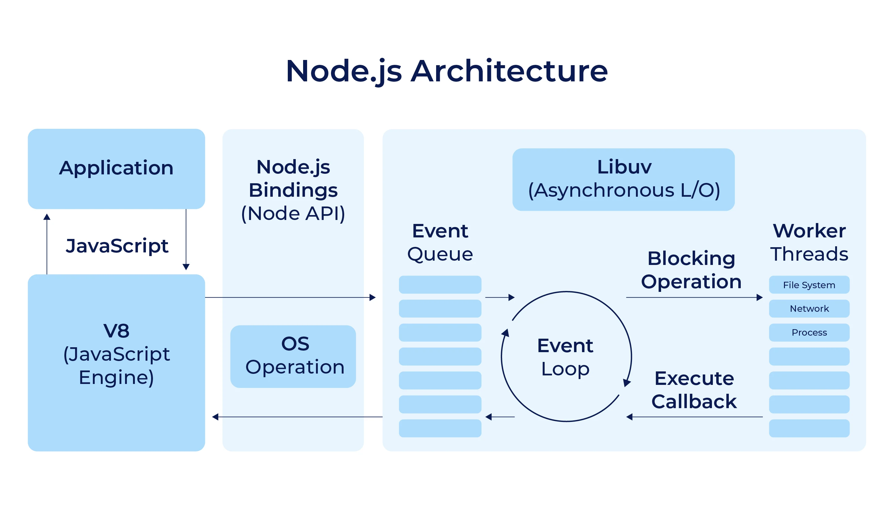

# 🧠 Understanding Node.js Architecture – A Complete Guide

Node.js is a **runtime environment** that allows you to run **JavaScript on the server side** — outside of a browser. But what really makes Node.js powerful, fast, and non-blocking is its unique **architecture**.

Let’s dive deep into how Node.js works under the hood.

---

## 🚀 1. What is Node.js?

- Node.js is built on **Google Chrome's V8 engine**
- It uses a **non-blocking, event-driven architecture**
- Ideal for **I/O-heavy operations** (e.g., file system, databases, network requests)

---

## 🏗️ 2. Node.js Architecture Overview

```
            ┌───────────────────────────────┐
            │        Application Code       │
            └───────────────────────────────┘
                          │
                          ▼
            ┌───────────────────────────────┐
            │      Node.js Runtime (C++)    │
            └───────────────────────────────┘
                          │
             ┌────────────┼────────────┐
             ▼            ▼            ▼
       ┌────────┐   ┌────────────┐  ┌────────────┐
       │  V8    │   │  Libuv     │  │  C++ Bindings │
       └────────┘   └────────────┘  └────────────┘
          │               │
          ▼               ▼
    JavaScript        Event Loop (core)
  Execution Engine    Thread Pool + I/O
```





---

## 🔄 3. Key Components of Node.js Architecture

### 1️⃣ V8 Engine
- Developed by Google (used in Chrome)
- Converts **JavaScript code to machine code** for fast execution
- Manages memory, garbage collection, etc.

---

### 2️⃣ Libuv
- A C library that provides:
  - **Event loop**
  - **Thread pool**
  - **Asynchronous I/O operations**
- Helps Node.js achieve **non-blocking behavior** even for things JS can’t do natively (e.g., file system)

---

### 3️⃣ Event Loop
- The **heart** of Node.js
- Constantly checks:
  - Are there any events (callbacks) to run?
  - Are there any pending timers, I/O, or promises?

---

## 🔁 4. Node.js Event Loop Phases

Node's event loop runs in **phases**, and each phase has its queue of callbacks.

```
   ┌───────────────────────────┐
┌─>│           timers          │
│  └─────────────┬─────────────┘
│  ┌─────────────┴─────────────┐
│  │     pending callbacks     │
│  └─────────────┬─────────────┘
│  ┌─────────────┴─────────────┐
│  │       idle, prepare       │
│  └─────────────┬─────────────┘      ┌───────────────┐
│  ┌─────────────┴─────────────┐      │   incoming:   │
│  │           poll            │<─────┤  connections, │
│  └─────────────┬─────────────┘      │   data, etc.  │
│  ┌─────────────┴─────────────┐      └───────────────┘
│  │           check           │ 
│  │       (setImmediate)      │
│  └─────────────┬─────────────┘
│  ┌─────────────┴─────────────┐
└──┤      close callbacks      │
   └───────────────────────────┘
```

Each phase:
- Pulls functions from its queue
- Executes them
- Passes control to the next phase

[See More...](https://nodejs.org/en/learn/asynchronous-work/event-loop-timers-and-nexttick)

---

## 🔧 5. Thread Pool (via Libuv)

- Node.js is **single-threaded for JS**, but uses **multi-threading under the hood**
- For blocking operations (e.g., fs.readFile), Libuv uses a **thread pool**
- Default size: 4 threads (can be increased)

---

## 🔗 6. C++ Bindings

- Some APIs (like file system, crypto) are built in C++
- Exposed to JS via bindings (using `N-API`, `node-addon-api`, or `Nan`)

---

## 🧪 7. Example: What Happens in a `setTimeout`

```js
console.log("Start");

setTimeout(() => {
  console.log("Timer done");
}, 1000);

console.log("End");
```

### Step-by-step:
1. JS engine (V8) executes `console.log("Start")`
2. `setTimeout` registers a timer via Libuv → handled outside main thread
3. `console.log("End")` executes
4. After 1000ms, the callback is pushed into the **event loop queue**
5. When the stack is clear, the callback runs → `"Timer done"`

---

## 🧠 8. Why is Node.js So Fast?

- No thread context switching
- Non-blocking I/O
- Event-driven concurrency
- V8’s compiled speed

But remember: **CPU-heavy tasks block the event loop**, so Node is best for **I/O-bound** workloads.

---

## ❌ 9. When Not to Use Node.js

- High-performance math or image/video processing
- CPU-bound workloads like ML model training
- Multi-threaded computation (use worker threads or offload to services)

---

## 🧵 10. Bonus: What About Worker Threads?

- Node.js ≥ v10.5 supports **`worker_threads`** for CPU-intensive work
- Still limited — not as native as Python multiprocessing or Java threads

---

## ✅ Summary

| Concept        | Role in Architecture             |
|----------------|----------------------------------|
| V8 Engine      | Executes JS, compiles to native  |
| Libuv          | Handles async I/O, event loop    |
| Event Loop     | Orchestrates all async behavior  |
| Thread Pool    | Executes blocking I/O off main thread |
| C++ Bindings   | Enable low-level OS features     |

---

## 📦 Real-World Use Cases
- REST APIs / GraphQL servers
- Streaming servers (video/audio)
- Real-time apps (chat, games)
- Developer tools (Webpack, ESLint are built on Node)
- Serverless functions (AWS Lambda supports Node.js natively)

---

## Comparison for CPU-intensive and I/O-intensive tasks:

Comparison for **CPU-intensive** and **I/O-intensive** tasks using **Java**, **Python**, and **Node.js**:

---

## 🧠 1. **CPU-Intensive Tasks** (e.g., image processing, data crunching, encryption)

| Language   | Performance | Threading Support | Suitability |
|------------|-------------|-------------------|-------------|
| ⚙️ **Java**   | ✅ Fast (JVM + JIT) | ✅ True multithreading | **Best choice** 💪 |
| 🐍 Python   | ❌ Slow (interpreted) | ⚠️ Threads blocked by GIL | Limited (use multiprocessing) |
| 🌐 Node.js  | ❌ Single-threaded JS | ⚠️ Worker threads are recent & limited | Not ideal |

> ✅ **Winner**: **Java** (native threads + performance)

---

## ⚡ 2. **I/O-Intensive Tasks** (e.g., API servers, file I/O, DB access, streaming)

| Language   | Async I/O Support | Memory Footprint | Suitability |
|------------|--------------------|------------------|-------------|
| ⚙️ Java     | ✅ Yes (NIO, Netty, Spring WebFlux) | Medium      | Great for scalable apps |
| 🐍 Python   | ✅ Yes (`asyncio`, `aiohttp`)        | Light       | Good for prototyping, but slower |
| 🌐 Node.js  | ✅ Native event loop (libuv)         | Very low    | **Best for real-time APIs/chat** ⚡

> ✅ **Winner**: **Node.js** (performance + developer speed)

> **Note:** ==Memory footprint== refers to the amount of computer memory (RAM) a software application or system occupies while running. It's not just about the total memory used, but also how that memory is distributed and the characteristics of the pages used. 

---

## 📊 Final Verdict

| Task Type       | Best Choice       | Notes                          |
|------------------|------------------|--------------------------------|
| CPU-intensive     | **Java**          | JVM optimizations + multithreading |
| I/O-intensive     | **Node.js**       | Lightweight, async-first       |
| Rapid prototyping | **Python**        | Fast to build, slower to scale |


