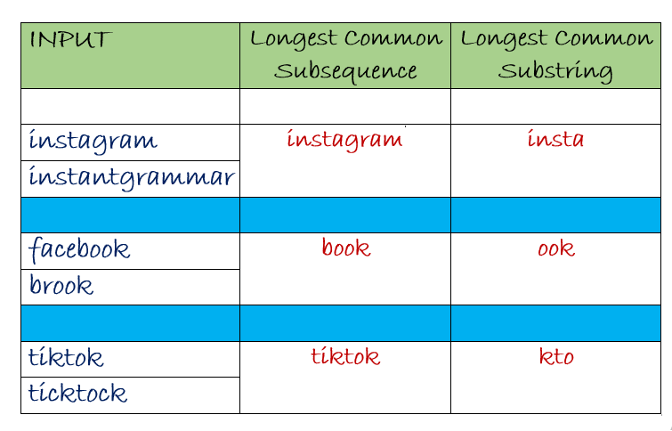
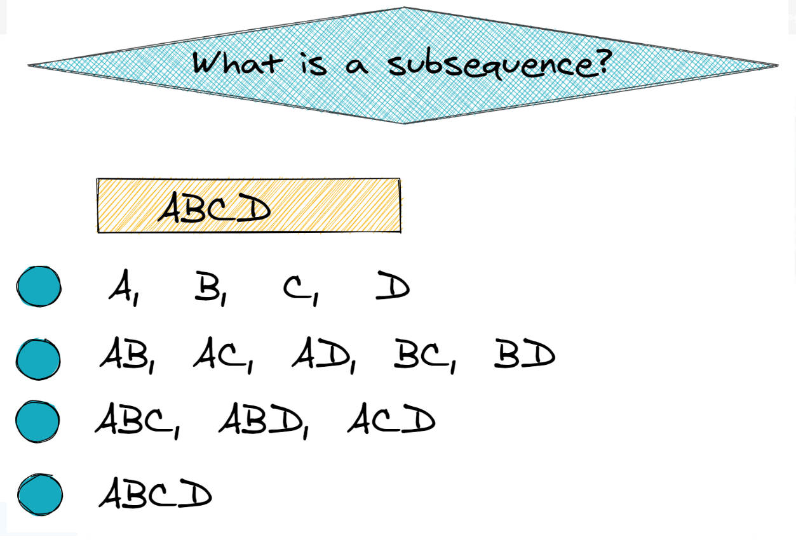

Here are **all the major approaches** to solve [LeetCode 3 – Longest Substring Without Repeating Characters](https://leetcode.com/problems/longest-substring-without-repeating-characters/description/):

---

### ==Subsequence vs Substring== 





---

## 💡 Problem Statement:
Given a string `s`, find the length of the **longest substring without repeating characters**.

---

## ✅ Approach 1: **Brute Force**

- **Idea:** Try all substrings, check if they have unique characters.
- **Time Complexity:** O(n³)
- **Space Complexity:** O(n)

```java
public int lengthOfLongestSubstring(String s) {
    int maxLen = 0;
    for (int i = 0; i < s.length(); i++) {
        for (int j = i + 1; j <= s.length(); j++) {
            if (allUnique(s, i, j)) {
                maxLen = Math.max(maxLen, j - i);
            }
        }
    }
    return maxLen;
}

private boolean allUnique(String s, int start, int end) {
    Set<Character> set = new HashSet<>();
    for (int i = start; i < end; i++) {
        if (!set.add(s.charAt(i))) return false;
    }
    return true;
}
```

---

## ✅ Approach 2: **Sliding Window with Set**

- **Idea:** Use a sliding window with two pointers and a Set to track characters.
- **Time Complexity:** O(2n) = O(n)
- **Space Complexity:** O(min(n, 128))

```java
public int lengthOfLongestSubstring(String s) {
    Set<Character> set = new HashSet<>();
    int left = 0, maxLen = 0;

    for (int right = 0; right < s.length(); right++) {
        while (set.contains(s.charAt(right))) {
            set.remove(s.charAt(left++));
        }
        set.add(s.charAt(right));
        maxLen = Math.max(maxLen, right - left + 1);
    }
    return maxLen;
}
```

---

## ✅ Approach 3: **Sliding Window with Map (Optimized Jump)**

- **Idea:** Store character indices in a map. Jump `left` directly after duplicate.
- **Time Complexity:** O(n)
- **Space Complexity:** O(min(n, 128))

```java
public int lengthOfLongestSubstring(String s) {
    Map<Character, Integer> map = new HashMap<>();
    int left = 0, maxLen = 0;

    for (int right = 0; right < s.length(); right++) {
        char ch = s.charAt(right);
        if (map.containsKey(ch)) {
            left = Math.max(map.get(ch) + 1, left);
        }
        map.put(ch, right);
        maxLen = Math.max(maxLen, right - left + 1);
    }
    return maxLen;
}
```

---

## ✅ Approach 4: **Fixed-Size Array Instead of Map (ASCII optimization)**

- **Idea:** Replace map with a 128-sized array if input is ASCII.
- **Time Complexity:** O(n)
- **Space Complexity:** O(128)

```java
public int lengthOfLongestSubstring(String s) {
    int[] index = new int[128]; // ASCII
    int left = 0, maxLen = 0;

    for (int right = 0; right < s.length(); right++) {
        char ch = s.charAt(right);
        left = Math.max(index[ch], left);
        maxLen = Math.max(maxLen, right - left + 1);
        index[ch] = right + 1;
    }
    return maxLen;
}
```

---

## 📌 Summary of All Approaches

| Approach                             | Time    | Space   | Notes                               |
|--------------------------------------|---------|---------|-------------------------------------|
| 1. Brute Force                       | O(n³)   | O(n)    | Very slow, just for understanding   |
| 2. Sliding Window + Set              | O(n)    | O(n)    | Easy and intuitive                  |
| 3. Sliding Window + HashMap          | O(n)    | O(n)    | Optimized, avoids unnecessary steps |
| 4. Sliding Window + Fixed Array (128)| O(n)    | O(1)    | Best for ASCII                      |

---

Below are **all the main approaches** to solve **"Longest Substring Without Repeating Characters"** in **TypeScript**, matching the Java versions previously shared.

---

## 🔁 **Approach 1: Brute Force**

```ts
function lengthOfLongestSubstring(s: string): number {
    let maxLen = 0;

    function allUnique(sub: string): boolean {
        const set = new Set<string>();
        for (const ch of sub) {
            if (set.has(ch)) return false;
            set.add(ch);
        }
        return true;
    }

    for (let i = 0; i < s.length; i++) {
        for (let j = i + 1; j <= s.length; j++) {
            if (allUnique(s.slice(i, j))) {
                maxLen = Math.max(maxLen, j - i);
            }
        }
    }
    return maxLen;
}
```

- ⛔ **Time:** O(n³)  
- ⛔ **Space:** O(n)

---

## 🚪 **Approach 2: Sliding Window with Set**

```ts
function lengthOfLongestSubstring(s: string): number {
    const set = new Set<string>();
    let left = 0;
    let maxLen = 0;

    for (let right = 0; right < s.length; right++) {
        while (set.has(s[right])) {
            set.delete(s[left++]);
        }
        set.add(s[right]);
        maxLen = Math.max(maxLen, right - left + 1);
    }
    return maxLen;
}
```

- ✅ **Time:** O(n)  
- ✅ **Space:** O(n)

---

## 🧠 **Approach 3: Sliding Window with HashMap (Optimized Jump)**

```ts
function lengthOfLongestSubstring(s: string): number {
    const map = new Map<string, number>();
    let left = 0;
    let maxLen = 0;

    for (let right = 0; right < s.length; right++) {
        const ch = s[right];
        if (map.has(ch)) {
            left = Math.max(map.get(ch)! + 1, left);
        }
        map.set(ch, right);
        maxLen = Math.max(maxLen, right - left + 1);
    }
    return maxLen;
}
```

- ✅ **Time:** O(n)  
- ✅ **Space:** O(n)

---

## 💡 **Approach 4: Sliding Window with Fixed-Size Array (ASCII Optimization)**

```ts
function lengthOfLongestSubstring(s: string): number {
    const index = new Array<number>(128).fill(0);
    let left = 0;
    let maxLen = 0;

    for (let right = 0; right < s.length; right++) {
        const chCode = s.charCodeAt(right);
        left = Math.max(index[chCode], left);
        maxLen = Math.max(maxLen, right - left + 1);
        index[chCode] = right + 1;
    }

    return maxLen;
}
```

- ✅ **Time:** O(n)  
- ✅ **Space:** O(1) (since array size is fixed: 128)

---

### 📌 Summary of All Approaches in TypeScript

| Approach                                | Time     | Space    | Best Use Case                     |
|-----------------------------------------|----------|----------|-----------------------------------|
| 1. Brute Force                          | O(n³)    | O(n)     | Naive, for understanding only     |
| 2. Sliding Window + Set                 | O(n)     | O(n)     | Easy to implement                 |
| 3. Sliding Window + Map (Optimized)     | O(n)     | O(n)     | Best general-purpose              |
| 4. Sliding Window + Fixed Array (ASCII) | O(n)     | O(1)     | Best if input is ASCII characters |

