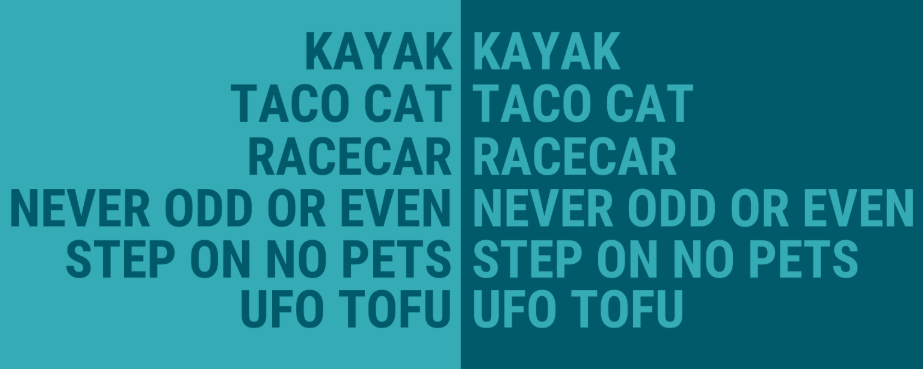

Here's a complete breakdown of **all approaches** to solve the [LeetCode 125: Valid Palindrome](https://leetcode.com/problems/valid-palindrome/) problem:


---

## 🔍 Problem Statement:
Determine if a string is a valid palindrome, **considering only alphanumeric characters** and ignoring cases.




---

## ✅ Constraints:
- Ignore non-alphanumeric characters.
- Ignore cases.
- Return `true` if the cleaned string is a palindrome.

---

## ✅ Example:
Input: `"A man, a plan, a canal: Panama"`  
Output: `true`  
Explanation: After cleaning → `"amanaplanacanalpanama"` → same forward & backward.

---

## 🧠 Approaches:

---

### **1. Two Pointer Approach (Optimal)**
**Logic:**  
Use two pointers from the start and end, skip non-alphanumerics, compare lowercased characters.

```java
public boolean isPalindrome(String s) {
    int left = 0, right = s.length() - 1;
    while (left < right) {
        while (left < right && !Character.isLetterOrDigit(s.charAt(left))) left++;
        while (left < right && !Character.isLetterOrDigit(s.charAt(right))) right--;
        if (Character.toLowerCase(s.charAt(left)) != Character.toLowerCase(s.charAt(right))) {
            return false;
        }
        left++;
        right--;
    }
    return true;
}
```

- **Time:** O(n)  
- **Space:** O(1) (no extra string created)

✅ **Best choice** for interviews.

---

### **2. Clean and Reverse Approach**
**Logic:**  
Filter alphanumeric chars into a string, lowercase them, then compare with reversed string.

```java
public boolean isPalindrome(String s) {
    StringBuilder sb = new StringBuilder();
    for (char c : s.toCharArray()) {
        if (Character.isLetterOrDigit(c)) {
            sb.append(Character.toLowerCase(c));
        }
    }
    String cleaned = sb.toString();
    String reversed = sb.reverse().toString();
    return cleaned.equals(reversed);
}
```

- **Time:** O(n)  
- **Space:** O(n)

🙆‍♂️ Easy to understand, but uses extra space.

---

### **3. Regex + Built-in Reverse**
**Logic:**  
Use regex to clean the string, then use built-in reverse.

```java
public boolean isPalindrome(String s) {
    String cleaned = s.replaceAll("[^A-Za-z0-9]", "").toLowerCase();
    String reversed = new StringBuilder(cleaned).reverse().toString();
    return cleaned.equals(reversed);
}
```

- **Time:** O(n)  
- **Space:** O(n)

🧽 Regex makes code compact but not the most performant.

---

### **4. Manual Stack Simulation (Educational)**
**Logic:**  
Push half the cleaned string into a stack, then pop and compare with second half.

- More useful for **linked list palindrome** problems.
- Not optimal for this one.

---

## ✅ Summary:

| Approach              | Time     | Space | Notes                     |
|-----------------------|----------|-------|----------------------------|
| Two Pointer           | O(n)     | O(1)  | ✅ Best, optimal solution   |
| Clean + Reverse       | O(n)     | O(n)  | Simple, beginner-friendly  |
| Regex + Reverse       | O(n)     | O(n)  | Clean but less performant  |
| Stack-Based (manual)  | O(n)     | O(n)  | Educational only           |

---

### TypeScript implementation


## 1️⃣ **Two Pointer Approach (Optimal)**

```ts
function isPalindrome(s: string): boolean {
    let left = 0, right = s.length - 1;
    while (left < right) {
        while (left < right && !isAlphaNumeric(s[left])) left++;
        while (left < right && !isAlphaNumeric(s[right])) right--;
        if (s[left].toLowerCase() !== s[right].toLowerCase()) return false;
        left++;
        right--;
    }
    return true;
}

function isAlphaNumeric(c: string): boolean {
    return /^[a-z0-9]$/i.test(c);
}
```

- **Time:** O(n)  
- **Space:** O(1)  
✅ Most efficient and interview-friendly.


### 🔍 Expression: `/^[a-z0-9]$/i`

| Part         | Meaning                                                                 |
|--------------|-------------------------------------------------------------------------|
| `^`          | Start of string                                                         |
| `[a-z0-9]`   | A **character class**: match any single character from `a` to `z` or `0` to `9` |
| `$`          | End of string                                                           |
| `i`          | Case-insensitive flag (`A-Z` is also accepted along with `a-z`)         |


---

## 2️⃣ **Clean and Reverse Approach**

```ts
function isPalindrome(s: string): boolean {
    let cleaned = "";
    for (let c of s) {
        if (isAlphaNumeric(c)) {
            cleaned += c.toLowerCase();
        }
    }
    let reversed = cleaned.split("").reverse().join("");
    return cleaned === reversed;
}

function isAlphaNumeric(c: string): boolean {
    return /^[a-z0-9]$/i.test(c);
}
```

- **Time:** O(n)  
- **Space:** O(n)  
🙆‍♂️ Simple and beginner-friendly.

---

## 3️⃣ **Regex + Reverse (Compact)**

```ts
function isPalindrome(s: string): boolean {
    const cleaned = s.replace(/[^a-z0-9]/gi, "").toLowerCase();
    const reversed = cleaned.split("").reverse().join("");
    return cleaned === reversed;
}
```

- **Time:** O(n)  
- **Space:** O(n)  
✨ Shortest and cleanest, good for quick scripts.

---

## 4️⃣ **Stack-Based Simulation (Educational)**

```ts
function isPalindrome(s: string): boolean {
    const filtered = [];
    for (let c of s) {
        if (isAlphaNumeric(c)) {
            filtered.push(c.toLowerCase());
        }
    }

    const stack: string[] = [];
    const half = Math.floor(filtered.length / 2);
    for (let i = 0; i < half; i++) {
        stack.push(filtered[i]);
    }

    let start = filtered.length % 2 === 0 ? half : half + 1;
    for (let i = start; i < filtered.length; i++) {
        if (stack.pop() !== filtered[i]) return false;
    }
    return true;
}

function isAlphaNumeric(c: string): boolean {
    return /^[a-z0-9]$/i.test(c);
}
```

- **Time:** O(n)  
- **Space:** O(n)  
🧠 For learning, not optimal for this problem.

---

## 🧾 Summary:

| Approach              | Code Style       | Time | Space | Use Case                      |
|----------------------|------------------|------|-------|-------------------------------|
| Two Pointer          | Clean & Fast     | O(n) | O(1)  | ✅ Best for interviews         |
| Clean + Reverse      | Easy to grasp    | O(n) | O(n)  | Good for learning             |
| Regex + Reverse      | Most compact     | O(n) | O(n)  | Best for quick implementation |
| Stack Simulation     | Educational only | O(n) | O(n)  | Practice logic                |
