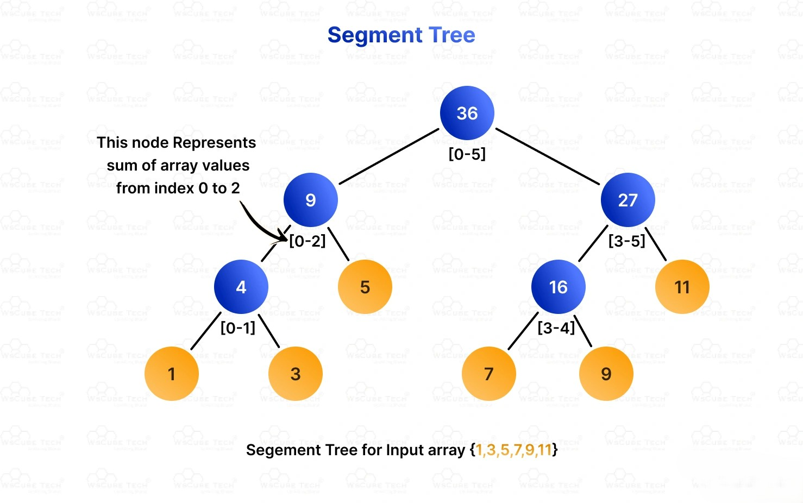
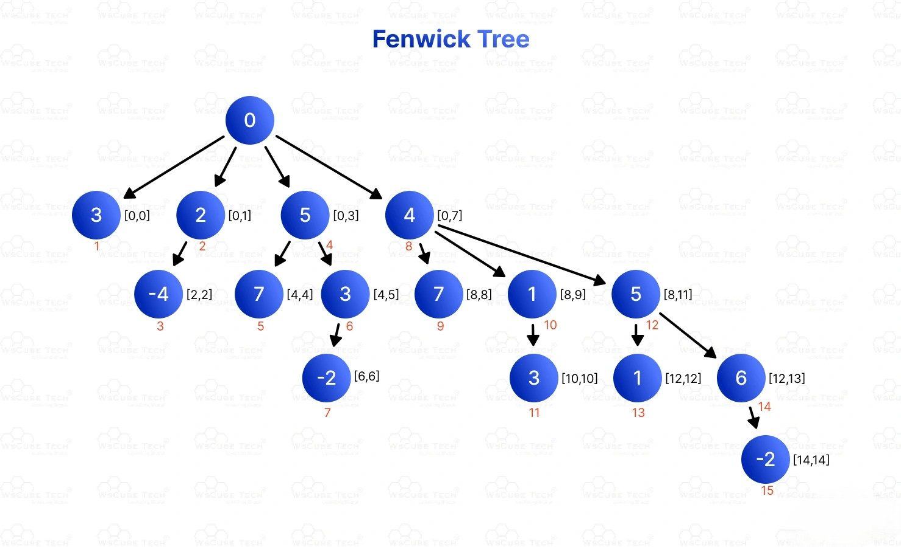

## 🟡 **Range Queries + Updates → Segment Tree or Fenwick Tree (Binary Indexed Tree)**

### 📌 **Use Case**  
When the array is **mutable** (frequent updates) and you need to **answer range sum (or min/max)** queries efficiently.

---

### 🧠 **Why Not Prefix Sum?**  
Prefix Sum is fast for queries (**O(1)**), but **updates take O(n)**.  
Segment Tree and Fenwick Tree optimize **both** query and update to **O(log n)**.

---

## ✅ **1. Segment Tree**

### 💡 Concept:
- Tree-like structure where each node represents a segment `[l, r]`.
- Can be built recursively (top-down) or iteratively (bottom-up).

### 🔧 Operations:
- **Build**: O(n)  
- **Query** (sum/min/max): O(log n)  
- **Update**: O(log n)

### 📘 Use Cases:
- Range Sum / Min / Max / GCD / LCM
- Dynamic Range queries
- Lazy Propagation for range updates

---

## ✅ **2. Fenwick Tree (Binary Indexed Tree – BIT)**

### 💡 Concept:
- Array-based tree that uses bit manipulation to jump between ranges.

### 🔧 Operations:
- **Update(index, delta)**: O(log n)  
- **Query(prefix sum 0..i)**: O(log n)

### 📘 Use Cases:
- Range Sum queries
- Prefix frequency counts (e.g., Inversions)
- Easier to implement but less flexible than Segment Tree

---

### ⚔️ **Segment Tree vs. Fenwick Tree**

| Feature | Segment Tree | Fenwick Tree |
|--------|---------------|-----------------|
| Queries | Range Sum, Min, Max, GCD | Only Range Sum |
| Updates | Point + Range (via Lazy Propagation) | Point only |
| Space | 2n–4n | n |
| Flexibility | High | Medium |
| Code | Complex | Simpler |

---

### 🧪 Example Problem:
**Range Sum Query – Mutable**  
[LeetCode 307](https://leetcode.com/problems/range-sum-query-mutable/)

