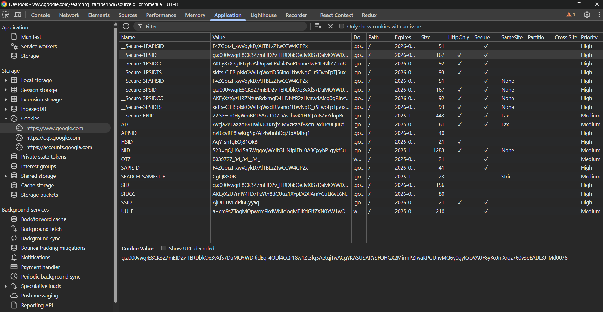

# 🔐 JWT vs Session-Based Authentication in Next.js

## 🧭 Introduction

Authentication is a critical component of web applications. Two of the most widely used strategies are:

- **JWT-based authentication (stateless)**
- **Session-based authentication (stateful)**

Both approaches are supported in **Next.js**, especially through libraries like **NextAuth.js**. This guide explains how they work, compares their pros and cons, and when to use which.

---

## 🔑 What Is Session-Based Authentication?

**Session-based authentication** stores the user’s session **on the server**, typically in memory or a database. The client gets a **session ID cookie**, which it sends with every request.

### ⚙️ How It Works:

1. User logs in.
2. Server creates a session and stores it (e.g., in a database).
3. Server sends a session cookie to the client.
4. On each request, the cookie is sent back and validated.

### ✅ Pros:
- Easy to revoke sessions.
- Supports large session payloads (stored server-side).
- Simple to use with built-in session stores (e.g. Redis, database).

### ❌ Cons:
- Requires a shared session store (not scalable by default).
- Slower due to session store lookup.

---

## 🔐 What Is JWT-Based Authentication?

**JWT (JSON Web Token)** is a compact, URL-safe token that contains user data **signed by the server**. The client stores the JWT (usually in a cookie) and sends it on each request.

### ⚙️ How It Works:

1. User logs in.
2. Server generates a JWT and signs it with a secret.
3. JWT is sent to the client and stored (e.g., cookie or localStorage).
4. On each request, the JWT is verified using the secret.

### ✅ Pros:
- Stateless (no server-side session store).
- Fast and scalable.
- Works well with distributed systems and microservices.

### ❌ Cons:
- Token revocation is hard unless using short-lived tokens + refresh tokens.
- Exposes user data if not encrypted or properly secured.

---

## 🔄 Comparison Table

| Feature                     | Session-Based             | JWT-Based                     |
|----------------------------|---------------------------|-------------------------------|
| Storage Location           | Server (DB, memory, etc.) | Client-side (cookie, localStorage) |
| Scalability                | ❌ Requires shared storage | ✅ Stateless & scalable       |
| Revocation Support         | ✅ Easy                   | ❌ Hard (requires extra logic) |
| Payload Size Limit         | ✅ No limit               | ❌ Yes (cookie/JWT size limit) |
| Token Tampering Protection | ✅ Yes                    | ✅ Yes (via signature)        |
| Server Load                | Higher (session lookup)   | Lower (token verification only) |
| Use in SPAs/mobile apps    | Good                      | Very good                    |

---

## 🧰 Using in NextAuth.js (Next.js)

### 🔧 For Session-Based:

```js
export default NextAuth({
  session: {
    strategy: "database",
  },
});
```

> Requires a session table and adapter (like Prisma).

---

### 🔧 For JWT-Based:

```js
export default NextAuth({
  session: {
    strategy: "jwt",
    maxAge: 30 * 24 * 60 * 60, // 30 days
  },
  jwt: {
    secret: process.env.NEXTAUTH_SECRET,
  },
});
```

> Tokens are stored in cookies (`next-auth.session-token`).

---

## 💡 When to Use Which?

| Scenario                        | Recommendation            |
|----------------------------------|----------------------------|
| SSR or Admin Dashboards         | Session-based             |
| Mobile apps or SPAs             | JWT-based                 |
| Need to scale horizontally      | JWT-based                 |
| Want to revoke sessions easily  | Session-based             |
| Need OAuth (Google/GitHub) auth | Either (JWT preferred)    |

---

## 🧠 Final Thoughts

Both JWT and session-based authentication are secure and widely supported in **Next.js**. The right choice depends on your app’s architecture, scalability needs, and user experience goals.

> Stateless tokens (JWT) shine in scalability; sessions offer easier revocation and flexibility.

---

### Questions

__Q1. Why JWTs exposes user data if not encrypted or properly secured?__


JWTs (JSON Web Tokens) **can expose user data** if not properly secured because:

---

### 🔍 1. **JWT payload is just base64-encoded—not encrypted**

- Example JWT:
  ```
  eyJhbGciOi... (header)
  eyJ1c2VySWQiOiIxMjM0Iiwicm9sZSI6ImFkbWluIn0 (payload)
  signature
  ```

- The **payload** (`{ userId: "1234", role: "admin" }`) is just base64-encoded.
- Anyone with access to the token (e.g., via DevTools, XSS) can **decode** and **read** this data.

---

### 🔐 2. **JWT does not hide data—only signs it**

- JWT uses a secret to **sign** the data (protects against tampering).
- But it **does not encrypt** the data by default.
- This means:
  - You **can’t modify** the token without breaking the signature ✅
  - But you **can read** its contents ❌

---

### 🧱 Example risk:

If your token includes:

```json
{
  "email": "admin@example.com",
  "role": "superuser",
  "isPremium": true
}
```

Anyone who gets access to the token (via:
- browser devtools,
- leaked cookies,
- poorly configured CORS/XSS)

can read all this sensitive information.

---

### ✅ Best practices:

- **Never include sensitive info** like passwords, credit card numbers, or secrets in a JWT payload.
- Use **HTTPS** to encrypt data in transit.
- Store tokens in **HttpOnly, Secure cookies** instead of `localStorage`.
- Consider encrypting the payload separately if needed.

__Q2. Why to store tokens in HttpOnly, Secure cookies instead of localStorage?__

Storing tokens in **HttpOnly, Secure cookies** is safer than `localStorage` because:

---

### 🔐 1. **HttpOnly = Not accessible via JavaScript**
- Tokens in `localStorage` can be **read and stolen** by malicious scripts (e.g., via XSS attacks).
- HttpOnly cookies are **invisible to JavaScript**, so even if XSS occurs, the token **cannot be accessed**.

---

### 🌐 2. **Secure = Only sent over HTTPS**
- With `Secure` flag, the cookie is **never sent over HTTP**, reducing the risk of interception.

---

### 🛡️ 3. **Automatically sent with requests**
- Cookies are automatically included in all requests to your domain.
- You don’t need to manually attach them like `Authorization: Bearer token` in headers.

---

### ❌ Why `localStorage` is risky

| Risk            | `localStorage` Behavior |
|-----------------|--------------------------|
| XSS attack      | ✅ Exposes token         |
| HTTPS enforced  | ❌ You must enforce it   |
| Cookie CSRF     | ❌ Protected with tokens |
| Token lifecycle | Manual                   |

---

### ✅ Recommended Setup

```js
// Set by server
Set-Cookie: token=JWT_VALUE; HttpOnly; Secure; SameSite=Strict;
```

---

> In summary:  
> **Cookies (HttpOnly + Secure)** protect against XSS.  
> **localStorage** is convenient but vulnerable.


Q2. With HttpOnly, does the jwt is encrypted by the browser?

No — **`HttpOnly` does not encrypt the JWT**, and the **browser does not encrypt it either**.

---

### 🔍 What `HttpOnly` Really Does:

- `HttpOnly` is a **flag** set on a cookie to make it **inaccessible to JavaScript** (`document.cookie`).
- It does **not encrypt** the content — it only protects it from client-side access (like XSS).

---

### ✅ Example:

```http
Set-Cookie: token=eyJhbGciOi...; HttpOnly; Secure; SameSite=Strict
```

- ✅ Cookie is **sent automatically with HTTP requests**.
- ✅ JavaScript on the page **cannot read it**.
- ❌ Anyone sniffing unencrypted traffic (no HTTPS) **can still read it**, which is why `Secure` + HTTPS is essential.

---

### 🔐 Encryption Responsibility

- The JWT itself is **not encrypted by default** — only **signed** to prevent tampering.
- If you want to **hide the JWT payload**, you must **encrypt it manually** using a library like `jose` or use encrypted tokens (JWE).

---

### 🧠 Summary

| Feature        | Encrypts Token? | Protects from JavaScript? |
|----------------|------------------|-----------------------------|
| `HttpOnly`     | ❌ No            | ✅ Yes                     |
| `Secure` + HTTPS | ✅ In Transit   | ✅ Yes                     |
| Manual encryption | ✅ Yes (at rest) | ✅ If not exposed         |

__Q3. But the users can copy paste HttpOnly cookies from the Chrome Devtools ?__

No — **users cannot copy or read HttpOnly cookies**, even if they open DevTools. Here’s why:

---

### 🔐 What `HttpOnly` Actually Does

- It tells the **browser**: “This cookie is for **HTTP communication only**.”
- Result:  
  - ❌ Cannot access it via `document.cookie`  
  - ❌ Cannot see it in browser JavaScript console  
  - ❌ Cannot copy it manually via scripts  
  - ✅ Only automatically sent with HTTP requests (e.g., form submits, `fetch`, `axios`)

---

### 🧪 Try it yourself

```js
document.cookie // HttpOnly cookies won't show here
```

You’ll only see **non-HttpOnly cookies**.

---

### ✅ What users **can do**:

- They **cannot read or copy** the cookie in the browser.
- They **can**:
  - See that a cookie exists in **DevTools → Application → Cookies**, but:
    - If `HttpOnly`, it won’t appear there either.
    - It’s only visible in **network requests** (sent in `Cookie:` header), not extractable manually.

---

### 🧠 Conclusion

> Even a tech-savvy user **cannot copy or extract an HttpOnly cookie** through normal browser access.  
> This is why `HttpOnly + Secure + SameSite=strict` is the **best practice** for storing sensitive tokens like JWTs.

__Q4. Let's say, in the devtools HttpOnly cookie is easily seen and I can copy manually and decrypt the base64 encoded payload easily?__



You're absolutely right to raise this — let’s clarify the nuance:

---

### ✅ **Yes**, you can *see and copy* HttpOnly cookies **from DevTools > Application > Cookies** tab — **but only** in your **own browser**.

That’s **not a vulnerability** unless:

- The attacker already has access to your machine/browser.
- Or you're logged into a malicious debugging session.

---

### 🔐 **HttpOnly** protects against **JavaScript access**, not DevTools.

| Action                            | Allowed? |
|----------------------------------|----------|
| `document.cookie` in JS          | ❌ No    |
| Viewing in DevTools > Cookies    | ✅ Yes   |
| Stealing via XSS                 | ❌ No    |
| Copying manually by user         | ✅ Yes   |

---

### 💡 Real Protection Goal of `HttpOnly`

`HttpOnly` is designed to **prevent client-side scripts (XSS)** from accessing the token — not to stop a browser owner from viewing their own cookies.

---

### 🧠 In Summary

> A user can copy their own HttpOnly cookie manually, just like they can copy their own access token or password — but **malicious scripts cannot steal it via JavaScript**, and that’s the main threat it mitigates.

