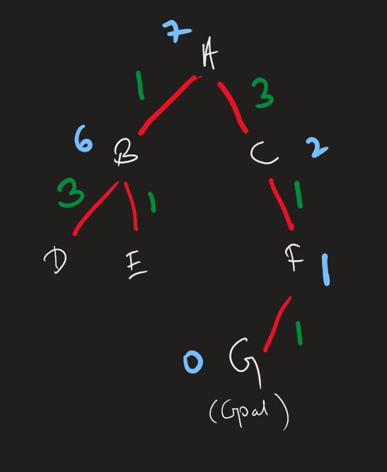

# 🔍 Greedy Best-First Search: Fast, But Not Always Smart


## 📑 Index: Greedy Best-First Search

- [What is Greedy Best-First Search?](#-what-is-greedy-best-first-search)
- [Questions](#questions)
- [Real World Examples](#real-world-examples)
    - [==2D grid==](#2d-grid)
    - [==8-puzzle==](#8-puzzle)

---

Would you like this TOC auto-generated as clickable in markdown using `[toc]`, or converted into a sidebar for a documentation site (like Docusaurus or GitBook)?


**Greedy Best-First Search** is one of the most intuitive informed search algorithms in Artificial Intelligence. It **uses a heuristic** to always pick what *seems* best at the moment — hence the name **"greedy"**.

---

## 💡 What is Greedy Best-First Search?

Greedy Best-First Search evaluates nodes using only the **heuristic function $h(n)$**, which estimates the cost from a node to the goal.

It expands the node that appears to be *closest* to the goal based on this estimate — ignoring how far it has already come from the start node.

---

### 🔢 Evaluation Function

$$
f(n) = h(n)
$$

* $h(n)$: Estimated cost from node $n$ to the goal
* No consideration for actual path cost $g(n)$

---

## 🧭 How it Works – Step-by-Step

1. Start with the initial node.
2. Maintain a **priority queue** (min-heap) ordered by $h(n)$.
3. At each step, pick the node with the **lowest $h(n)$**.
4. If it's the goal, return the path.
5. Else, expand the node and add its children to the queue.

---

## 📌 Key Properties

| Feature      | Value                                 |
| ------------ | ------------------------------------- |
| Strategy     | Heuristic-driven                      |
| Completeness | ❌ No (may get stuck in loops)         |
| Optimality   | ❌ No (may return suboptimal solution) |
| Time         | $O(b^m)$                              |
| Space        | $O(b^m)$                              |
| Informed     | ✅ Yes                                 |

* **b**: branching factor
* **m**: maximum depth

---

## 🧠 Heuristic Function Design

A good heuristic:

* Brings the goal *closer*
* Should be **admissible** (optional for greedy but helps)
* Example heuristics:

  * **8 Puzzle**: Manhattan distance
  * **Grid Navigation**: Euclidean or Diagonal distance

> ⚠️ A bad heuristic can lead the algorithm to wander aimlessly.

---

## 🔄 Example Walkthrough (Grid World)

Imagine a 2D grid where the agent must reach the goal from a starting cell. It can move in 4 directions.

Let’s say the goal is at (5,5), and the agent starts at (1,1).
The heuristic $h(n)$ = Manhattan distance to (5,5).

| Node  | h(n) |
| ----- | ---- |
| (1,1) | 8    |
| (2,1) | 7    |
| (2,2) | 6    |
| ...   | ...  |

At each step, Greedy Best-First picks the node with the **lowest h(n)** — regardless of how long the path is.

---

## ⚠️ Pitfalls

* **No guarantee of finding a solution** (can loop)
* **No guarantee of the shortest path**
* Can be **deceived by local minima**

---

## ✅ When to Use It?

* You need **speed over accuracy**
* You have a **well-designed heuristic**
* **Space constraints** are manageable

---

## 🧮 Code Snippet (Python-style Pseudocode)

```python
from queue import PriorityQueue

def greedy_best_first_search(start, goal, h):
    open_set = PriorityQueue()
    open_set.put((h(start), start))
    came_from = {}

    while not open_set.empty():
        _, current = open_set.get()
        if current == goal:
            return reconstruct_path(came_from, current)

        for neighbor in get_neighbors(current):
            if neighbor not in came_from:
                came_from[neighbor] = current
                open_set.put((h(neighbor), neighbor))
    return None
```

---

## 🧾 Summary

* **Greedy Best-First Search** is like following your nose — fast but not foolproof.
* It **relies only on heuristic** to pick the next node.
* Good for **quick solutions** where optimality is not critical.
* Often used in combination with other methods (e.g., as a base for A\*).


----

## Let's take an example and understand it better: 

Here's a **concrete example** of **Greedy Best-First Search** on a graph:

---

## 🧭 Example Graph:





### 📍 Heuristic values $h(n)$ — estimated cost to goal **G**:

| Node | h(n) |
| ---- | ---- |
| A    | 7    |
| B    | 6    |
| C    | 2    |
| D    | 5    |
| E    | 4    |
| F    | 1    |
| G    | 0    |

---

## 🔄 Greedy Best-First Search Steps (start = A, goal = G):

### Step 1: Start at A

Open = \[(A, h=7)]

### Step 2: Expand A → B (h=6), C (h=2)

Open = \[(C, h=2), (B, h=6)] → pick **C**

### Step 3: Expand C → F (h=1)

Open = \[(F, h=1), (B, h=6)] → pick **F**

### Step 4: Expand F → G (h=0)

Open = \[(G, h=0), (B, h=6)] → pick **G**

✅ Goal reached!

---


## 📌 Path found:

**A → C → F → G**

> Greedy Best-First reached the goal quickly using lowest $h(n)$, but this may not be the **shortest-cost path**.

---

# Questions: 

__Q1. ==So what are the edge values you have taken, for example A -> B, you took 1. For B -> D you took 3 and so on.. What is that?==__


The **edge values** (like `A → B = 1`) in the example represent the **actual path cost** $c(n, n')$ between nodes — i.e., how much it *really* costs to move from one node to another.

These costs are **ignored** by **Greedy Best-First Search**, which uses only the **heuristic values $h(n)$** to choose the next node.

---

### 🔁 Recap of Edge Costs:

| Edge  | Cost |
| ----- | ---- |
| A → B | 1    |
| A → C | 3    |
| B → D | 3    |
| B → E | 1    |
| C → F | 1    |
| F → G | 1    |

---

### 🧠 Important Point:

* Greedy Best-First Search **does not use** these edge costs to make decisions.
* It chooses the node with **lowest $h(n)$**, not **lowest total path cost**.
* These edge costs only matter if you were doing **Uniform Cost Search** or **A\***.


__Q2. ==How the heuristic function value is calculated here?==__

In AI, especially with **Greedy Best-First Search** and **A\***, the **heuristic function $h(n)$** is **domain-specific** — it's a best guess of the cost from a node $n$ to the **goal**, based on some approximation.

---

### 🔍 In Our Example:

We assigned heuristic values like:

| Node | h(n) | Interpretation       |
| ---- | ---- | -------------------- |
| A    | 7    | A is “far” from G    |
| C    | 2    | C is “closer” to G   |
| F    | 1    | F is very close to G |
| G    | 0    | Goal reached         |

---

### ✅ How It's Typically Calculated:

1. **Grid Maps (e.g., 2D maze)**

   * $h(n)$ = Manhattan distance = $|x_1 - x_2| + |y_1 - y_2|$
   * OR Euclidean distance = $\sqrt{(x_1 - x_2)^2 + (y_1 - y_2)^2}$

2. **Game Trees or Puzzles**

   * 8-puzzle: number of misplaced tiles or total Manhattan distance of tiles from their goal position

3. **Graphs (like ours)**

   * You assign heuristic estimates **manually**, based on how "close" a node feels to the goal.
   * Example: if G is 3 hops away from A, you might assign $h(A) = 3 \times 2 = 6$, assuming each hop costs \~2.

---

### 🧠 Heuristic Rules of Thumb:

* **Admissible**: Never overestimates the real cost
* **Consistent**: $h(n) \leq c(n, n') + h(n')$

In this demo, the values are **artificially assigned** for illustration, simulating how close each node is to G.

---


# Real World Examples

### ==2D grid==

Let’s walk through a **real-world example** of **Greedy Best-First Search** with a **2D grid** and compute the **heuristic function step-by-step** using **Manhattan distance** — a common admissible heuristic.

---

## 🧭 Scenario: Grid Pathfinding (5x5 Grid)

* **Start**: (0, 0)
* **Goal**: (4, 4)
* **Obstacle**: Let’s ignore obstacles for simplicity
* **Allowed Moves**: Up, Down, Left, Right (no diagonals)

---

## 🧠 Heuristic Function: Manhattan Distance

$$
h(n) = |x_{goal} - x_n| + |y_{goal} - y_n|
$$

So for any cell $(x_n, y_n)$, the heuristic to goal $(4, 4)$ is:

---

### 🔢 Heuristic Values for Each Cell:

|     | y=0 | y=1 | y=2 | y=3 | y=4 |
| --- | --- | --- | --- | --- | --- |
| x=0 | 8   | 7   | 6   | 5   | 4   |
| x=1 | 7   | 6   | 5   | 4   | 3   |
| x=2 | 6   | 5   | 4   | 3   | 2   |
| x=3 | 5   | 4   | 3   | 2   | 1   |
| x=4 | 4   | 3   | 2   | 1   | 0   |

---

### 🔄 Example Steps for Greedy Best-First Search

**Start**: (0, 0)
**Goal**: (4, 4)
Heuristic at (0, 0):

$$
h(0,0) = |4 - 0| + |4 - 0| = 8
$$

From (0,0), neighbors:

* (0,1): $h = 7$
* (1,0): $h = 7$

Choose either (say (0,1)), continue...

Greedy keeps expanding node with **lowest heuristic**, even if the actual path is longer — it just chases the goal!

---

## 🔥 Why Manhattan Distance?

* Works for grids where movement is limited to 4 directions.
* Admissible and consistent.
* Easy to compute: no square roots, just simple addition.

---

### ✅ Summary

* In a grid, use **Manhattan distance** for $h(n)$.
* In puzzles like the **8-puzzle**, sum the distances of tiles to their goal.
* In real-world maps, use **Euclidean** or **actual road distance estimates**.

### ==8-puzzle==


## 🧩 What is the 8-Puzzle Problem?

The **8-puzzle** is a 3x3 grid containing **8 numbered tiles (1 to 8)** and **one empty space (0)**.
The goal is to **move tiles** (by sliding into the empty space) to reach a **target configuration**.

---

### 🟦 Initial State (Example):

```
1 2 3
4 0 6
7 5 8
```

### 🟩 Goal State:

```
1 2 3
4 5 6
7 8 0
```

---

### 🔄 Legal Moves:

* You can slide a tile **up, down, left, or right** into the blank (0).
* No diagonal moves.

---

## 🧠 State Space:

* There are **9! = 362,880** possible arrangements.
* Only **half are solvable** (based on parity/inversions).

---

## 📌 AI Search Perspective

* **Initial state**: Given scrambled puzzle
* **Actions**: Move blank tile in 4 directions (if possible)
* **Transition model**: Apply action to get a new configuration
* **Goal test**: Matches goal configuration
* **Path cost**: Usually 1 per move

---

## 🔍 Heuristic Functions (for Greedy or A\*):

### ✅ 1. **Misplaced Tiles (h₁)**

* Count of tiles that are not in the goal position
* **Example**:
  From the state

  ```
  1 2 3
  4 0 6
  7 5 8
  ```

  Goal is

  ```
  1 2 3
  4 5 6
  7 8 0
  ```

  Misplaced tiles = 5, 8 → so **h₁ = 2**

### ✅ 2. **Manhattan Distance (h₂)**

* Sum of **tile distances** from current to goal position

  $$
  h(n) = \sum_{i=1}^8 \left( |x_i - x_i'| + |y_i - y_i'| \right)
  $$

* More informed than misplaced tiles

* **Admissible and consistent**

---

### 📈 Why 8-Puzzle is Important in GATE AI:

* It's a perfect use-case for comparing **Uninformed (BFS/DFS)** and **Informed (Greedy, A\*)** search.
* Shows how heuristics affect performance.

---

### ✅ Summary

* The **8-puzzle** is a benchmark for AI search algorithms.
* Greedy Best-First uses $h(n)$ only (like misplaced tiles or Manhattan).
* A\* uses $f(n) = g(n) + h(n)$ — both path cost and heuristic.

