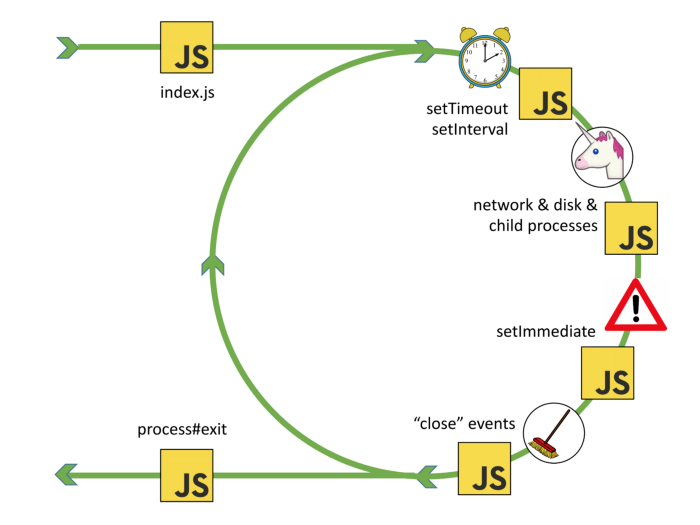
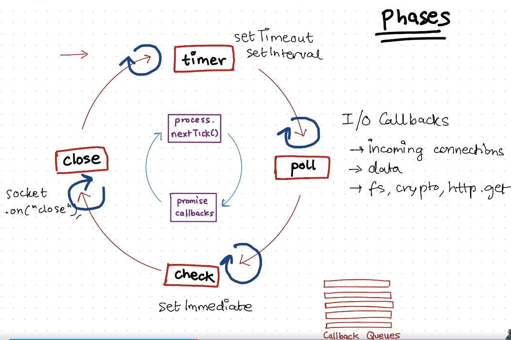

# 🧠 Understanding Node.js Event Loop and libuv

**Node.js** is a powerful JavaScript runtime built on Chrome's V8 engine. One of its defining features is its **non-blocking I/O model**, achieved using the **event loop** powered by a C library called **libuv**.

In this post, we’ll explore:

* What is the Node.js Event Loop?
* How does libuv power async behavior?
* Event Loop phases (with real-world analogy)
* Timers, I/O, Microtasks & Macrotasks
* Common Interview Questions

---

## 🔁 What is the Event Loop?

The **Event Loop** is the mechanism that enables Node.js to perform **non-blocking operations** — like reading files, handling HTTP requests, or querying databases — despite being **single-threaded**.

It works by **offloading blocking tasks** to the **libuv thread pool** or the OS, and then **queues callbacks** to be run later.

Think of it like a **restaurant**:

* Node.js (the chef) handles one dish at a time.
* Time-consuming tasks (like baking) are offloaded to assistants (libuv threads).
* Once ready, the chef is notified to **process the next step**.

---

## ⚙️ What is libuv?

**libuv** is a **C-based multi-platform library** that provides Node.js with:

* A **thread pool** (used for file system & crypto tasks)
* **Event loop**
* **Async I/O**
* TCP/UDP sockets
* DNS resolution

It acts as the **engine** underneath Node.js’s asynchronous APIs.

> Without libuv, Node.js would be synchronous or dependent on native OS APIs.

---

## 🧩 Node.js Event Loop Phases (in order)

The event loop runs in **phases**, and each phase has its own **queue of callbacks** to execute.





### 1. **Timers Phase**

* Executes callbacks scheduled by `setTimeout()` and `setInterval()` once their delay has passed.

```js
setTimeout(() => console.log('Timeout callback'), 0);
```

### 2. **Pending Callbacks Phase**

* Executes I/O callbacks **deferred** to the next loop iteration.

### 3. **Idle, Prepare Phase**

* Internal libuv phase. Not accessible to users.

### 4. **Poll Phase**

* Waits for new I/O events (like file read, HTTP).
* If there are callbacks in the queue, it executes them.

### 5. **Check Phase**

* Executes `setImmediate()` callbacks.

```js
setImmediate(() => console.log('Immediate callback'));
```

### 6. **Close Callbacks Phase**

* Executes `close` events like `socket.on('close', …)`.

---

## 🔬 Microtasks vs Macrotasks

### 🧵 Macrotasks

These include:

* `setTimeout`
* `setInterval`
* `setImmediate`
* `I/O callbacks`

### 🧬 Microtasks

These are **executed right after the current operation and before the next event loop tick**:

* `process.nextTick()`
* Promises (`.then`, `catch`, `finally`)

```js
setTimeout(() => console.log('Macro'), 0);
Promise.resolve().then(() => console.log('Micro'));
process.nextTick(() => console.log('NextTick'));
```

Output:

```
NextTick
Micro
Macro
```

---

## 🧠 How libuv uses Threads under the Hood

* I/O like **file reading** is NOT done on the main thread.
* libuv maintains a **fixed-size thread pool** (default: 4).
* Tasks like `fs.readFile()` are sent to this pool.
* Once complete, the callback is pushed to the **event loop queue**.

```js
const fs = require('fs');

fs.readFile('file.txt', () => {
  console.log('File read complete');
});
```

---

## 🔍 Real World Summary

| Task            | Thread Used   | Mechanism         |
| --------------- | ------------- | ----------------- |
| `console.log()` | Main thread   | Sync              |
| `setTimeout()`  | Timer thread  | libuv timer       |
| `fs.readFile()` | Worker thread | libuv thread pool |
| `http.get()`    | OS kernel     | Evented I/O       |

---

## 📚 Common Interview Questions

1. **What is the difference between `setTimeout` and `setImmediate`?**

   * `setTimeout` waits for N ms; `setImmediate` runs after the poll phase.

2. **What is the difference between `process.nextTick()` and `Promise.then()`?**

   * `nextTick` is higher priority than microtasks and runs before them.

3. **Why is Node.js single-threaded, but libuv uses threads?**

   * JS execution is single-threaded, but libuv performs async I/O in threads.

4. **Can Node.js run on multiple cores?**

   * Yes, using the `cluster` module or worker threads.

---

## 🧪 Bonus: Debugging Event Loop with `--trace-events`

Run Node with:

```bash
node --trace-events-enabled script.js
```

It will log internal event loop phases for deeper insight.

---

## 📝 Conclusion

The **Node.js event loop and libuv** allow JavaScript to handle thousands of operations **concurrently**, without the complexity of traditional multi-threaded programming.

Understanding this helps you:

* Write better async code
* Avoid blocking the main thread
* Perform efficient I/O in backends

---

### A complete the picture of **all major macrotasks and microtasks** in the Node.js Event Loop:

---

### ✅ Complete Demo: `event-loop-complete.js`

```js
const { Worker, isMainThread, parentPort } = require('worker_threads');
const fs = require('fs');

console.time('⏱ Total Execution');

if (isMainThread) {
  console.log('🔵 [1] Start of script');

  // Microtasks
  process.nextTick(() => console.log('🟡 [2] process.nextTick'));
  Promise.resolve().then(() => console.log('🟢 [3] Promise.then'));

  // Macrotasks
  setTimeout(() => {
    console.log('🟣 [4] setTimeout (Timer Phase)');
  }, 0);

  setImmediate(() => {
    console.log('🟠 [5] setImmediate (Check Phase)');
  });

  // Interval (repeats, but we stop it manually to demonstrate)
  let intervalCount = 0;
  const interval = setInterval(() => {
    intervalCount++;
    console.log(`🟤 [6] setInterval (${intervalCount})`);
    if (intervalCount === 2) {
      clearInterval(interval);
    }
  }, 0);

  // File read (I/O poll phase)
  fs.readFile(__filename, () => {
    console.log('🔴 [7] fs.readFile (I/O Callback)');

    process.nextTick(() => console.log('⚫ [8] nextTick inside readFile'));
    Promise.resolve().then(() => console.log('⚪ [9] Promise inside readFile'));
    setTimeout(() => console.log('🔶 [10] setTimeout inside readFile'), 0);
    setImmediate(() => console.log('🔷 [11] setImmediate inside readFile'));
  });

  // Worker thread
  const worker = new Worker(__filename);
  worker.on('message', (msg) => {
    console.log(`🧵 [12] Worker message: ${msg}`);
    console.timeEnd('⏱ Total Execution');
  });
} else {
  parentPort.postMessage('Hello from Worker');
}
```

---

### 🧾 Output Summary (approximate order)

```bash
🔵 [1] Start of script
🟡 [2] process.nextTick
🟢 [3] Promise.then
🟣 [4] setTimeout (Timer Phase)
🟠 [5] setImmediate (Check Phase)
🟤 [6] setInterval (1)
🟤 [6] setInterval (2)
🔴 [7] fs.readFile (I/O Callback)
⚫ [8] nextTick inside readFile
⚪ [9] Promise inside readFile
🔶 [10] setTimeout inside readFile
🔷 [11] setImmediate inside readFile
🧵 [12] Worker message: Hello from Worker
⏱ Total Execution: XX.XXXms
```

---

### 💡 Key Point

* `setInterval()` is like a repeating `setTimeout`, queued repeatedly in the **Timer Phase**.
* In this example, we run it only **twice** by manually clearing it with `clearInterval()` for simplicity.

