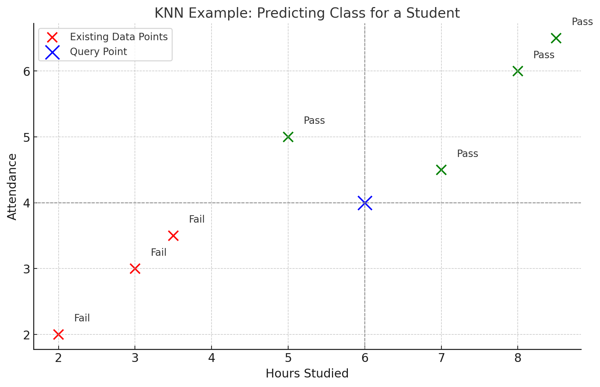

### **Understanding K-Nearest Neighbor (KNN) Algorithm**

The **K-Nearest Neighbor (KNN)** algorithm is one of the simplest and most intuitive machine learning algorithms used for classification and regression tasks. It is a **non-parametric**, **lazy learning** algorithm that relies on the similarity between data points to make predictions. In this blog, we’ll explore how KNN works, its advantages and limitations, and provide a practical example.

---

### **What is K-Nearest Neighbor (KNN)?**

KNN is a supervised learning algorithm that classifies a data point based on the class of its nearest neighbors. The principle behind KNN is that ==similar data points are likely to belong to the same category==.

- **K:** The number of nearest neighbors considered for determining the class or predicting the value.
- **Nearest Neighbor:** The closest data points to the query point, measured by a distance metric like Euclidean distance.

---

### **How Does KNN Work?**

1. **Choose the value of K:**
   Decide the number of neighbors \( K \) to consider. For example, \( K = 3 \) means that the algorithm will consider the 3 nearest neighbors.

2. **Calculate the distance:**
   For the query point, calculate the distance from all points in the training dataset using a distance metric such as:
   - **Euclidean Distance**: \( d(x, y) = \sqrt{\sum{(x_i - y_i)^2}} \)
   - **Manhattan Distance**: \( d(x, y) = \sum{|x_i - y_i|} \)
   - **Minkowski Distance**, **Hamming Distance**, etc.

3. **Find the nearest neighbors:**
   Identify the \( K \) closest data points to the query point.

4. **Vote (for classification) or average (for regression):**
   - **Classification**: The class with the majority vote among the neighbors is assigned to the query point.
   - **Regression**: The average of the values of the neighbors is assigned as the predicted value.

5. **Make the prediction:**
   Assign the query point to the most common class (classification) or predicted value (regression).

---

### **Example of KNN**

Let’s consider a simple **classification problem**:

#### **Dataset**
We have a dataset of students' grades with two features:
- **Hours Studied (X1)**
- **Attendance (X2)**

The goal is to classify whether a student passes or fails (target class: Pass = 1, Fail = 0).

| Hours Studied (X1) | Attendance (X2) | Class (Pass = 1, Fail = 0) |
|---------------------|-----------------|----------------------------|
| 2                  | 1               | 0                          |
| 4                  | 1               | 0                          |
| 5                  | 4               | 1                          |
| 7                  | 5               | 1                          |
| 8                  | 6               | 1                          |

#### **New Query Point**
We want to predict the class for a student who studied for **6 hours** and had **4 attendance**.

#### **Step-by-Step Solution**

1. **Choose \( K \):**
   Let \( K = 3 \).

2. **Calculate Distances:**
   Compute the **Euclidean distance** between the query point (6, 4) and each point in the dataset:

   \[
   d = \sqrt{(X1_{query} - X1_{data})^2 + (X2_{query} - X2_{data})^2}
   \]

   - \( d((6, 4), (2, 1)) = \sqrt{(6-2)^2 + (4-1)^2} = \sqrt{16 + 9} = \sqrt{25} = 5 \)
   - \( d((6, 4), (4, 1)) = \sqrt{(6-4)^2 + (4-1)^2} = \sqrt{4 + 9} = \sqrt{13} \approx 3.6 \)
   - \( d((6, 4), (5, 4)) = \sqrt{(6-5)^2 + (4-4)^2} = \sqrt{1 + 0} = \sqrt{1} = 1 \)
   - \( d((6, 4), (7, 5)) = \sqrt{(6-7)^2 + (4-5)^2} = \sqrt{1 + 1} = \sqrt{2} \approx 1.4 \)
   - \( d((6, 4), (8, 6)) = \sqrt{(6-8)^2 + (4-6)^2} = \sqrt{4 + 4} = \sqrt{8} \approx 2.8 \)

3. **Find the Nearest Neighbors:**
   Sort the distances in ascending order:

   - (5, 4): Distance = 1
   - (7, 5): Distance = 1.4
   - (8, 6): Distance = 2.8

   The 3 nearest neighbors are:
   - (5, 4) → Class = 1
   - (7, 5) → Class = 1
   - (8, 6) → Class = 1

4. **Vote:**
   The majority class among the 3 neighbors is **1** (Pass).

5. **Prediction:**
   The student is predicted to **Pass (Class = 1)**.

---

The graph above visualizes the example where the goal is to predict the class of a student who studied for 6 hours and had 4 attendances using K-Nearest Neighbors (KNN). 

- **Red Points:** Represent data points classified as "Fail."
- **Green Points:** Represent data points classified as "Pass."
- **Blue Point:** Represents the query point `(6 hours, 4 attendance)` for which we want to predict the class.

The dashed lines indicate the coordinates of the query point. Using KNN, the class of the query point can be determined by finding the closest neighbors in the dataset and checking the majority class among them.

---

### **Advantages of KNN**
1. **Simple to Understand and Implement:** No assumptions about data distribution; easy to use.
2. **Versatile:** Can handle both classification and regression problems.
3. **Non-Parametric:** No prior assumption about the underlying data distribution.

---

### **Disadvantages of KNN**
1. **Computationally Expensive:** KNN needs to compute distances for all points in the dataset, which can be slow for large datasets.
2. **Sensitive to Feature Scaling:** Features with larger scales can dominate distance calculations. Standardization or normalization is required.
3. **Choosing \( K \):** The value of \( K \) significantly affects performance and requires careful tuning.
4. **Imbalanced Data:** If classes are imbalanced, KNN can be biased toward the majority class.

---

### **Use Cases of KNN**
1. **Recommendation Systems:** E.g., suggesting movies or products based on user similarity.
2. **Image Recognition:** Classifying images based on visual similarity.
3. **Customer Segmentation:** Grouping customers based on purchase behavior.
4. **Medical Diagnosis:** Predicting diseases based on patient symptoms.

---

### **Conclusion**

The K-Nearest Neighbor (KNN) algorithm is an intuitive yet powerful machine learning tool for classification and regression tasks. Despite its simplicity, it can deliver high accuracy for small and well-curated datasets. However, it requires proper data preprocessing and parameter tuning to handle real-world challenges effectively. Whether you are a beginner exploring machine learning or a professional working on practical problems, KNN is a great algorithm to have in your toolkit.