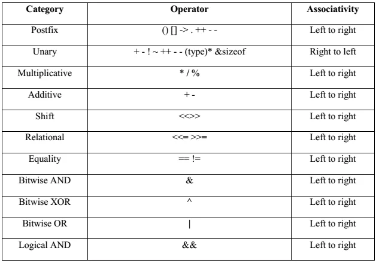
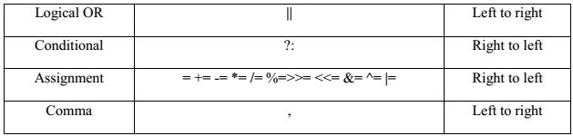

## 🧠 Matching & Parsing Characters — Use **Stack**

### Mastering Balanced Parentheses, Infix/Postfix Parsing, and Expression Evaluation

---

### 🔍 Why This Pattern Matters

In programming interviews and competitive coding, **expression parsing** and **bracket validation** are recurring themes. Whether it's checking if parentheses are balanced, converting between infix and postfix notation, or evaluating an expression, **Stacks** are the go-to tool.

This pattern is **highly important for problems involving structured matching, nesting, and expression evaluation** — all of which require **LIFO (Last In, First Out)** access, which is exactly what stacks provide.

---


### ✅ **Matching** means:

> **Checking if pairs of symbols (like brackets, tags, or quotes) open and close properly in the right order.**

**Examples:**

* `"()[]{}"` → ✅ Balanced
* `"(]"` → ❌ Not matched properly
* `"<div><p></div></p>"` → ❌ Invalid tag matching

📌 **Matching problems** are about **structure validation** — making sure every opening symbol has a correct closing match in the right place.

---

### ✅ **Parsing** means:

> **Breaking down and analyzing an expression or string to understand or evaluate it.**

**Examples:**

* Converting `"3 + (4 * 2)"` from **infix** to **postfix**: `3 4 2 * +`
* Evaluating `23*54*+9-` to get a final answer
* Extracting numbers, operators, or words from a complex input

📌 **Parsing problems** are about **processing or transforming** input — usually for **expression evaluation or conversion**.

---

### 🧠 Stack Use:

* In **matching**, stack tracks the last opened symbol and ensures it closes correctly.
* In **parsing**, stack helps **store intermediate values** (like operands or operators) as you evaluate or convert expressions.


[Recap of infix, prefix and postfix](#precap-of-infix-prefix-and-postfix)

---

## ✅ When to Apply

Use **Stack** when:

* You need to **match opening and closing characters** (like `(` with `)`, `{` with `}`, etc.).
* You are parsing **arithmetic expressions** or **logical conditions**.
* You want to **convert between infix, postfix, and prefix** notations.
* You're evaluating expressions like `"3 + (4 * 2)"`.

---

### 📌 Classic Problems & How Stack Solves Them

---

### 1️⃣ **Balanced Parentheses / Valid Brackets**

* **Problem**: Check if a string containing `()`, `{}`, `[]` is **well-formed**.
* **Technique**: Push opening brackets to stack. On closing, pop and check for a match.

```java
boolean isValid(String s) {
    Stack<Character> stack = new Stack<>();
    for (char c : s.toCharArray()) {
        if (c == '(' || c == '{' || c == '[')
            stack.push(c);
        else {
            if (stack.isEmpty()) return false;
            char top = stack.pop();
            if ((c == ')' && top != '(') ||
                (c == '}' && top != '{') ||
                (c == ']' && top != '[')) return false;
        }
    }
    return stack.isEmpty();
}
```

🧠 **Pattern Matched**: Character Matching → Use Stack.

---

### 2️⃣ **Infix to Postfix Conversion**

* **Problem**: Convert `a + b * c` (infix) to `abc*+` (postfix).
* **Technique**: Use stack for operators, apply precedence rules.

```java
String infixToPostfix(String expr) {
    StringBuilder output = new StringBuilder();
    Stack<Character> operators = new Stack<>();
    for (char c : expr.toCharArray()) {
        if (Character.isLetterOrDigit(c))
            output.append(c);
        else if (c == '(')
            operators.push(c);
        else if (c == ')') {
            while (!operators.isEmpty() && operators.peek() != '(')
                output.append(operators.pop());
            operators.pop(); // pop '('
        } else { // operator
            while (!operators.isEmpty() && precedence(operators.peek()) >= precedence(c))
                output.append(operators.pop());
            operators.push(c);
        }
    }
    while (!operators.isEmpty())
        output.append(operators.pop());
    return output.toString();
}
```

🧠 **Pattern Matched**: Expression Parsing → Stack with Operator Precedence.

---

### 3️⃣ **Evaluate Postfix Expression**

* **Problem**: Evaluate `23*54*+9-` = ?
* **Technique**: Use stack to push operands and compute on operator encounter.

```java
int evaluatePostfix(String expr) {
    Stack<Integer> stack = new Stack<>();
    for (char c : expr.toCharArray()) {
        if (Character.isDigit(c))
            stack.push(c - '0');
        else {
            int b = stack.pop();
            int a = stack.pop();
            switch (c) {
                case '+': stack.push(a + b); break;
                case '-': stack.push(a - b); break;
                case '*': stack.push(a * b); break;
                case '/': stack.push(a / b); break;
            }
        }
    }
    return stack.pop();
}
```

🧠 **Pattern Matched**: Postfix Evaluation → Use Stack for operands.

---

## 🎯 Bonus Use Cases

* **HTML/XML tag validation** → Ensure matching `<tag></tag>` using stack.
* **Minimum Remove to Make Valid Parentheses** (LeetCode #1249)
* **Longest Valid Parentheses** (LeetCode #32)

---

## 🛠️ Interview Tips

* Watch for **empty stack access** errors.
* Handle **edge cases** like multiple consecutive operators or invalid input.
* Memorize **precedence rules** for operators.
* Practice both **character** and **expression parsing** use cases.

---

## 🧪 Practice Problems

| Problem                          | Platform      | Difficulty |
| -------------------------------- | ------------- | ---------- |
| Valid Parentheses                | LeetCode #20  | Easy       |
| Evaluate Reverse Polish Notation | LeetCode #150 | Medium     |
| Infix to Postfix                 | GFG / Custom  | Medium     |
| Longest Valid Parentheses        | LeetCode #32  | Hard       |
| Remove Invalid Parentheses       | LeetCode #301 | Hard       |

---

## ✨ Conclusion

Stacks are **perfect for problems that require tracking nested or ordered elements**, especially when you need to reverse operations or maintain temporary state. If a question involves **"matching", "balancing", or "evaluating"**, think **Stack**.

> “Whenever you're dealing with **matching open-close symbols or parsing expressions**, the stack is your most reliable ally.”

---

## Precap of Infix, Prefix and Postfix

Here’s a clear breakdown of **Infix**, **Prefix**, and **Postfix** notations along with **use cases**:

---

## 🔢 1. **Infix Notation** (What we use normally)

**Format:** `operand operator operand`
**Example:** `A + B`, `3 + 4 * 2`

### ✅ Pros:

* Easy for humans to read and write.

### ❌ Cons:

* Needs **parentheses** and **operator precedence rules**.
* Hard to evaluate programmatically without parsing.

> Note: Operator precedence in programming dictates the order in which operators are evaluated within an expression. Operators with higher precedence are evaluated before those with lower precedence






---

## 🔃 2. **Prefix Notation** (Polish Notation)

**Format:** `operator operand operand`
**Example:** `+ A B`, `+ 3 * 4 2`

### ✅ Pros:

* No need for parentheses.
* Unambiguous — order of operations is built-in.
* Easy for **recursive evaluation**.

### 📌 Use Case:

* Used in **LISP programming language**
* Used in **compilers/interpreters** when converting expressions.

---

## 🔄 3. **Postfix Notation** (Reverse Polish Notation)

**Format:** `operand operand operator`
**Example:** `A B +`, `3 4 2 * +`

### ✅ Pros:

* **No need for parentheses** or precedence rules.
* **Easy to evaluate using a stack**.
* Ideal for **compilers**, **calculators**, and **expression evaluators**.

### 📌 Use Case:

* **Stack-based calculators**
* **Expression evaluators** in **Postfix notation** using stack (like `RPN calculators`)

---

## 📚 Example Conversion

Given: `3 + 4 * 2`

* **Infix:** `3 + 4 * 2`
* **Prefix:** `+ 3 * 4 2`
* **Postfix:** `3 4 2 * +`

👉 Note: In infix, `4 * 2` is evaluated first due to precedence. Prefix/Postfix handles this **without parentheses**.

---

## ⚒️ In Summary

| Notation | Format | Needs Parentheses? | Evaluation Style              |
| -------- | ------ | ------------------ | ----------------------------- |
| Infix    | A + B  | ✅ Yes              | Complex (needs stack + rules) |
| Prefix   | + A B  | ❌ No               | Recursion or stack            |
| Postfix  | A B +  | ❌ No               | Simple stack-based            |

---

 **Rules for converting infix expressions** to **prefix** and **postfix**, with a step-by-step example.


## 🔁 Infix → Postfix (Reverse Polish Notation)

### ✅ **Rules**

1. **Operands** (A, B, 3, x, etc.) go directly to the output.
2. **Operators** are pushed to a **stack**:

   * Pop higher/equal precedence operators from the stack before pushing a new one.
3. **Left parenthesis `(`** → Push to stack.
4. **Right parenthesis `)`** → Pop and append to output until `(` is encountered.

### 📌 **Operator Precedence**

* High: `* / %`
* Low: `+ -`
* Left to right associativity.

---

### 🔁 Infix → Prefix (Polish Notation)

### ✅ **Steps**

1. **Reverse** the infix expression.
2. **Swap** `(` with `)` and vice versa.
3. **Convert** to postfix using the above rules.
4. **Reverse** the postfix result → That’s your prefix.

---

## 🧪 Example:

Infix: `A + B * C`

### 🔄 Step-by-step for **Postfix**

| Token | Stack   | Output     |
| ----- | ------- | ---------- |
| A     |         | A          |
| +     | +       | A          |
| B     | +       | A B        |
| \*    | + \*    | A B        |
| C     | + \*    | A B C      |
|       | +       | A B C \*   |
|       | (empty) | A B C \* + |

✅ Postfix = `A B C * +`

---

### 🔄 Step-by-step for **Prefix**

1. **Reverse Infix**: `C * B + A`
2. **Swap brackets** (none here)
3. **Convert to postfix** of reversed: `C B * A +`
4. **Reverse that**: `+ A * B C`

✅ Prefix = `+ A * B C`

---

## ✅ Summary

| Infix               | Postfix         | Prefix          |
| ------------------- | --------------- | --------------- |
| `A + B * C`         | `A B C * +`     | `+ A * B C`     |
| `A * (B + C)`       | `A B C + *`     | `* A + B C`     |
| `(A + B) * (C - D)` | `A B + C D - *` | `* + A B - C D` |


---

Here is a **Java implementation** for converting **Infix to Postfix** and **Infix to Prefix** using the stack-based approach:

---

## ✅ Java Code

```java
import java.util.*;

public class InfixConverter {

    // Operator precedence map
    static int precedence(char ch) {
        switch (ch) {
            case '+':
            case '-': return 1;
            case '*':
            case '/': return 2;
            case '^': return 3;
        }
        return -1;
    }

    // Check if character is operator
    static boolean isOperator(char ch) {
        return "+-*/^".indexOf(ch) != -1;
    }

    // Infix to Postfix
    public static String infixToPostfix(String expr) {
        StringBuilder result = new StringBuilder();
        Stack<Character> stack = new Stack<>();

        for (char c : expr.toCharArray()) {
            if (Character.isLetterOrDigit(c)) {
                result.append(c);
            } else if (c == '(') {
                stack.push(c);
            } else if (c == ')') {
                while (!stack.isEmpty() && stack.peek() != '(')
                    result.append(stack.pop());
                stack.pop(); // remove '('
            } else if (isOperator(c)) {
                while (!stack.isEmpty() && precedence(c) <= precedence(stack.peek()))
                    result.append(stack.pop());
                stack.push(c);
            }
        }

        while (!stack.isEmpty())
            result.append(stack.pop());

        return result.toString();
    }

    // Infix to Prefix
    public static String infixToPrefix(String expr) {
        // 1. Reverse the string
        StringBuilder rev = new StringBuilder(expr).reverse();
        // 2. Swap '(' with ')'
        for (int i = 0; i < rev.length(); i++) {
            if (rev.charAt(i) == '(')
                rev.setCharAt(i, ')');
            else if (rev.charAt(i) == ')')
                rev.setCharAt(i, '(');
        }
        // 3. Get postfix of reversed
        String reversedPostfix = infixToPostfix(rev.toString());
        // 4. Reverse the postfix to get prefix
        return new StringBuilder(reversedPostfix).reverse().toString();
    }

    // Test the code
    public static void main(String[] args) {
        String infix = "A+(B*C)";
        System.out.println("Infix:   " + infix);
        System.out.println("Postfix: " + infixToPostfix(infix));
        System.out.println("Prefix:  " + infixToPrefix(infix));
    }
}
```

---

### 🧪 Output:

```
Infix:   A+(B*C)
Postfix: ABC*+
Prefix:  +A*BC
```

