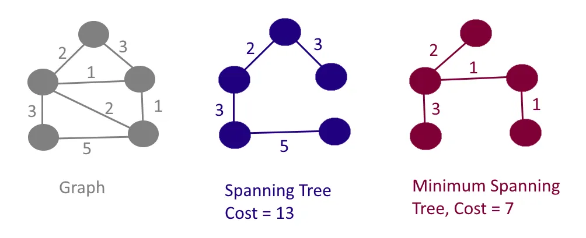

## 🌲 Optimization Using MST




When you want to **connect all nodes** in a **weighted undirected graph** with **minimum total edge weight** and **no cycles**, use a **Minimum Spanning Tree (MST)**.

---

## 🧠 MST: What It Solves

> **Goal**: Connect all vertices using the **least total weight** without forming a cycle.

Use cases:

* Network cabling
* Road construction planning
* Cost-efficient spanning

---

## ⚔️ Kruskal vs Prim: When to Use

| Feature         | Kruskal’s Algorithm         | Prim’s Algorithm           |
| --------------- | --------------------------- | -------------------------- |
| Approach        | Greedy on **edges**         | Greedy on **vertices**     |
| Graph Type      | **Sparse** graphs preferred | **Dense** graphs preferred |
| Data Structure  | Disjoint Set (Union-Find)   | Min Heap (Priority Queue)  |
| Cycle Detection | Handled via Union-Find      | Not needed                 |
| Edge Sorting    | Required                    | Not needed                 |

---

## 🔧 When to Use:

* Use **Kruskal** when:

  * Graph is **edge-heavy**
  * Easy to sort edges

* Use **Prim** when:

  * Graph is **dense**
  * Adjacency list + min-heap is available

---

## 🧪 Example Outputs

**Input** (Weighted Undirected Graph):

```
A --3-- B
|     /
6   1
| / 
C
```

**MST Cost** = 4
**MST Edges** = `B–C (1)`, `A–B (3)`

---

## ✅ Summary

> For **minimum cost connection** problems, use **MST**:

* **Kruskal** → sorted edges + disjoint sets
* **Prim** → grow tree using heap and nearest neighbor

---

Here is the **Java implementation** of both **Kruskal’s** and **Prim’s Algorithm** for **Minimum Spanning Tree (MST)**:

---

## 🧮 Kruskal’s Algorithm (Using Union-Find)

```java
class Edge implements Comparable<Edge> {
    int u, v, weight;
    Edge(int u, int v, int weight) {
        this.u = u;
        this.v = v;
        this.weight = weight;
    }

    public int compareTo(Edge other) {
        return this.weight - other.weight;
    }
}

class UnionFind {
    int[] parent;
    UnionFind(int n) {
        parent = new int[n];
        for (int i = 0; i < n; i++) parent[i] = i;
    }

    int find(int x) {
        if (x != parent[x]) parent[x] = find(parent[x]);
        return parent[x];
    }

    boolean union(int x, int y) {
        int px = find(x), py = find(y);
        if (px == py) return false;
        parent[px] = py;
        return true;
    }
}

public int kruskalMST(int V, List<Edge> edges) {
    Collections.sort(edges);
    UnionFind uf = new UnionFind(V);
    int mstWeight = 0, count = 0;

    for (Edge e : edges) {
        if (uf.union(e.u, e.v)) {
            mstWeight += e.weight;
            count++;
            if (count == V - 1) break;
        }
    }

    return mstWeight;
}
```

---

## 🧮 Prim’s Algorithm (Using Min Heap)

```java
class Pair {
    int node, weight;
    Pair(int node, int weight) {
        this.node = node;
        this.weight = weight;
    }
}

public int primMST(int V, List<List<Pair>> adj) {
    boolean[] visited = new boolean[V];
    PriorityQueue<Pair> pq = new PriorityQueue<>((a, b) -> a.weight - b.weight);
    pq.offer(new Pair(0, 0));
    int mstWeight = 0;

    while (!pq.isEmpty()) {
        Pair curr = pq.poll();
        int u = curr.node;
        if (visited[u]) continue;
        visited[u] = true;
        mstWeight += curr.weight;

        for (Pair nei : adj.get(u)) {
            if (!visited[nei.node]) {
                pq.offer(nei);
            }
        }
    }

    return mstWeight;
}
```

---

## 📌 Notes

* `V` is the number of vertices (indexed from `0` to `V-1`)
* **Kruskal** takes a **list of all edges**
* **Prim** works on an **adjacency list** (`List<List<Pair>>`)

Let me know if you want:

* Edge list/adjacency list setup
* Output of these on sample graphs
* Explanation of time complexities


---

[See More ==>](http://localhost:3000/#/contents/full-stack-developer-course/algorithms/Graph%20Algorithms/minimum-spanning-tree/introduction-to-mst)