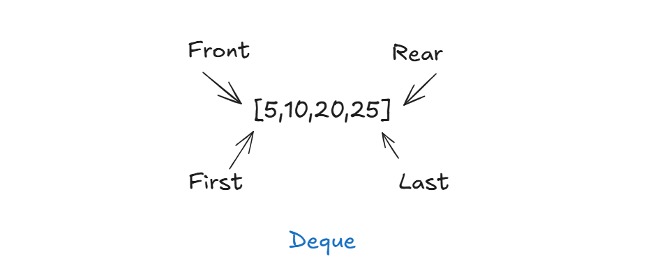

> Q. Show priority queue in java. All CRUD operation.


### ✅ **Full Java Code** (Min-Heap by default):

```java
import java.util.*;

public class PriorityQueueExample {
    public static void main(String[] args) {
        // Create a PriorityQueue (Min-Heap by default)
        PriorityQueue<Integer> pq = new PriorityQueue<>();

        // ====== C - Create / Insert ======
        pq.add(10);
        pq.add(5);
        pq.add(20);
        pq.offer(15); // offer() is similar to add()

        System.out.println("Initial PriorityQueue: " + pq);

        // ====== R - Read / Peek (View top element without removing) ======
        System.out.println("Peek (top element): " + pq.peek());

        // ====== U - Update (Remove + Add = Replace) ======
        // Java PQ doesn't support direct update, simulate with remove + add
        pq.remove(10);  // remove specific value
        pq.add(7);      // add new value
        System.out.println("After update (10 -> 7): " + pq);

        // ====== D - Delete / Remove ======
        System.out.println("Poll (remove top): " + pq.poll()); // removes top element
        System.out.println("After poll: " + pq);

        pq.remove(20);  // remove specific element
        System.out.println("After removing 20: " + pq);

        // ====== Iterate ======
        System.out.println("Iterating over PriorityQueue:");
        for (int num : pq) {
            System.out.println(num);
        }

        // ====== Clear all ======
        pq.clear();
        System.out.println("After clear: " + pq);
    }
}
```

---

### 🧠 Notes:

* **Min-Heap** is default (`PriorityQueue` gives smallest element first).
* `add()` and `offer()` → insert
* `peek()` → view head
* `poll()` → remove head
* `remove(val)` → remove specific value
* `clear()` → delete all
* No `update()` method — simulate by remove + add.


> Q. Where is the priority value here?


In Java's `PriorityQueue`, **priority is determined by the natural order or a custom comparator**, **not by storing a separate “priority value” explicitly** like in some other languages or data structures.

---

### 🔍 So where is the priority?

In this line:

```java
PriorityQueue<Integer> pq = new PriorityQueue<>();
```

* This creates a **min-heap**, meaning **lower numbers have higher priority**.
* So `5` has higher priority than `10` or `20`.

---

### 💡 If you want to assign **custom priorities**, use a class with comparator:

#### ✅ Example with custom priority:

```java
import java.util.*;

class Task {
    String name;
    int priority; // lower means higher priority

    Task(String name, int priority) {
        this.name = name;
        this.priority = priority;
    }

    public String toString() {
        return name + " (priority " + priority + ")";
    }
}

public class CustomPriorityQueue {
    public static void main(String[] args) {
        PriorityQueue<Task> taskQueue = new PriorityQueue<>(Comparator.comparingInt(task -> task.priority));

        taskQueue.add(new Task("Do laundry", 3));
        taskQueue.add(new Task("Pay bills", 1));
        taskQueue.add(new Task("Clean house", 2));

        while (!taskQueue.isEmpty()) {
            System.out.println("Next task: " + taskQueue.poll());
        }
    }
}
```

---

### 🧠 Output:

```
Next task: Pay bills (priority 1)
Next task: Clean house (priority 2)
Next task: Do laundry (priority 3)
```

This is how **you explicitly associate a “priority value”** with each item.


> Q. Is by default priority queue uses min heap?


Yes, by default Java’s `PriorityQueue` uses a **Min-Heap**, meaning the **smallest element has the highest priority** and comes out first when you call `poll()` or `peek()`.

---

### ✅ Example:

```java
PriorityQueue<Integer> pq = new PriorityQueue<>();
pq.add(30);
pq.add(10);
pq.add(20);

System.out.println(pq.poll()); // Output: 10 (smallest first)
```

---

### 🔁 To create a **Max-Heap**, use a custom comparator:

```java
PriorityQueue<Integer> maxHeap = new PriorityQueue<>(Collections.reverseOrder());
maxHeap.add(30);
maxHeap.add(10);
maxHeap.add(20);

System.out.println(maxHeap.poll()); // Output: 30 (largest first)
```

---

So yes — **Min-Heap is the default behavior** in Java's `PriorityQueue`.


> Q. In this case how can you make this snippet max heap `PriorityQueue<Task> taskQueue = new PriorityQueue<>(Comparator.comparingInt(task -> task.priority));`


To make your `PriorityQueue<Task>` behave like a **Max-Heap** (i.e., higher `priority` value means higher actual priority), just reverse the comparator:

---

### ✅ **Max-Heap version**:

```java
PriorityQueue<Task> taskQueue = new PriorityQueue<>(Comparator.comparingInt(task -> -task.priority));
```

or more clearly:

```java
PriorityQueue<Task> taskQueue = new PriorityQueue<>(
    (t1, t2) -> Integer.compare(t2.priority, t1.priority)
);
```

---

### 🧠 Explanation:

* `Comparator.comparingInt(task -> task.priority)` → **Min-Heap** (lower value = higher priority)
* `Comparator.comparingInt(task -> -task.priority)` → **Max-Heap** (higher value = higher priority)

---

##  Descending based on `name` or multiple fields too.


### 🔽 **Descending based on `name`**

Suppose your `Task` class has:

```java
class Task {
    String name;
    int priority;
}
```

If you want to sort by `name` in **reverse alphabetical order** (Z → A), you can write:

```java
PriorityQueue<Task> taskQueue = new PriorityQueue<>(
    Comparator.comparing((Task t) -> t.name).reversed()
);
```

---

### 🔁 **Multiple fields (e.g., priority first, then name)**

You can sort by **priority (Max-Heap)**, and if two tasks have the same priority, then sort by **name (A → Z)**:

```java
PriorityQueue<Task> taskQueue = new PriorityQueue<>(
    Comparator.<Task>comparingInt(t -> -t.priority)
              .thenComparing(t -> t.name)
);
```

Or using lambda explicitly:

```java
PriorityQueue<Task> taskQueue = new PriorityQueue<>(
    (t1, t2) -> {
        int cmp = Integer.compare(t2.priority, t1.priority); // descending priority
        if (cmp == 0) {
            return t1.name.compareTo(t2.name); // ascending name
        }
        return cmp;
    }
);
```

---

### Now let's do these: 

* ==Priority ascending, name descending==
* ==Full runnable example with output==

Here's a **full runnable Java example** that uses `PriorityQueue<Task>` with:

* **Primary sort**: descending by `priority` (Max-Heap style)
* **Secondary sort**: ascending by `name` (A → Z)

---

### ✅ Full Code with Custom Comparator

```java
import java.util.*;

class Task {
    String name;
    int priority;

    Task(String name, int priority) {
        this.name = name;
        this.priority = priority;
    }

    public String toString() {
        return name + " (priority " + priority + ")";
    }
}

public class TaskPriorityQueue {
    public static void main(String[] args) {
        // Max-Heap by priority, tie-breaker by name (A-Z)
        PriorityQueue<Task> taskQueue = new PriorityQueue<>(
            (t1, t2) -> {
                int cmp = Integer.compare(t2.priority, t1.priority); // higher priority first
                if (cmp == 0) {
                    return t1.name.compareTo(t2.name); // if same priority, sort by name A-Z
                }
                return cmp;
            }
        );

        taskQueue.add(new Task("Email Client", 3));
        taskQueue.add(new Task("Code Review", 5));
        taskQueue.add(new Task("Team Meeting", 5));
        taskQueue.add(new Task("Daily Standup", 4));

        System.out.println("Tasks in priority order:");
        while (!taskQueue.isEmpty()) {
            System.out.println(taskQueue.poll());
        }
    }
}
```

---

### 🧾 Output:

```
Tasks in priority order:
Code Review (priority 5)
Team Meeting (priority 5)
Daily Standup (priority 4)
Email Client (priority 3)
```

* `Code Review` and `Team Meeting` both have priority 5 → sorted by name (`C` before `T`)
* Next is priority 4, then 3

---

## CRUD with Dequeue

Here’s a complete example demonstrating **CRUD operations for `Deque`** (Double-Ended Queue) in Java using `ArrayDeque`.

---





### ✅ Full Java Code: CRUD on Deque

```java
import java.util.*;

public class DequeExample {
    public static void main(String[] args) {
        Deque<Integer> deque = new ArrayDeque<>();

        // ====== C - Create / Insert ======
        deque.addFirst(10);  // Insert at front
        deque.addLast(20);   // Insert at rear
        deque.offerFirst(5); // Safer insert at front
        deque.offerLast(25); // Safer insert at rear

        System.out.println("After insertions: " + deque); // [5, 10, 20, 25]

        // ====== R - Read / Peek ======
        System.out.println("Peek first: " + deque.peekFirst()); // 5
        System.out.println("Peek last: " + deque.peekLast());   // 25

        // ====== U - Update ======
        // No direct update by index — simulate by remove + add
        deque.removeFirst();        // remove 5
        deque.addFirst(15);         // add 15 at front
        System.out.println("After updating front: " + deque); // [15, 10, 20, 25]

        // ====== D - Delete / Remove ======
        deque.pollFirst();          // remove from front
        deque.pollLast();           // remove from rear
        deque.remove(10);           // remove specific value
        System.out.println("After deletions: " + deque); // [20]

        // ====== Iterate ======
        System.out.println("Iterating Deque:");
        for (int num : deque) {
            System.out.println(num);
        }

        // ====== Clear ======
        deque.clear();
        System.out.println("After clear: " + deque); // []
    }
}
```

---

### 🔑 Common `Deque` Methods:

| Operation     | Front Side                      | Rear Side                     |
| ------------- | ------------------------------- | ----------------------------- |
| Insert        | `addFirst()` / `offerFirst()`   | `addLast()` / `offerLast()`   |
| Read/Peek     | `peekFirst()`                   | `peekLast()`                  |
| Delete/Remove | `pollFirst()` / `removeFirst()` | `pollLast()` / `removeLast()` |
| Contains      | `contains(value)`               | —                             |

---

## Using **LinkedList**, or a **custom object** like `Task`.

Here are both versions of the Deque CRUD code:

---

## ✅ 1. **Deque CRUD Using `LinkedList` Instead of `ArrayDeque`**

```java
import java.util.*;

public class DequeWithLinkedList {
    public static void main(String[] args) {
        Deque<Integer> deque = new LinkedList<>();

        // C - Create
        deque.addFirst(10);
        deque.addLast(20);
        deque.offerFirst(5);
        deque.offerLast(25);
        System.out.println("After insertions: " + deque); // [5, 10, 20, 25]

        // R - Read
        System.out.println("Peek first: " + deque.peekFirst()); // 5
        System.out.println("Peek last: " + deque.peekLast());   // 25

        // U - Update (simulate)
        deque.removeFirst(); // remove 5
        deque.addFirst(15);  // add 15
        System.out.println("After update: " + deque); // [15, 10, 20, 25]

        // D - Delete
        deque.pollFirst();
        deque.pollLast();
        deque.remove(10);
        System.out.println("After deletions: " + deque); // [20]

        // Iterate
        System.out.println("Iterate:");
        for (int val : deque) {
            System.out.println(val);
        }

        // Clear
        deque.clear();
        System.out.println("After clear: " + deque);
    }
}
```

---

## ✅ 2. **Deque CRUD Using Custom Class `Task`**

```java
import java.util.*;

class Task {
    String name;
    int priority;

    Task(String name, int priority) {
        this.name = name;
        this.priority = priority;
    }

    public String toString() {
        return name + " (priority " + priority + ")";
    }
}

public class DequeWithCustomObject {
    public static void main(String[] args) {
        Deque<Task> deque = new ArrayDeque<>();

        // C - Create
        deque.addFirst(new Task("Email", 2));
        deque.addLast(new Task("Code Review", 3));
        deque.offerFirst(new Task("Login Fix", 1));
        deque.offerLast(new Task("Team Call", 4));
        System.out.println("After insertions: " + deque);

        // R - Read
        System.out.println("Peek first: " + deque.peekFirst());
        System.out.println("Peek last: " + deque.peekLast());

        // U - Update (simulate by remove + add)
        deque.removeFirst();  // remove "Login Fix"
        deque.addFirst(new Task("Login Fix - Urgent", 5));
        System.out.println("After update: " + deque);

        // D - Delete
        deque.pollFirst();
        deque.pollLast();
        deque.removeIf(t -> t.name.equals("Email"));
        System.out.println("After deletions: " + deque);

        // Iterate
        for (Task t : deque) {
            System.out.println(t);
        }

        // Clear
        deque.clear();
        System.out.println("After clear: " + deque);
    }
}
```

---

## Let's dive in :

* `Deque<Task>` with sorting
* Output comparison
* Or unit test examples for CRUD


---

## ✅ 1. `Deque<Task>` with Sorting

### 🔧 Problem:

`Deque` doesn't maintain order based on fields like `priority`. But you can **sort manually** using a list.

---

### 🧩 Example Code: Sort `Deque<Task>` by `priority` descending

```java
import java.util.*;

class Task {
    String name;
    int priority;

    Task(String name, int priority) {
        this.name = name;
        this.priority = priority;
    }

    public String toString() {
        return name + " (priority " + priority + ")";
    }
}

public class DequeTaskWithSort {
    public static void main(String[] args) {
        Deque<Task> deque = new ArrayDeque<>();
        deque.add(new Task("Email", 2));
        deque.add(new Task("Code Review", 3));
        deque.add(new Task("Login Fix", 5));
        deque.add(new Task("Team Call", 4));

        System.out.println("Before sorting:");
        deque.forEach(System.out::println);

        // Convert to list, sort by priority descending
        List<Task> sorted = new ArrayList<>(deque);
        sorted.sort((a, b) -> Integer.compare(b.priority, a.priority)); // Max first

        System.out.println("\nAfter sorting by priority (desc):");
        sorted.forEach(System.out::println);
    }
}
```

---

## 🧾 2. Output Comparison

### ✅ Output:

```
Before sorting:
Email (priority 2)
Code Review (priority 3)
Login Fix (priority 5)
Team Call (priority 4)

After sorting by priority (desc):
Login Fix (priority 5)
Team Call (priority 4)
Code Review (priority 3)
Email (priority 2)
```

---

### 🧠 Notes:

* `Deque` is good for fast front/rear insertions, not sorted access.
* To **sort**, copy to a `List`, then apply `Collections.sort` or `List.sort`.
* If you need both queue behavior **and** sorted access → consider `PriorityQueue` or `TreeSet`.


> Q. is iteration in deque possible with while loop?

Yes, absolutely! Iteration over a `Deque` using a `while` loop is possible in multiple ways. Here's how:

---

### ✅ 1. **Using an `Iterator`**

```java
Deque<Integer> deque = new ArrayDeque<>(List.of(10, 20, 30));
Iterator<Integer> it = deque.iterator();

while (it.hasNext()) {
    System.out.println(it.next());
}
```

---

### ✅ 2. **Using `while (!deque.isEmpty())` + `pollFirst()`**

> ⚠️ This **consumes** the deque (removes elements).

```java
Deque<Integer> deque = new ArrayDeque<>(List.of(10, 20, 30));

while (!deque.isEmpty()) {
    System.out.println(deque.pollFirst()); // or pollLast()
}
```

---

### ✅ 3. **Manual index loop (if converted to List)**

```java
List<Integer> list = new ArrayList<>(deque);
int i = 0;
while (i < list.size()) {
    System.out.println(list.get(i));
    i++;
}
```

---

Here’s how to **iterate over a `Deque<Task>` using a `while` loop** — in both **forward** and **reverse order**:

---

## ✅ Full Example: `Deque<Task>` Iteration with `while` Loop

```java
import java.util.*;

class Task {
    String name;
    int priority;

    Task(String name, int priority) {
        this.name = name;
        this.priority = priority;
    }

    public String toString() {
        return name + " (priority " + priority + ")";
    }
}

public class DequeWhileLoopExample {
    public static void main(String[] args) {
        Deque<Task> deque = new ArrayDeque<>();
        deque.add(new Task("Email", 2));
        deque.add(new Task("Code Review", 3));
        deque.add(new Task("Login Fix", 5));
        deque.add(new Task("Team Call", 4));

        // ✅ Forward iteration using Iterator and while
        System.out.println("Forward Iteration:");
        Iterator<Task> it = deque.iterator();
        while (it.hasNext()) {
            System.out.println(it.next());
        }

        // ✅ Reverse iteration using descendingIterator and while
        System.out.println("\nReverse Iteration:");
        Iterator<Task> reverseIt = deque.descendingIterator();
        while (reverseIt.hasNext()) {
            System.out.println(reverseIt.next());
        }

        // ⚠️ Destructive iteration (consumes deque)
        System.out.println("\nPolling Iteration (destructive):");
        while (!deque.isEmpty()) {
            System.out.println(deque.pollFirst());
        }
    }
}
```

---

### 🧾 Output:

```
Forward Iteration:
Email (priority 2)
Code Review (priority 3)
Login Fix (priority 5)
Team Call (priority 4)

Reverse Iteration:
Team Call (priority 4)
Login Fix (priority 5)
Code Review (priority 3)
Email (priority 2)

Polling Iteration (destructive):
Email (priority 2)
Code Review (priority 3)
Login Fix (priority 5)
Team Call (priority 4)
```

---


## Iterate with filtering (e.g., only priority > 3)

Here’s how to **iterate over a `Deque<Task>` using a `while` loop** and **filter tasks with `priority > 3`**:

---

### ✅ Full Example with Filtering in While Loop

```java
import java.util.*;

class Task {
    String name;
    int priority;

    Task(String name, int priority) {
        this.name = name;
        this.priority = priority;
    }

    public String toString() {
        return name + " (priority " + priority + ")";
    }
}

public class DequeFilterExample {
    public static void main(String[] args) {
        Deque<Task> deque = new ArrayDeque<>();
        deque.add(new Task("Email", 2));
        deque.add(new Task("Code Review", 3));
        deque.add(new Task("Login Fix", 5));
        deque.add(new Task("Team Call", 4));

        System.out.println("Filtered tasks (priority > 3):");
        Iterator<Task> it = deque.iterator();
        while (it.hasNext()) {
            Task task = it.next();
            if (task.priority > 3) {
                System.out.println(task);
            }
        }
    }
}
```

---

### 🧾 Output:

```
Filtered tasks (priority > 3):
Login Fix (priority 5)
Team Call (priority 4)
```


