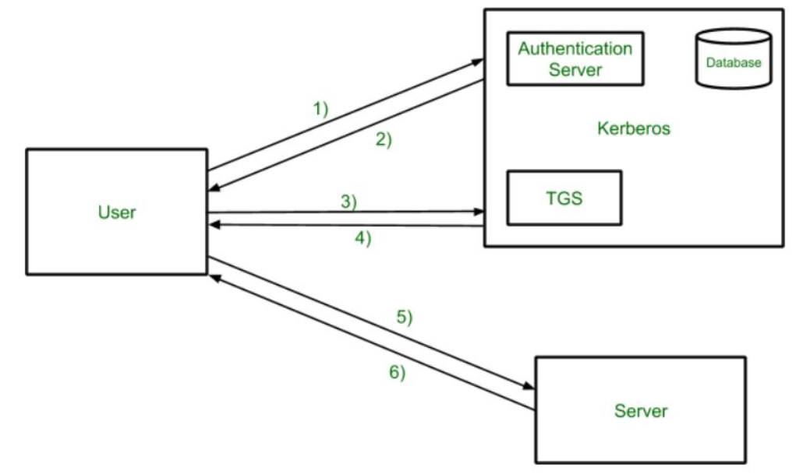

### 📌 **Introduction to Kerberos**

**Kerberos** is a **network authentication protocol** designed to provide **secure and trusted identity verification** over insecure networks. Developed at **MIT**, Kerberos uses **symmetric key cryptography** to authenticate clients to services in a distributed computing environment—**without sending passwords over the network**.

It is especially prominent in **enterprise environments** for internal authentication and is integrated into operating systems like **Windows, Unix, and Linux**.

---

## 🔐 **How Kerberos Works – Step-by-Step Process**

### 🔢 **Step-by-Step Explanation of Kerberos Workflow**

---

### **1) User → Authentication Server (AS)**

**Request for Ticket Granting Ticket (TGT)**

* The user logs in and sends an authentication request to the **Authentication Server**, typically including the user ID.
* No password is sent—only the request to authenticate.

---

### **2) Authentication Server → User**

**AS responds with TGT and session key**

* If the user ID is valid, the AS sends back:

  * A **Ticket Granting Ticket (TGT)** (encrypted using the TGS's key)
  * A **session key** (encrypted using the user's password hash)
* The user can decrypt it **only if the correct password is entered** (proving identity without sending the password).

---

### **3) User → Ticket Granting Server (TGS)**

**Request for Service Ticket**

* The user sends the TGT (received from AS) to the TGS to request access to a specific service/server.
* The user includes an **Authenticator** (timestamp encrypted with the session key) to prove it's not a replay.

---

### **4) TGS → User**

**TGS responds with a Service Ticket**

* If the TGT and Authenticator are valid:

  * TGS returns a **Service Ticket** (encrypted with the service/server's secret key).
  * Also sends a **new session key** for secure communication with the target server.

---

### **5) User → Server**

**Send Service Ticket + Authenticator**

* The user sends:

  * The **Service Ticket** (from Step 4)
  * A new **Authenticator** (encrypted with the session key from TGS)
* This authenticates the user to the target server.

---

### **6) Server → User**

**Mutual Authentication (Optional)**

* The server decrypts the ticket and verifies the Authenticator.
* If mutual authentication is enabled, the server sends a confirmation (e.g., a timestamp encrypted with the session key) back to the user.

---

### ✅ **Summary of Components:**

* **Authentication Server (AS)**: Verifies user identity and issues TGT.
* **Ticket Granting Server (TGS)**: Issues service tickets.
* **TGT**: Allows access to TGS.
* **Service Ticket**: Grants access to the target server.
* **Session Keys**: Ensure secure communication between parties.

This flow ensures **secure, time-limited, and mutual authentication** using symmetric key cryptography without exposing passwords or credentials on the network.

---

Kerberos operates using a trusted third-party system called the **Key Distribution Center (KDC)**, which includes two main components:

* **Authentication Server (AS)**
* **Ticket Granting Server (TGS)**

### 🔸 a. **Client Authentication**

* The user logs in and requests a **Ticket Granting Ticket (TGT)** from the **KDC’s Authentication Server**.
* The AS verifies the user’s credentials using a **shared secret key** (derived from the password).
* If valid, the AS sends back a TGT (encrypted), which includes session keys and a timestamp.

### 🔸 b. **Ticket Granting**

* When the user wants to access a service, the client sends the **TGT to the TGS**, requesting a **Service Ticket**.
* The TGS decrypts the TGT, verifies its validity, and then generates a **Service Ticket** for the requested application or service.

### 🔸 c. **Service Access**

* The client presents the Service Ticket to the desired **application server**.
* The server verifies the ticket and grants access **without requiring the user to re-enter credentials**.

---

## ✅ **Advantages of Kerberos**

1. **Mutual Authentication**

   * Both the **client and server** verify each other's identity, minimizing the risk of **impersonation** or **man-in-the-middle attacks**.

2. **Single Sign-On (SSO)**

   * Users authenticate **once**, and can then access multiple network services without logging in again, improving user experience and reducing password fatigue.

3. **Time-Based Authentication**

   * Tickets are **timestamped and expire**, reducing the chance of ticket theft or **replay attacks**.

4. **No Password Transmission**

   * Passwords are **never transmitted over the network**, which makes it harder for attackers to steal user credentials.

---

## 🌐 **Applications of Kerberos**

### 🔹 **Enterprise Networks**

* Kerberos is widely used to secure **intranet services**, authenticate employees, and **control internal access** to networked resources (e.g., printers, file servers).

### 🔹 **Operating Systems**

* Integrated in **Windows Active Directory**, **Unix**, and **Linux** for authenticating user sessions and permissions across domains.

### 🔹 **Cloud Services**

* Used in conjunction with **federated identity systems** to authenticate users for **cloud-hosted enterprise applications**.

---

## ✅ **Conclusion**

Kerberos is a robust and secure authentication system suited for environments where **multiple services** must be accessed securely by multiple users. With its **mutual authentication**, **time-sensitive tickets**, and **single sign-on** capabilities, it plays a vital role in **modern enterprise security architectures**—helping organizations maintain **confidentiality and trust** across distributed systems.
