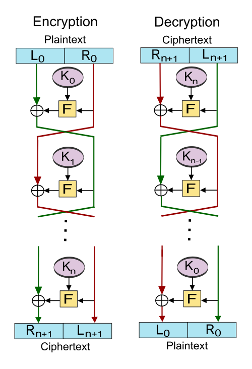

### 📌 **Feistel Ciphers**

**Feistel Ciphers** are a class of **symmetric block ciphers** named after **Horst Feistel**, who designed the structure while working at IBM. The Feistel structure provides a systematic method for constructing encryption algorithms that are **efficient, secure**, and **easy to reverse** for decryption.

It forms the basis of many famous encryption algorithms, including **DES (Data Encryption Standard)**.

---

## 🔐 **What Is a Feistel Cipher?**

A **Feistel cipher** divides the plaintext input into **two equal halves**—**Left (L)** and **Right (R)**—and then processes them through multiple **rounds of encryption** using a **round function (F)** and subkeys.

Unlike some cipher designs where encryption and decryption require different algorithms, Feistel ciphers use **the same structure for both**, simply **reversing the key schedule** during decryption.

---

## 🔁 **Feistel Cipher Encryption Process – Step-by-Step**

Let’s assume we have an input block split into **Left (L₀)** and **Right (R₀)**:

### 🔸 **1. Split Input**
- The plaintext block is split into:
  - **L₀ = Left half**
  - **R₀ = Right half**

### 🔸 **2. Round Function**
- For **each round i**, perform the following transformations:
  - `Lᵢ = Rᵢ₋₁`
  - `Rᵢ = Lᵢ₋₁ ⊕ F(Rᵢ₋₁, Kᵢ)`
- Where:
  - `F` is the **round function**
  - `Kᵢ` is the **subkey** for the ith round
  - `⊕` is the **XOR** operation

### 🔸 **3. Swap and Repeat**
- Swap L and R and repeat for the desired number of **n rounds**.

### 🔸 **4. Final Output**
- After the final round, combine L and R (in their last state) to form the **ciphertext**.

---

## 🔁 **Decryption in Feistel Cipher**

One of the **key advantages** of Feistel ciphers is that **decryption uses the same structure**:
- The same steps are followed, but the **subkeys are used in reverse order** (from last to first).
- This **simplifies implementation**, especially in hardware and embedded systems.

---

## ✅ **Advantages of Feistel Structure**

1. **Simplicity in Implementation**
   - Same process for encryption and decryption—only key order is reversed.

2. **Scalability**
   - More rounds → Higher security (up to a practical limit).

3. **Proven Security Basis**
   - Used in many well-known ciphers like **DES, Blowfish, and CAST-128**.

4. **Flexibility**
   - The round function **F** can be varied to achieve different levels of security and performance.

---

## 🧪 **Examples of Feistel-Based Ciphers**
- **DES (Data Encryption Standard)**
- **Blowfish**
- **Twofish**
- **CAST-128**

---

## ✅ **Conclusion**

Feistel ciphers are a foundational concept in symmetric key cryptography. By **splitting data into two halves** and **processing them through multiple rounds with XOR and key mixing**, they provide a **secure and efficient** encryption method. Their major strength lies in the **symmetry of encryption and decryption**, which makes them ideal for both hardware and software implementations.