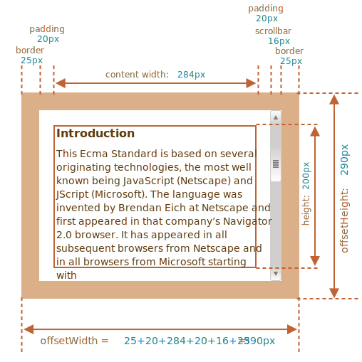

## ⚙️ `useLayoutEffect` — The Hook You Don’t *Always* Need, But Should Understand

Okay, so we all know about `useEffect`, right? It runs after the DOM has painted, meaning it's great for API calls, logging, or any side effect that doesn’t mess with layout.

But sometimes, you need to **measure DOM elements or make visual adjustments immediately after DOM mutations but before the browser paints** — that’s where **`useLayoutEffect`** comes in.

Think of it like this:

> 📌 "`useEffect` waits politely; `useLayoutEffect` jumps in right after DOM updates but *before* the screen shows anything."

---

### ✅ What It’s Used For

You’d reach for `useLayoutEffect` when:

* You need to **measure the layout** (e.g., width, height, position of elements)
* You want to **synchronously modify DOM styles** before the user sees anything
* You need to **prevent visual flickering or jank** during mounting or re-rendering

---

### 🔍 Example: Auto-scroll to a ref

```jsx
import React, { useRef, useLayoutEffect } from 'react';

function ScrollToBottom() {
  const divRef = useRef(null);

  useLayoutEffect(() => {
    if (divRef.current) {
      divRef.current.scrollTop = divRef.current.scrollHeight;
    }
  }, []); // Runs after DOM updates but before paint

  return (
    <div ref={divRef} style={{ height: '200px', overflowY: 'scroll' }}>
      {/* lots of content here */}
    </div>
  );
}
```

If you use `useEffect` here instead, the scroll might happen *after* the user sees the jump. With `useLayoutEffect`, it scrolls before paint — no visual flicker.

Reference: 

Picture 1:


Picture 2: 


---

### 🤔 So, When Should You Prefer It Over `useEffect`?

| Situation                                        | Use                  |
| ------------------------------------------------ | -------------------- |
| You’re fetching data or doing async stuff        | `useEffect` ✅        |
| You’re measuring or modifying the DOM directly   | `useLayoutEffect` ✅  |
| You want smoother UI transitions with no flicker | `useLayoutEffect` ✅  |
| Performance-sensitive or non-visual logic        | `useEffect` is safer |

---

### 🧠 Gotchas

* It runs **synchronously**, so if it's slow or blocking, it can delay the paint and make the app feel sluggish.
* Don’t use it everywhere — **default to `useEffect`**, and reach for `useLayoutEffect` *only* when you're doing layout-specific tasks.

---

### 🧾 Summary (how a dev might explain it casually)

> "If I need to do something that *has to happen* before the user sees the screen — like fixing layout, measuring DOM, or auto-scrolling — I use `useLayoutEffect`.
> But for everything else, `useEffect` is safer and less disruptive."

