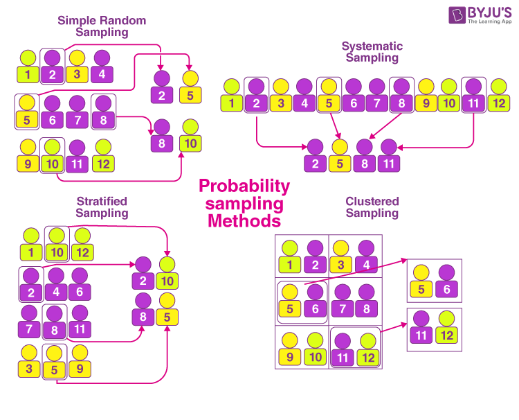

# 📊 Data Analysis Pipeline

---

## 🔹 Introduction to the Data Analysis Pipeline

The **data analysis pipeline** is a systematic process that transforms raw data into meaningful insights through a series of well-defined steps. It ensures that data is **collected, cleaned, analyzed, and interpreted** in a structured manner, enabling reliable and efficient decision-making.

---

### 🔄 Key Stages of the Data Analysis Pipeline

---

### **1. Data Collection**

* The first step where **raw data is gathered** from various sources like:

  * Databases
  * Sensors
  * Surveys
  * Social media
* **Importance:**
  Data quality at this stage determines the reliability of the final analysis.
  *Garbage in, garbage out.*

---

### **2. Data Preprocessing**

* Involves preparing the raw data by:

  * Handling missing values
  * Removing duplicates
  * Standardizing formats
  * Filtering noise
* **Importance:**
  Ensures consistency, completeness, and readiness of data for analysis.
  Often considered the **most time-consuming and critical** phase.

---

### **3. Data Analysis**

* Application of **statistical and machine learning methods** to extract patterns.
* **Techniques include:**

  * Descriptive statistics
  * Regression analysis
  * Clustering/classification
* **Goal:**
  Discover trends, relationships, and hidden insights within the data.

---

### **4. Interpretation of Results**

* Translate analysis into **business-relevant conclusions**.
* Data is visualized using:

  * Graphs
  * Charts
  * Dashboards
* **Importance:**
  Allows stakeholders to understand insights clearly for decision-making.

---

## 🔹 Importance of the Pipeline

| Industry   | Application                                                              |
| ---------- | ------------------------------------------------------------------------ |
| Healthcare | Patient diagnosis and treatment using clean and accurate medical records |
| Finance    | Risk modeling, fraud detection, portfolio optimization                   |
| Retail     | Customer segmentation, inventory forecasting, and sales analysis         |

A **well-defined pipeline** ensures:

* Scalability
* Data governance
* Consistency across repeated analyses

---

## 🔹 Attribute Handling and Transformation Techniques

---

### **1. Handling Missing Values**

Missing values arise due to **data entry errors, hardware failures, or incomplete inputs**.

#### Techniques:

* **a. Deletion**: Remove records with missing values.

  * Suitable when missingness is minimal.
* **b. Imputation**:

  * Fill using mean, median, mode.
  * Advanced: KNN, regression-based imputation.
* **c. Prediction Models**:

  * Use machine learning models to estimate missing values.

**Example:**
In a retail dataset, missing purchase amounts can be filled using the mean or regression based on user behavior.

---

### **2. Attribute Transformation**

Converts features into formats suitable for analysis or modeling.

#### Techniques:

* **a. Scaling**

  * Adjusts range of features.
  * *Standardization:* Mean = 0, SD = 1.
  * Ensures equal treatment of all features.

* **b. Normalization**

  * Scales values between 0 and 1.
  * Useful in **distance-based algorithms** like KNN, SVM.

* **c. Encoding**

  * Converts categorical data to numeric.
  * *One-hot encoding:* Creates binary features.
  * *Label encoding:* Converts categories to integer labels.

**Example:**
In credit risk modeling, income and expenditure are scaled to avoid dominance in predictions.

---

## 🔹 Sampling Methods and Their Importance

---

### **Introduction**

**Sampling** refers to selecting a subset of data to represent the whole population—especially useful for large datasets or time/resource-constrained analysis.

---

### **Types of Sampling**

#### a. **Random Sampling**

* Every item has equal probability of selection.
* Best for unbiased generalization.

#### b. **Stratified Sampling**

* Data divided into subgroups (strata), samples drawn proportionally.
* Ensures subgroup representation.
* *Example:* Classifying users by age group in market surveys.

#### c. **Systematic Sampling**

* Select every *k-th* record from the data.
* Efficient, but may introduce bias if data has periodic patterns.

#### d. **Cluster Sampling**

* Divide population into clusters, randomly choose a few clusters.
* Study all units in selected clusters.
* Cost-effective for dispersed populations.

---

### **Example: Stratified Sampling in Market Research**

A company wants to know product preferences. Population is stratified by **age, region, income**, and samples are collected proportionally to draw reliable marketing insights.

---

## 🔹 Importance of Sampling in Data Analysis

| **Benefit**            | **Explanation**                                                       |
| ---------------------- | --------------------------------------------------------------------- |
| **Efficiency**         | Faster analysis by processing less data                               |
| **Cost-effectiveness** | Saves computation, storage, and survey costs                          |
| **Accuracy**           | With correct techniques, provides results close to full data analysis |

---

## ✅ Summary Table

| **Pipeline Stage**       | **Purpose**                                    | **Example**                             |
| ------------------------ | ---------------------------------------------- | --------------------------------------- |
| Data Collection          | Gather raw data                                | Sensors, APIs, databases                |
| Data Preprocessing       | Clean, impute, transform                       | Handle missing sales entries            |
| Data Analysis            | Extract insights using statistical methods     | Cluster customers, predict sales        |
| Interpretation           | Visualize and present insights                 | Bar charts, dashboards                  |
| Attribute Transformation | Convert/scale features for model compatibility | Normalize credit scores                 |
| Sampling                 | Select subset of data for scalable analysis    | Stratified sampling of survey responses |

