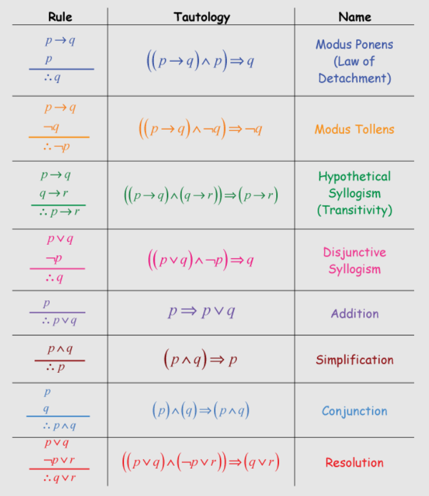

## 📘 Inference Rules and Proof Techniques

### 🔹 What are Inference Rules?

**Inference rules** are standard templates that help derive **logically valid conclusions** from given premises (propositions).

They form the **basis of mathematical reasoning**, **proof construction**, and **logical deductions** in computer science.

---

## 🧱 Common Inference Rules



## Examples

### 1. **Modus Ponens (Law of Detachment)**

**Form**:  
```
P → Q  
P  
⟹ Q
```

**Meaning**: If P implies Q, and P is true, then Q must be true.

**Example**:  
- If it rains (P), then the ground gets wet (Q).  
- It is raining.  
✅ So, the ground is wet.

---

### 2. **Modus Tollens**

**Form**:  
```
P → Q  
¬Q  
⟹ ¬P
```

**Meaning**: If P implies Q, and Q is false, then P must also be false.

**Example**:  
- If it's a cat (P), it has whiskers (Q).  
- It doesn’t have whiskers.  
✅ So, it’s not a cat.

---

### 3. **Hypothetical Syllogism**

**Form**:  
```
P → Q  
Q → R  
⟹ P → R
```

**Meaning**: If P implies Q and Q implies R, then P implies R.

**Example**:  
- If I wake up early (P), I go for a run (Q).  
- If I go for a run, I stay fit (R).  
✅ So, if I wake up early, I stay fit.

---

### 4. **Disjunctive Syllogism**

**Form**:  
```
P ∨ Q  
¬P  
⟹ Q
```

**Meaning**: If either P or Q is true, and P is false, then Q must be true.

**Example**:  
- Either tea (P) or coffee (Q) is served.  
- Tea is not served.  
✅ So, coffee is served.

---

### 5. **Addition**

**Form**:  
```
P  
⟹ P ∨ Q
```

**Meaning**: From P, you can infer “P or anything”.

**Example**:  
- I like math.  
✅ So, I like math or pizza.

---

### 6. **Simplification**

**Form**:  
```
P ∧ Q  
⟹ P
```

**Meaning**: From “P and Q”, you can conclude P.

**Example**:  
- I’m tired and hungry.  
✅ So, I’m tired.

---

### 7. **Conjunction**

**Form**:  
```
P  
Q  
⟹ P ∧ Q
```

**Meaning**: If P is true and Q is true, then both are true together.

**Example**:  
- It’s Sunday.  
- The sun is shining.  
✅ So, it’s Sunday and the sun is shining.

---

### 8. **Resolution (Advanced)**

**Form**:  
```
P ∨ Q  
¬P ∨ R  
⟹ Q ∨ R
```

**Meaning**: Used to eliminate variables in propositional logic (especially in CNF).

**Example**:  
- I’ll study (P) or play (Q).  
- If I don’t study (¬P), I’ll rest (R).  
✅ So, I’ll play or rest.

---

## 🔍 Why Are Inference Rules Important?

- 📚 Used in **mathematical proofs**
- 🤖 Basis for **AI reasoning and logic programming**
- 💡 Foundation for **automated theorem provers**
- 🔐 Helps in validating **argument correctness**


---

## 🧠 What are Proof Techniques?

**Proof techniques** are formal methods to establish the **truth or falsity** of a logical or mathematical statement.

---

### 🔹 1. **Direct Proof**
- Start from known facts or premises
- Apply logical steps to arrive at the conclusion

📌 Example:  
To prove `P → Q`, assume `P` is true and show that `Q` must follow.

---

### 🔹 2. **Proof by Contrapositive**
- To prove `P → Q`, instead prove `¬Q → ¬P`

✅ Useful when proving direct implication is hard.

---

### 🔹 3. **Proof by Contradiction**
- Assume the **negation** of the statement
- Derive a **contradiction**, hence the original statement must be true

📌 Used often in existence or uniqueness proofs

---

### 🔹 4. **Proof by Cases**
- Divide the problem into **exhaustive cases**
- Prove the statement in **each case** individually

✅ Often used when premises involve OR conditions

---

### 🔹 5. **Mathematical Induction**
Used for statements involving **natural numbers**.

Steps:
1. **Base Case**: Prove for `n = 0` or `n = 1`
2. **Inductive Step**: Assume it’s true for `n = k`, then prove for `n = k + 1`

📌 Widely used in algorithm analysis, recurrence relations, etc.

---

## 🔁 Summary Table

| Technique               | Key Idea                          | Example Usage                   |
|-------------------------|------------------------------------|---------------------------------|
| Direct Proof            | Logical steps from P to Q          | Proving properties of numbers   |
| Contrapositive          | Prove ¬Q → ¬P instead of P → Q     | Divisibility proofs             |
| Contradiction           | Assume opposite, derive conflict   | Proving irrational numbers      |
| Proof by Cases          | Split into logical cases           | Piecewise functions             |
| Induction               | Base case + recursive step         | Loop invariant, recurrences     |

---

## 🔧 Applications:
- 📚 Formal logic & mathematics
- 🧮 Program correctness and verification
- 🤖 AI (logical inference engines)
- 🧠 Automated theorem proving

