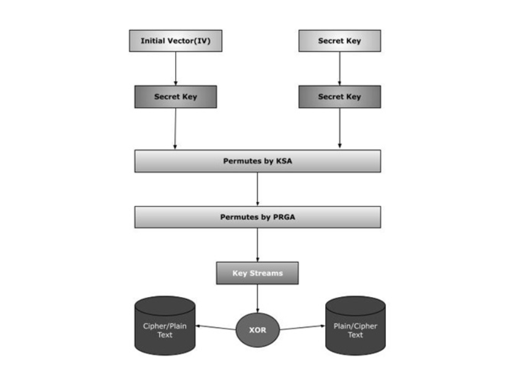

### 📌 **RC4 Stream Cipher**

**RC4 (Rivest Cipher 4)** is a **symmetric key stream cipher** developed by **Ron Rivest** in **1987** for RSA Security. It became one of the most widely used stream ciphers due to its **simplicity**, **speed**, and **efficiency**, especially in software implementations. RC4 was integrated into numerous standards, including **SSL/TLS** for secure web communications and **WEP/WPA** for Wi-Fi security.

---

## 🔐 **Key Features of RC4**

### 🔸 1. **Variable Key Length**

* RC4 supports a **key size ranging from 40 to 2048 bits**, typically **128 bits**.
* This flexibility allows it to adapt to different security needs.

### 🔸 2. **Key Scheduling Algorithm (KSA)**

* Initializes a **256-byte state array S** with values from `0 to 255`.
* Uses the secret key to **shuffle** this array through a permutation process:

  * Ensures a complex initial internal state, depending on the key.

### 🔸 3. **Pseudorandom Generation Algorithm (PRGA)**

* After KSA, the PRGA generates the **keystream**:

  * Two indices `i` and `j` are updated in each iteration.
  * Elements of the state array are swapped, and a **byte is selected from S** to be XORed with the plaintext.

### 🔸 4. **Operation**

* **Encryption**: Each byte of plaintext is XORed with a byte from the keystream to produce ciphertext.
* **Decryption**: The ciphertext is XORed with the same keystream to retrieve the plaintext (since XOR is reversible).

---

## ⚠️ **Security Concerns**

Despite its widespread use, RC4 has several **critical vulnerabilities**:

### 🔸 1. **Keystream Biases**

* Certain bytes in the keystream are statistically more likely to appear, which can **leak information** about the key or plaintext.

### 🔸 2. **Fluhrer, Mantin, and Shamir Attack**

* This cryptanalysis method targets the **Key Scheduling Algorithm**.
* If the same key is used across multiple sessions (as in **WEP**), the algorithm can be broken to **recover the key**.

### 🔸 3. **Weaknesses in TLS**

* RC4 was used in **SSL/TLS**, but due to keystream biases and known attacks, its use was **prohibited by major organizations like IETF and Microsoft**.

---

## 🌐 **Real-Life Applications**

### ✅ Used in:

* **SSL/TLS** (now deprecated)
* **WEP/WPA** for Wi-Fi encryption
* **Microsoft’s Remote Desktop Protocol (RDP)**
* **BitTorrent protocol encryption**

### ❌ Replaced by:

* **AES (Advanced Encryption Standard)** in stream cipher mode (e.g., AES-GCM, AES-CTR)
* **ChaCha20** – a modern, secure stream cipher used in TLS/HTTPS

---

## ✅ **Conclusion**

RC4 is a historically significant stream cipher known for its **simplicity and speed**, but it has become obsolete due to **severe security flaws**, especially when misused. While it played a vital role in securing internet and wireless communications, today it has been **phased out in favor of more secure algorithms** like **AES** and **ChaCha20**, which offer better **resistance to cryptanalytic attacks** and meet modern security standards.
