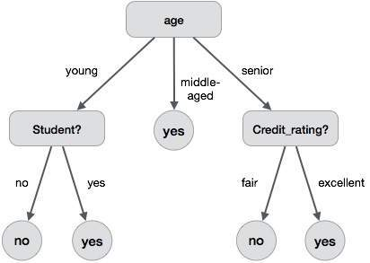
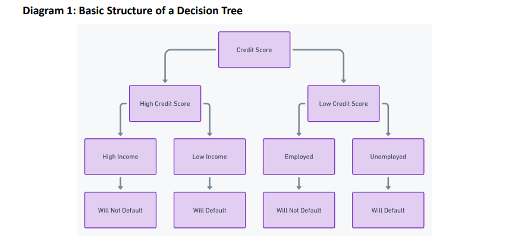

# 🧠 Decision Tree Induction, Bayes Classification, and Rule-Based Classification

---

## 📌 1. **Introduction to Classification Techniques**

Classification is a **supervised learning** technique used to assign predefined labels to input data. It is widely applied in:

* Predicting customer behavior
* Disease diagnosis
* Spam detection
* Fraud detection

Two commonly used methods:

* **Decision Tree Induction**
* **Bayes Classification**

---

## 🌳 2. **Decision Tree Induction**

### 🔹 Definition:



A decision tree is a **hierarchical model** in the form of a tree used to predict the value of a target variable based on input features. It consists of:

* **Root Node**: Top-most decision attribute
* **Internal Nodes**: Test conditions on attributes
* **Branches**: Outcomes of the tests
* **Leaf Nodes**: Final classification label

---

### 🔹 How Decision Trees Work:

A decision tree recursively splits the dataset using the most **discriminative feature**.

#### 🧮 Splitting Criteria:

* **Information Gain (Entropy-based)**:

  $$
  IG(D, A) = Entropy(D) - \sum \frac{|D_i|}{|D|} \cdot Entropy(D_i)
  $$

  Used by **ID3** algorithm. Prefers attributes that produce **pure subsets**.

* **Gini Index**:

  $$
  Gini(D) = 1 - \sum_{i=1}^{c} p_i^2
  $$

  Used by **CART**. Measures impurity; lower is better.

---

### 🔹 Stopping Criteria:

* Max depth reached
* Minimum samples in node
* No further gain in splitting

---

### 🔹 Example: Banking Loan Default Prediction

**Attributes**: Credit Score, Income, Employment

**Root Node**: Credit Score

**Branches**: High vs Low

**Leaves**: “Default” / “No Default”



---

### ✅ Advantages:

* Highly **interpretable**
* Handles **categorical and numerical** data
* No need for normalization

### ❌ Disadvantages:

* **Overfitting** if not pruned
* Unstable to small changes in data
* Can grow **very large**

---

## 📊 3. **Bayes Classification**

### 🔹 Definition:

Uses **Bayes’ Theorem** to predict the probability that a data point belongs to a particular class.

$$
P(A|B) = \frac{P(B|A) \cdot P(A)}{P(B)}
$$

Where:

* $P(A|B)$: Posterior probability
* $P(B|A)$: Likelihood
* $P(A)$: Prior
* $P(B)$: Evidence

---

### 🔹 Naive Bayes Classifier

Assumes that all features are **independent**.

#### Example: Spam Classification

* Features: Words like “win”, “free”
* Naive Bayes estimates:

  $$
  P(\text{spam}|\text{words}) \propto P(\text{words}|\text{spam}) \cdot P(\text{spam})
  $$

---

### ✅ Advantages:

* Very **fast and scalable**
* Requires **less training data**
* Works well with **text data**

### ❌ Disadvantages:

* **Strong independence assumption** rarely holds
* Performs poorly with **correlated** features

---

## 📜 4. **Rule-Based Classification**

### 🔹 Definition:

Uses human-readable **if–then rules** to classify data.

#### Example:

```
IF age > 30 AND income > 50,000 THEN buy_car = yes
```

---

### 🔹 Rule Extraction:

* Derived from decision trees or association rule mining
* Expressed as:

  ```
  IF (condition) THEN (class)
  ```

### 🔹 Rule Pruning:

Removes redundant or overfitted rules using a **validation set** to improve generalization.

---

### ✅ Applications:

* **Expert Systems** (e.g., medical diagnosis)
* **Credit Scoring** (loan approvals)
* **Customer Segmentation** (e-commerce targeting)

#### Indian Context Example:

```
IF purchases include electronics AND income > ₹10L THEN recommend premium electronics
```

---

### ✅ Advantages:

* **Highly interpretable**
* Easily **customizable**
* Embeds **domain knowledge**

### ❌ Disadvantages:

* Not scalable to **very large** datasets
* Can become **complex** with many rules
* **Computational cost** of rule mining is high

---

## 📚 Summary Table

| Method        | Key Idea                     | Pros                            | Cons                         |
| ------------- | ---------------------------- | ------------------------------- | ---------------------------- |
| Decision Tree | Tree of decisions            | Interpretable, no preprocessing | Overfitting, instability     |
| Naive Bayes   | Bayes Theorem + independence | Fast, good for text             | Assumes feature independence |
| Rule-Based    | If-Then rules                | Transparent, editable           | Not scalable, rule explosion |

